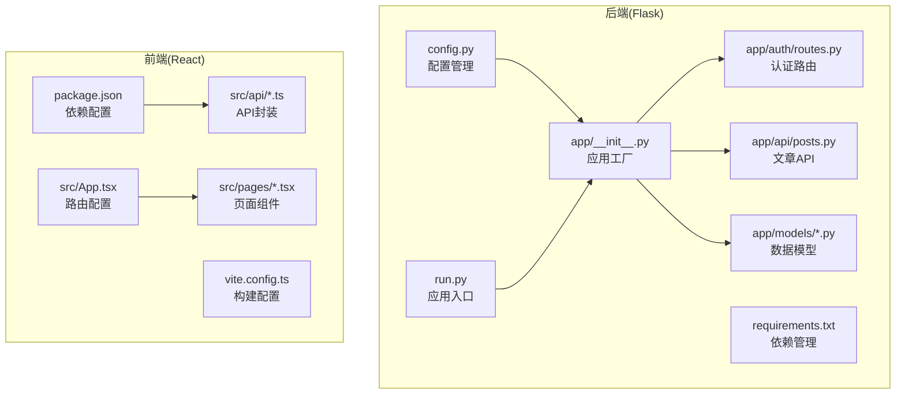
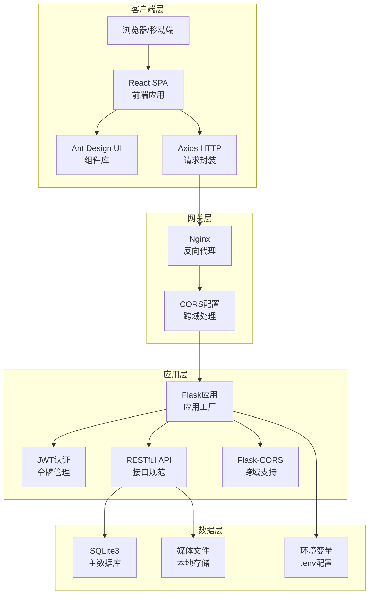
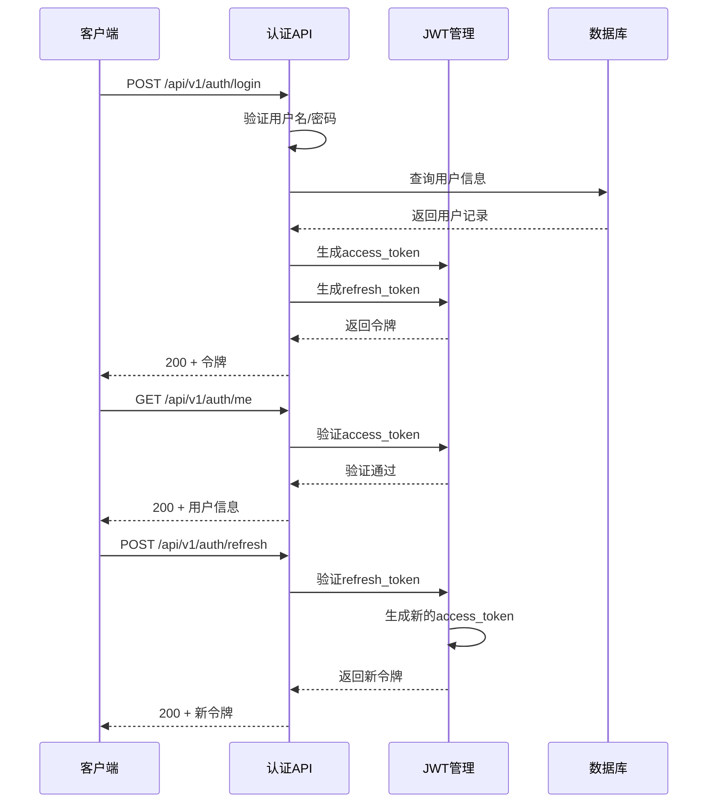
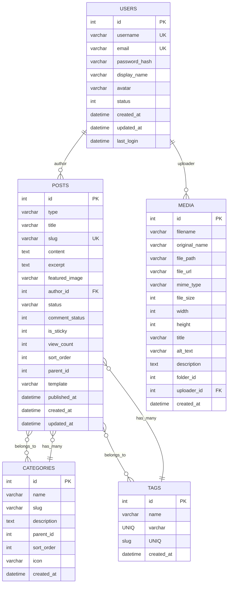
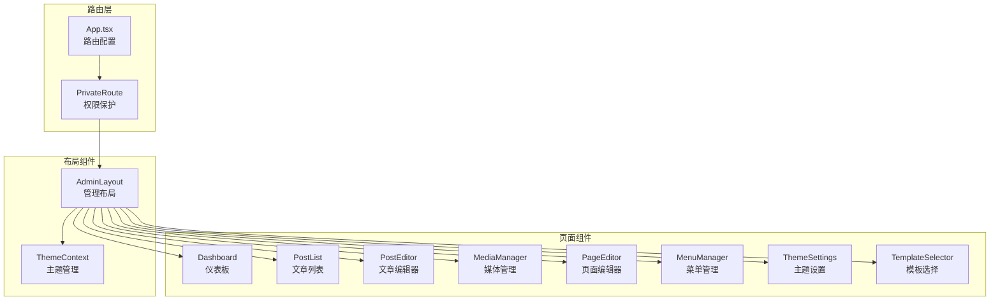
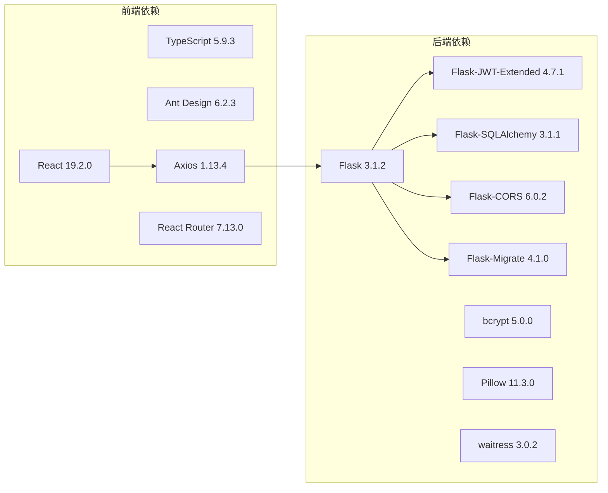

# 技术需求

<cite>
**本文引用的文件**
- [config.py](file://company_cms_project/backend/config.py)
- [run.py](file://company_cms_project/backend/run.py)
- [requirements.txt](file://company_cms_project/backend/requirements.txt)
- [package.json](file://company_cms_project/frontend/package.json)
- [app/__init__.py](file://company_cms_project/backend/app/__init__.py)
- [auth/routes.py](file://company_cms_project/backend/app/auth/routes.py)
- [posts.py](file://company_cms_project/backend/app/api/posts.py)
- [models/post.py](file://company_cms_project/backend/app/models/post.py)
- [models/user.py](file://company_cms_project/backend/app/models/user.py)
- [api/auth.ts](file://company_cms_project/frontend/src/api/auth.ts)
- [api/posts.ts](file://company_cms_project/frontend/src/api/posts.ts)
- [App.tsx](file://company_cms_project/frontend/src/App.tsx)
- [Dashboard.tsx](file://company_cms_project/frontend/src/pages/Dashboard.tsx)
- [vite.config.ts](file://company_cms_project/frontend/vite.config.ts)
</cite>

## 更新摘要
**所做更改**
- 更新了Flask+React完整架构设计的技术要求
- 新增了JWT认证系统的详细实现规范
- 完善了数据库设计与API接口规范
- 增强了前端技术栈与组件架构说明
- 补充了现代化技术栈的选型理由

## 目录
1. [引言](#引言)
2. [项目结构](#项目结构)
3. [核心组件](#核心组件)
4. [架构总览](#架构总览)
5. [详细组件分析](#详细组件分析)
6. [依赖分析](#依赖分析)
7. [性能考量](#性能考量)
8. [故障排查指南](#故障排查指南)
9. [结论](#结论)
10. [附录](#附录)

## 引言
本技术需求文档面向"企业网站CMS系统"的完整技术架构设计，基于Flask+React的现代化技术栈实现，涵盖前后端分离架构、JWT认证系统、数据库设计、API规范、部署方案等核心要求。文档详细阐述了技术栈选择理由、接口设计规范、安全设计方案、性能优化策略，为项目团队提供完整的开发指导和技术保障。

## 项目结构
项目采用前后端分离架构，包含完整的后端Flask应用和前端React应用：



**章节来源**
- [config.py](file://company_cms_project/backend/config.py#L1-L61)
- [run.py](file://company_cms_project/backend/run.py#L1-L58)
- [package.json](file://company_cms_project/frontend/package.json#L1-L44)

## 核心组件

### 前端技术栈
- **框架与类型**: React 19.2.0 + TypeScript 5.9.3，构建工具Vite 7.2.4
- **UI组件库**: Ant Design 6.2.3 + @ant-design/icons 6.1.0
- **状态管理**: React Context + 本地状态管理
- **路由系统**: React Router DOM 7.13.0
- **HTTP客户端**: Axios 1.13.4
- **富文本编辑**: react-quill-new 3.8.3
- **拖拽系统**: @dnd-kit/core 6.3.1 + @dnd-kit/sortable 10.0.0
- **图表可视化**: Recharts 3.7.0
- **工具库**: dayjs 1.11.19, uuid 13.0.0, lucide-react 0.563.0

### 后端技术栈
- **核心框架**: Flask 3.1.2 + Flask-SQLAlchemy 3.1.1
- **认证系统**: Flask-JWT-Extended 4.7.1
- **跨域支持**: Flask-CORS 6.0.2
- **数据库迁移**: Flask-Migrate 4.1.0
- **文件处理**: Pillow 11.3.0
- **WSGI服务器**: waitress 3.0.2
- **环境管理**: python-dotenv 1.2.1
- **密码加密**: bcrypt 5.0.0

### 部署环境
- **操作系统**: Windows Server 2019/2022
- **Web服务器**: Nginx 1.24+
- **进程管理**: NSSM服务管理
- **数据库**: SQLite3单文件数据库
- **构建工具**: Vite前端构建
- **CI/CD**: GitLab CI/Jenkins

**章节来源**
- [package.json](file://company_cms_project/frontend/package.json#L12-L42)
- [requirements.txt](file://company_cms_project/backend/requirements.txt#L1-L10)

## 架构总览
系统采用完整的前后端分离架构，实现现代化的企业内容管理系统：



**图表来源**
- [app/__init__.py](file://company_cms_project/backend/app/__init__.py#L15-L42)
- [config.py](file://company_cms_project/backend/config.py#L35-L40)

**章节来源**
- [app/__init__.py](file://company_cms_project/backend/app/__init__.py#L15-L60)
- [config.py](file://company_cms_project/backend/config.py#L8-L41)

## 详细组件分析

### JWT认证系统
系统采用JWT（JSON Web Token）实现无状态认证，支持访问令牌和刷新令牌机制：



**图表来源**
- [auth/routes.py](file://company_cms_project/backend/app/auth/routes.py#L105-L194)

**章节来源**
- [auth/routes.py](file://company_cms_project/backend/app/auth/routes.py#L25-L225)
- [config.py](file://company_cms_project/backend/config.py#L19-L22)

### 数据库设计
采用SQLite3作为主数据库，支持完整的文章管理功能：



**图表来源**
- [models/post.py](file://company_cms_project/backend/app/models/post.py#L4-L248)
- [models/user.py](file://company_cms_project/backend/app/models/user.py#L5-L47)

**章节来源**
- [models/post.py](file://company_cms_project/backend/app/models/post.py#L4-L248)
- [models/user.py](file://company_cms_project/backend/app/models/user.py#L5-L47)

### API接口规范
RESTful API设计遵循统一的响应格式和错误处理机制：

**统一响应格式**：
```json
{
  "code": 200,
  "message": "操作成功",
  "data": {}
}
```

**分页响应格式**：
```json
{
  "code": 200,
  "message": "获取成功",
  "data": {
    "items": [],
    "pagination": {
      "page": 1,
      "per_page": 10,
      "total": 100,
      "pages": 10
    }
  }
}
```

**章节来源**
- [posts.py](file://company_cms_project/backend/app/api/posts.py#L16-L75)

### 前端组件架构
React应用采用模块化组件设计，支持完整的后台管理功能：



**图表来源**
- [App.tsx](file://company_cms_project/frontend/src/App.tsx#L18-L57)
- [Dashboard.tsx](file://company_cms_project/frontend/src/pages/Dashboard.tsx#L48-L215)

**章节来源**
- [App.tsx](file://company_cms_project/frontend/src/App.tsx#L1-L65)
- [Dashboard.tsx](file://company_cms_project/frontend/src/pages/Dashboard.tsx#L1-L218)

## 依赖分析
系统依赖关系清晰，前后端通过RESTful API进行通信：



**图表来源**
- [package.json](file://company_cms_project/frontend/package.json#L12-L42)
- [requirements.txt](file://company_cms_project/backend/requirements.txt#L1-L10)

**章节来源**
- [package.json](file://company_cms_project/frontend/package.json#L1-L44)
- [requirements.txt](file://company_cms_project/backend/requirements.txt#L1-L10)

## 性能考量
系统性能优化策略包括：

- **响应时间**: 首页<2秒，内页<3秒，API<500ms
- **并发处理**: 支持1000+并发用户
- **缓存策略**: Redis缓存（可选）、浏览器缓存、API响应缓存
- **资源优化**: 图片懒加载、响应式图片、WebP格式、CSS/JS压缩
- **数据库优化**: 索引优化、连接池配置、查询优化
- **CDN加速**: 静态资源CDN、缓存刷新机制

## 故障排查指南
常见问题及解决方案：

**认证相关**:
- 检查JWT令牌格式和有效期
- 验证CORS配置是否正确
- 确认用户状态和权限

**数据库相关**:
- 检查SQLite3文件权限
- 验证数据库连接字符串
- 确认表结构和索引

**前端相关**:
- 检查API端点和参数
- 验证路由配置
- 确认组件状态管理

**部署相关**:
- 检查Nginx配置
- 验证WSGI服务器状态
- 确认环境变量设置

## 结论
本技术需求文档详细定义了基于Flask+React的企业CMS系统技术架构，包括JWT认证、数据库设计、API规范、前端组件架构等完整技术方案。通过现代化技术栈的选择和合理的架构设计，系统具备良好的可扩展性、安全性和维护性，能够满足企业网站内容管理的核心需求。

## 附录
- **技术术语**: CMS、SPA、ORM、JWT、RBAC、RESTful API、CORS
- **开发工具**: VS Code、Postman、SQLite Browser、Chrome DevTools
- **测试工具**: Jest、React Testing Library、pytest
- **部署工具**: Docker、Nginx、SSL证书管理

**章节来源**
- [vite.config.ts](file://company_cms_project/frontend/vite.config.ts#L1-L8)
- [run.py](file://company_cms_project/backend/run.py#L21-L48)