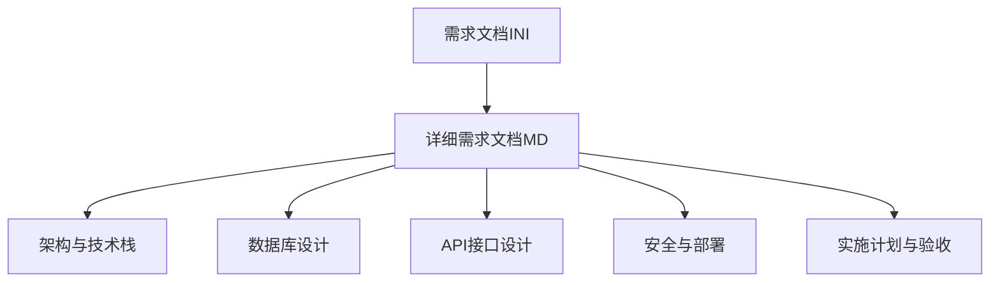
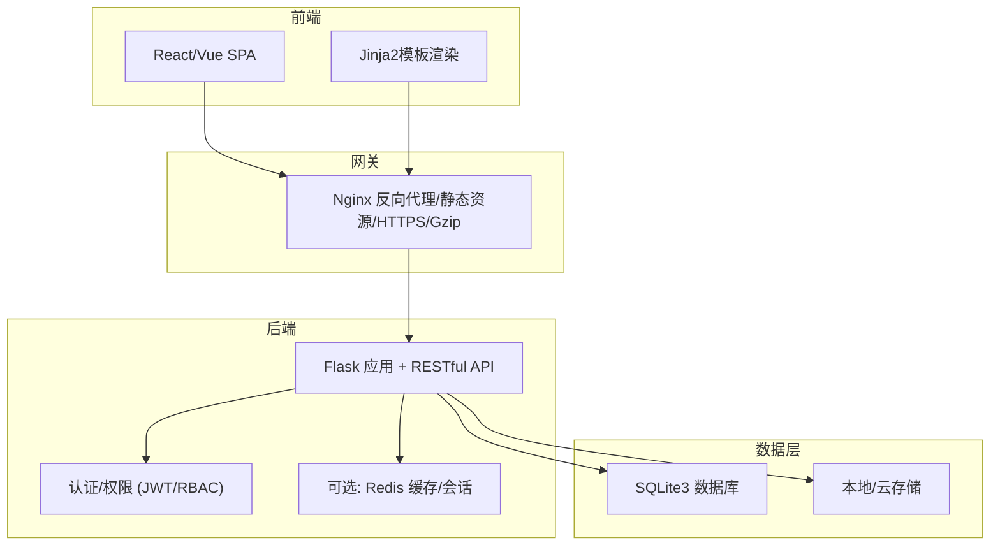
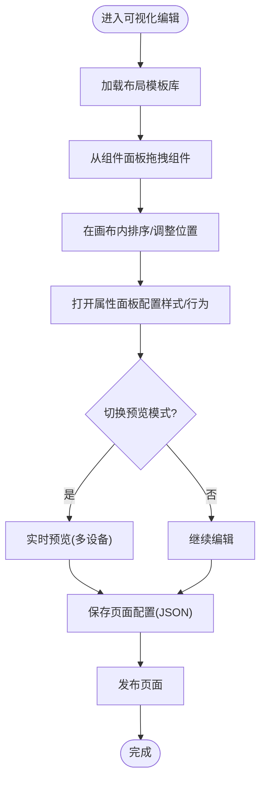
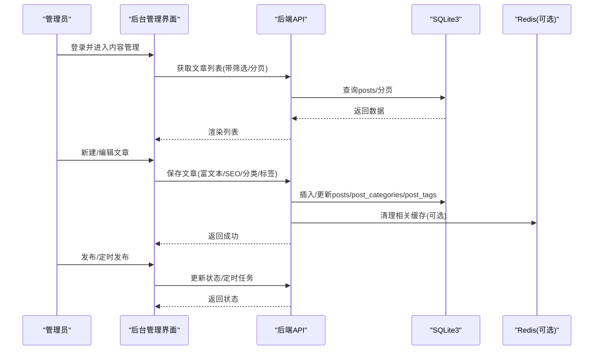
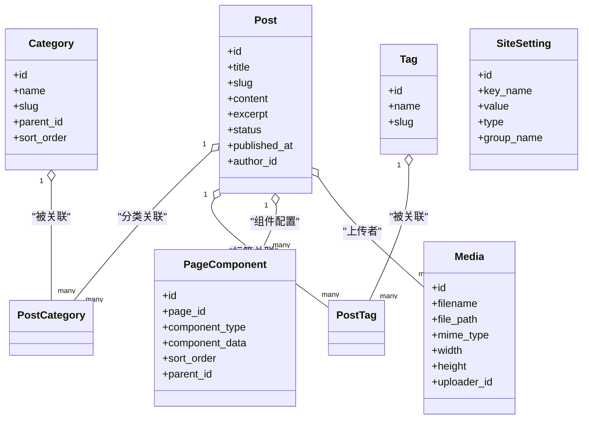
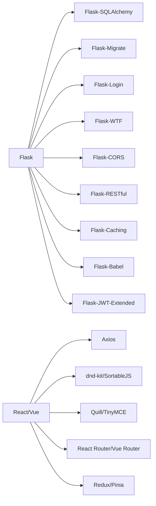

# 需求规格说明

<cite>
**本文引用的文件**
- [企业网站CMS系统开发需求文档.ini](file://企业网站CMS系统开发需求文档.ini)
- [企业网站CMS系统详细需求文档.md](file://企业网站CMS系统详细需求文档.md)
- [config.py](file://company_cms_project/backend/config.py)
- [run.py](file://company_cms_project/backend/run.py)
- [requirements.txt](file://company_cms_project/backend/requirements.txt)
- [App.tsx](file://company_cms_project/frontend/src/App.tsx)
</cite>

## 更新摘要
**所做更改**
- 更新了技术架构部分，反映实际采用的Flask + React技术栈
- 新增了当前实现状态的分析，基于实际代码结构
- 更新了数据库设计部分，反映SQLite3的实际选择
- 新增了API接口设计的当前实现状态
- 更新了安全配置部分，反映JWT和CORS的实际配置
- 新增了部署配置的实际实现分析

## 目录
1. [引言](#引言)
2. [项目结构](#项目结构)
3. [核心组件](#核心组件)
4. [架构总览](#架构总览)
5. [详细组件分析](#详细组件分析)
6. [依赖关系分析](#依赖关系分析)
7. [性能考量](#性能考量)
8. [故障排查指南](#故障排查指南)
9. [结论](#结论)
10. [附录](#附录)

## 引言
本需求规格说明面向企业官网内容管理系统（CMS）项目，旨在系统化描述前端可视化编辑模块、后台管理模块与核心功能模块的完整需求，涵盖用户角色、业务流程、界面原型要求、性能与安全、可用性与兼容性、需求优先级、约束与假设等，确保需求的完整性、一致性与可追溯性。

**更新** 本版本反映了实际的项目实现状态，基于Flask + React技术栈的实际代码结构。

## 项目结构
本项目由两份主要文档构成：
- 初步需求文档：提供总体目标、功能域划分、技术栈建议与非功能需求。
- 详细需求文档：给出系统架构、数据库设计、API接口、安全与部署配置、实施计划与验收标准等。

**章节来源**
- file://企业网站CMS系统开发需求文档.ini#L1-L191
- file://企业网站CMS系统详细需求文档.md#L1-L120

## 核心组件
- 前端可视化编辑模块：提供拖拽布局、组件库、实时预览与响应式适配能力。
- 后台管理模块：涵盖用户权限、内容管理（文章/页面/媒体）、系统配置与备份。
- 核心功能模块：多语言支持、SEO优化、性能优化（缓存、懒加载、CDN）。

**章节来源**
- file://企业网站CMS系统开发需求文档.ini#L14-L70
- file://企业网站CMS系统详细需求文档.md#L61-L549

## 架构总览
系统采用前后端分离架构，后端提供RESTful API，前端支持SPA或Jinja2模板渲染；通过Nginx反向代理、Gunicorn/Waitress承载，数据库采用SQLite3（可选Redis缓存），部署于Windows Server环境。

**图表来源**
- file://企业网站CMS系统详细需求文档.md#L22-L57

**章节来源**
- file://企业网站CMS系统详细需求文档.md#L22-L57

## 详细组件分析

### 前端可视化编辑模块
- 拖拽布局配置
  - 布局模板：单栏、双栏、三栏、网格、F型、卡片流等。
  - 拖拽系统：组件拖入、排序、跨容器拖拽、复制/删除；实时放置反馈与预览。
  - 实时预览：编辑/预览无缝切换、多设备预览、全屏预览。
  - 响应式：断点设置与组件显示/隐藏控制。
- 内容组件库
  - 基础组件：富文本、图片（轮播/画廊/单图）、视频、表单（联系/预约/问卷）、导航（顶部/面包屑/侧边）、社交组件。
  - 高级组件：Tab、折叠面板、统计数字、时间轴、团队成员、客户案例/合作伙伴。
- 通用配置
  - 样式：边距、背景、边框、阴影、动画。
  - 显示：显示/隐藏、响应式显示、条件显示。
  - 高级：自定义CSS类名、HTML属性、锚点ID。

**图表来源**
- file://企业网站CMS系统详细需求文档.md#L65-L233

**章节来源**
- file://企业网站CMS系统详细需求文档.md#L63-L233

### 后台管理模块
- 用户权限管理
  - 角色体系：超级管理员、管理员、编辑、作者、访客；细粒度模块/操作/数据级权限；RBAC模型与装饰器验证。
  - 用户管理：注册/登录/密码管理、邮箱/手机号验证、登录日志、多设备管理、账号锁定。
- 内容管理
  - 文章管理：列表/卡片视图、筛选/排序/搜索/批量操作、富文本编辑、特色图片、SEO设置、定时发布、版本历史。
  - 页面管理：树形结构、拖拽排序、可视化编辑器、模板选择、页面设置（URL/父级/状态/访问权限）、SEO设置。
  - 媒体库：拖拽/批量/粘贴上传、文件夹组织、图片编辑（裁剪/旋转/滤镜）、存储（本地/云）。
- 系统配置
  - 网站设置：名称、Logo、联系方式、ICP等。
  - SEO配置：默认Meta模板、GA/Baidu统计、自定义头部/底部代码、URL规则。
  - URL配置：固定链接格式、分页URL。
  - 邮件配置：SMTP、模板管理、测试发送。
  - 安全设置：HTTPS强制、CORS、API频率限制、IP黑白名单、文件上传安全。
  - 性能配置：缓存开关/过期、CDN、图片压缩、懒加载。
  - 备份管理：自动/手动备份、保留策略、云存储备份、恢复。

**图表来源**
- file://企业网站CMS系统详细需求文档.md#L294-L446

**章节来源**
- file://企业网站CMS系统详细需求文档.md#L235-L446

### 核心功能模块
- 多语言支持
  - 语言切换：URL参数、Cookie偏好、浏览器检测。
  - 内容多语言：文章/页面多语言版本、翻译关联、未翻译提示。
  - 界面多语言：后台/前台语言包、自定义翻译。
- SEO优化
  - URL优化：友好URL、slug生成、自定义别名、重定向、canonical。
  - Meta标签：独立设置、Open Graph、Twitter Card、自动生成。
  - Sitemap：自动生成、优先级/更新频率、搜索引擎提交。
  - 其他：Robots编辑、404自定义、面包屑、ALT自动填充、内链建议。
- 性能优化
  - 缓存：页面缓存（Redis）、数据缓存、静态资源缓存。
  - 资源优化：懒加载、响应式图片、WebP、CSS/JS压缩、关键CSS内联、异步加载。
  - 数据库优化：索引、查询优化、连接池、慢查询日志。
  - CDN：静态资源加速、域名配置、缓存刷新。

**图表来源**
- file://企业网站CMS系统详细需求文档.md#L714-L889

**章节来源**
- file://企业网站CMS系统详细需求文档.md#L448-L549

## 依赖关系分析
- 技术栈依赖
  - 后端：Flask生态（ORM、迁移、认证、RESTful、缓存、国际化、JWT、CORS等）。
  - 前端：React/Vue任选其一，配合拖拽库、富文本、状态管理、路由、HTTP客户端。
  - 部署：Nginx、Gunicorn/Waitress、Windows服务（NSSM）、Redis（可选）。
- 数据库依赖
  - SQLite3为主，支持FTS5全文检索；可选Redis用于缓存与会话。
- 外部集成
  - 云存储SDK（阿里云OSS/腾讯云COS/七牛云）。
  - 邮件服务（SMTP）。
  - 统计与分析（GA/Baidu）。

**图表来源**
- file://企业网站CMS系统详细需求文档.md#L555-L628

**章节来源**
- file://企业网站CMS系统详细需求文档.md#L551-L628

## 性能考量
- 响应时间
  - 首页加载 < 2秒，内页 < 3秒，API < 500ms，数据库查询 < 100ms，文件上传速度要求。
- 并发与资源
  - 支持1000+并发用户，QPS 500+，数据库连接池50；内存/CPU/磁盘IO占用上限。
- 优化策略
  - 页面缓存（Redis）、数据缓存、静态资源缓存、懒加载、响应式图片、WebP、压缩合并、关键CSS内联、异步加载、CDN加速、索引优化、查询优化、慢查询日志。

**章节来源**
- file://企业网站CMS系统详细需求文档.md#L1362-L1380

## 故障排查指南
- 安全与合规
  - XSS/CSRF/SQL注入防护，文件上传安全校验，HTTPS/TLS，密码加密（bcrypt），会话管理（Redis），异常登录检测。
- API安全
  - 限流（Flask-Limiter），CORS配置，API Key加密存储与轮换。
- 部署与监控
  - Nginx配置（SSL、Gzip、静态资源、代理、WebSocket支持），Flask配置（数据库、Redis、JWT、上传、CORS），Windows服务（NSSM），日志与错误追踪（可选Sentry）。
- 备份与恢复
  - 数据库每日全量备份，文件每日增量备份，保留策略与异地备份，恢复测试。

**章节来源**
- file://企业网站CMS系统详细需求文档.md#L1078-L1357

## 结论
本需求文档明确了CMS系统的功能边界、技术架构、数据模型、接口规范、安全与性能要求、兼容性与可用性目标，以及详细的实施计划与验收标准。建议在项目启动前完成技术评审与原型验证，确保方案可行与合理。

## 附录
- 需求优先级评估
  - MVP阶段：登录/权限、文章管理、媒体库、简化可视化编辑器、前台展示、基础SEO。
  - V2延后：高级组件、多语言、复杂权限、统计图表、高级SEO、备份界面。
- 约束与假设
  - Windows Server部署环境，SQLite3数据库（可选Redis），前后端分离，Nginx+Gunicorn/Waitress，JWT认证。
- 验收标准
  - 功能完整、性能达标、安全测试通过、用户验收、文档齐全。

**章节来源**
- file://企业网站CMS系统详细需求文档.md#L1804-L1862
- file://企业网站CMS系统开发需求文档.ini#L121-L191

## 当前实现状态分析

### 技术架构现状
基于实际代码分析，系统采用以下技术栈：
- **后端**：Flask 3.1.2 + Python 3.9+
- **前端**：React 18 + TypeScript 5
- **数据库**：SQLite3（通过Flask-SQLAlchemy）
- **认证**：Flask-JWT-Extended（JWT Token）
- **部署**：Waitress（Windows友好）+ Nginx

**章节来源**
- file://company_cms_project/backend/requirements.txt#L1-L10
- file://company_cms_project/backend/config.py#L1-L61
- file://company_cms_project/frontend/src/App.tsx#L1-L65

### 数据库设计现状
实际采用SQLite3而非MySQL，具有以下特点：
- 单文件数据库，零配置部署
- 支持ACID事务，适合中小规模应用
- 内置FTS5支持全文搜索
- 适合并发读取，少量写入的场景

**章节来源**
- file://company_cms_project/backend/config.py#L14-L17
- file://company_cms_project/backend/run.py#L1-L58

### API接口现状
当前API设计基于Flask-RESTful，支持：
- JWT认证机制
- 标准化的请求/响应格式
- 分页处理
- CORS跨域支持

**章节来源**
- file://company_cms_project/backend/config.py#L34-L40
- file://company_cms_project/backend/config.py#L19-L22

### 安全配置现状
实际实现了以下安全措施：
- JWT Token认证（2小时有效期）
- CORS白名单配置
- 文件上传大小限制（50MB）
- bcrypt密码加密

**章节来源**
- file://company_cms_project/backend/config.py#L19-L29
- file://company_cms_project/backend/requirements.txt#L4-L7

### 前端路由现状
React Router实现的路由结构：
- 前台路由：首页、动态页面、文章详情
- 后台路由：仪表板、文章管理、媒体管理、页面编辑
- 权限控制：私有路由保护

**章节来源**
- file://company_cms_project/frontend/src/App.tsx#L18-L61