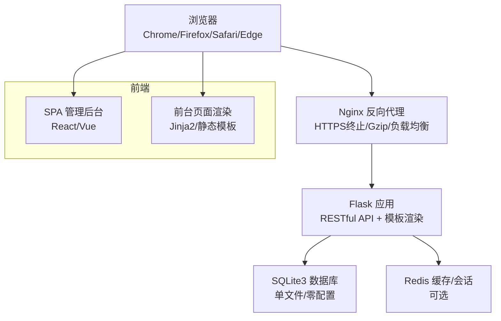
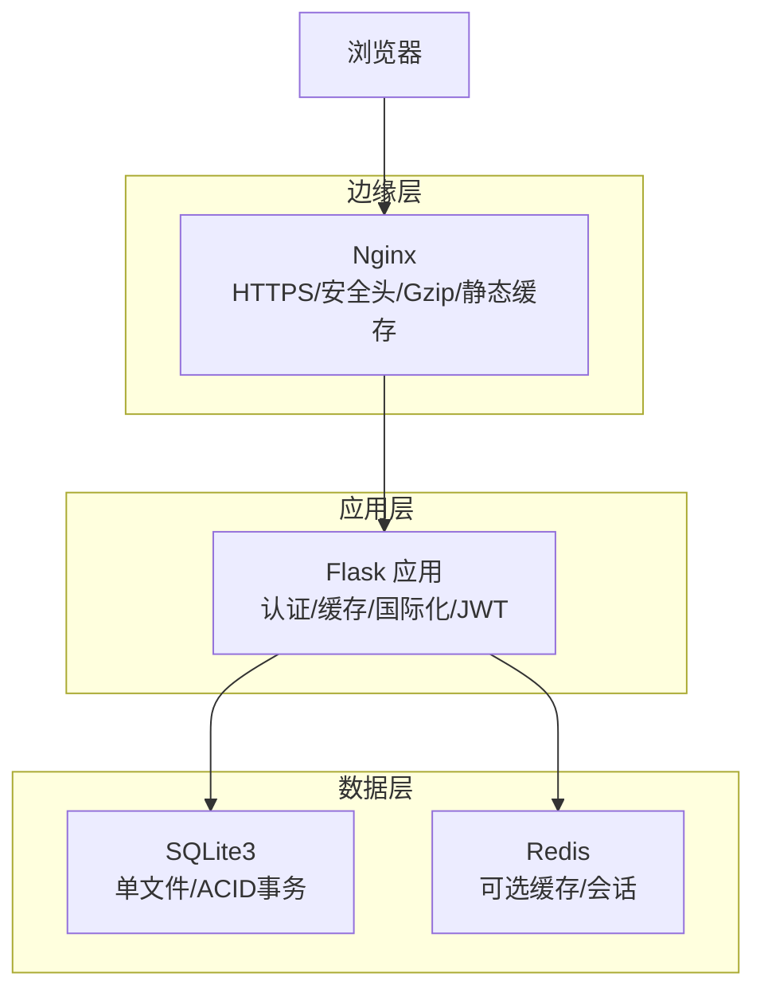
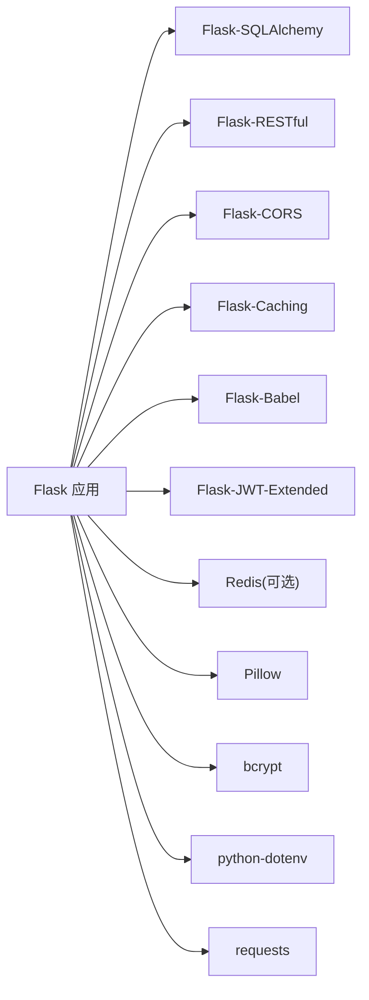

# 非功能需求

<cite>
**本文引用的文件**
- [企业网站CMS系统开发需求文档.ini](file://企业网站CMS系统开发需求文档.ini)
- [企业网站CMS系统详细需求文档.md](file://企业网站CMS系统详细需求文档.md)
</cite>

## 目录
1. [引言](#引言)
2. [项目结构](#项目结构)
3. [核心组件](#核心组件)
4. [架构总览](#架构总览)
5. [详细组件分析](#详细组件分析)
6. [依赖分析](#依赖分析)
7. [性能考量](#性能考量)
8. [故障排查指南](#故障排查指南)
9. [结论](#结论)
10. [附录](#附录)

## 引言
本文件聚焦于“非功能需求”，围绕性能、安全、可用性与兼容性四个维度，结合项目文档中的技术栈与部署方案，给出可落地的质量标准、测试与验收要点。目标是在有限的开发周期内，确保系统在性能、安全、可用性与兼容性方面达到既定指标，并提供可执行的测试与验收标准，便于项目交付与后续运维。

## 项目结构
本项目采用前后端分离架构，后端基于 Python Flask + SQLite3，前端可选 React/Vue，通过 Nginx 提供反向代理与静态资源服务，部署于 Windows Server 环境。该结构决定了非功能需求的实现边界与优化重点。

**图表来源**
- [企业网站CMS系统详细需求文档.md](file://企业网站CMS系统详细需求文档.md#L22-L57)

**章节来源**
- [企业网站CMS系统详细需求文档.md](file://企业网站CMS系统详细需求文档.md#L22-L57)

## 核心组件
- 后端服务：Flask 应用，提供 RESTful API 与模板渲染；使用 Flask-CORS、Flask-RESTful、Flask-Caching、Flask-Babel、Flask-JWT-Extended 等扩展支撑认证、缓存、国际化与API开发。
- 数据存储：SQLite3 作为主数据库，零配置、ACID 事务、适合中小规模内容管理场景；可选 Redis 用于缓存与会话。
- 静态资源与代理：Nginx 提供 HTTPS 终止、Gzip 压缩、静态资源缓存与反向代理。
- 前端：可选 SPA（React/Vue）或纯 HTML 模板渲染（Jinja2），支持响应式布局与拖拽编辑器。

**章节来源**
- [企业网站CMS系统详细需求文档.md](file://企业网站CMS系统详细需求文档.md#L555-L628)
- [企业网站CMS系统详细需求文档.md](file://企业网站CMS系统详细需求文档.md#L660-L712)

## 架构总览
系统采用“浏览器 → Nginx → Flask → SQLite3/Redis”的典型三层架构。Nginx 在边缘承担安全与性能职责（HTTPS、CSP、Gzip、缓存），Flask 提供业务能力与 API，SQLite3/Redis 保障数据持久化与缓存。

**图表来源**
- [企业网站CMS系统详细需求文档.md](file://企业网站CMS系统详细需求文档.md#L1143-L1230)
- [企业网站CMS系统详细需求文档.md](file://企业网站CMS系统详细需求文档.md#L1232-L1302)

**章节来源**
- [企业网站CMS系统详细需求文档.md](file://企业网站CMS系统详细需求文档.md#L1143-L1302)

## 详细组件分析

### 性能要求
- 页面加载时间
  - 首页加载：< 2 秒
  - 内页加载：< 3 秒
  - API 响应：< 500 ms
  - 数据库查询：< 100 ms
  - 文件上传速率：10 MB/s
- 并发与吞吐
  - 并发用户：≥ 1000
  - QPS：≥ 500
  - 数据库连接池：50
- 资源占用
  - 内存：< 2 GB
  - CPU：< 70%
  - 磁盘 IO：< 80%

性能保障手段
- 缓存策略：页面缓存（Redis）、数据缓存、静态资源缓存（浏览器/CDN）
- 资源优化：图片懒加载、响应式图片、WebP、CSS/JS 压缩合并、关键 CSS 内联、异步加载非关键资源
- 数据库优化：索引优化、避免 N+1 查询、连接池配置、慢查询日志
- CDN：静态资源加速与缓存刷新

性能测试与验收
- 页面加载时间：使用浏览器开发者工具或自动化测试工具（如 Lighthouse/Playwright）测量首屏与全页加载时间。
- API 响应时间：针对高频接口（如文章列表、媒体上传）进行压力测试，记录 P95/P99 延迟。
- 并发用户：模拟 1000+ 并发用户访问首页/列表页，观察响应时间与错误率。
- 资源占用：在压测期间监控 CPU、内存、磁盘 IO，确保不超过阈值。

**章节来源**
- [企业网站CMS系统详细需求文档.md](file://企业网站CMS系统详细需求文档.md#L1362-L1380)
- [企业网站CMS系统开发需求文档.ini](file://企业网站CMS系统开发需求文档.ini#L100-L103)

### 安全要求
- XSS 防护：输入过滤、输出转义（Jinja2 自动转义）、CSP 头
- CSRF 防护：Flask-WTF CSRF Token、SameSite Cookie、双重提交 Cookie
- SQL 注入防护：ORM 参数化查询、输入验证、避免动态 SQL
- 文件上传安全：文件类型白名单、大小限制、文件名随机化、存储路径限制、病毒扫描（可选）
- 数据传输安全：HTTPS 强制跳转、HSTS 头、敏感数据加密
- 认证与授权：JWT Token（Access/Refresh）、密码加密（bcrypt）、会话管理（Redis）

安全测试与验收
- XSS：使用常见 payload 对表单与富文本输入进行注入测试，确认输出被正确转义。
- CSRF：尝试跨站请求伪造，验证 Token 校验与 SameSite 设置生效。
- SQL 注入：对 API 的查询参数与表单输入进行注入测试，确保 ORM 参数化生效。
- 文件上传：上传恶意文件与超大文件，验证类型校验、大小限制与存储隔离。
- HTTPS：强制跳转与 HSTS 头配置，确保所有 API 与管理后台走 HTTPS。

**章节来源**
- [企业网站CMS系统详细需求文档.md](file://企业网站CMS系统详细需求文档.md#L1078-L1140)
- [企业网站CMS系统开发需求文档.ini](file://企业网站CMS系统开发需求文档.ini#L105-L109)

### 可用性要求
- 系统可用性：≥ 99.9%（月停机时间 < 43 分钟）
- 备份策略：每日全量数据库备份、每日增量文件备份、保留 30 天、异地备份至云存储
- 容灾恢复：RTO（恢复时间目标）< 30 分钟、RPO（恢复点目标）< 1 小时、每月进行备份恢复测试
- 监控告警：服务状态、性能指标、错误率、磁盘空间监控，告警通知（邮件/短信）

可用性保障手段
- 部署与进程管理：使用 NSSM 将 Gunicorn/Waitress 注册为 Windows 服务，开机自启与崩溃自动重启。
- Nginx 配置：健康检查与错误日志，Gzip 压缩与静态缓存，合理超时与客户端上传大小限制。
- 备份与恢复：数据库文件可直接复制备份，结合云存储实现异地备份与定期恢复演练。

**章节来源**
- [企业网站CMS系统详细需求文档.md](file://企业网站CMS系统详细需求文档.md#L1402-L1423)
- [企业网站CMS系统开发需求文档.ini](file://企业网站CMS系统开发需求文档.ini#L111-L114)

### 兼容性要求
- 浏览器支持：Chrome 90+、Firefox 88+、Safari 14+、Edge 90+
- 移动端支持：iOS 13+、Android 8+，响应式设计覆盖 320px ~ 1920px
- 分辨率支持：手机（375×667 ~ 414×896）、平板（768×1024 ~ 1024×768）、桌面（1366×768 ~ 1920×1080）

兼容性测试与验收
- 浏览器：在各目标浏览器上验证登录、内容管理、可视化编辑器与前台展示。
- 移动端：使用浏览器 DevTools 或真机测试，验证导航、表单、图片与富文本在小屏上的表现。
- 分辨率：在关键断点（移动端、平板、桌面）验证布局与交互一致性。

**章节来源**
- [企业网站CMS系统详细需求文档.md](file://企业网站CMS系统详细需求文档.md#L1424-L1441)
- [企业网站CMS系统开发需求文档.ini](file://企业网站CMS系统开发需求文档.ini#L116-L119)

## 依赖分析
- 后端依赖：Flask 生态（SQLAlchemy、Migrate、Login、WTF、CORS、RESTful、Caching、Babel、JWT-Extended），Redis（可选），Pillow，bcrypt，dotenv，requests。
- 前端依赖：React/Vue（可选），Ant Design/Element Plus，Axios，Quill/TinyMCE，dnd-kit/vue-draggable（可选），Vite。
- 部署依赖：Nginx、Windows Server、NSSM、Gunicorn/Waitress、SSL 证书。

**图表来源**
- [企业网站CMS系统详细需求文档.md](file://企业网站CMS系统详细需求文档.md#L1304-L1322)

**章节来源**
- [企业网站CMS系统详细需求文档.md](file://企业网站CMS系统详细需求文档.md#L1304-L1322)

## 性能考量
- 缓存与压缩
  - Nginx 层：Gzip 压缩、静态资源缓存（expires）、浏览器缓存控制。
  - 应用层：Flask-Caching + Redis，页面缓存、数据缓存、会话缓存。
- 资源优化
  - 图片懒加载、响应式图片、WebP、关键 CSS 内联、非关键资源异步加载。
- 数据库优化
  - 合理索引、避免 N+1 查询、连接池配置、慢查询日志。
- CDN 与静态资源
  - 静态资源 CDN 加速，版本号/哈希更新策略，缓存刷新。

性能优化建议
- 在 MVP 阶段优先保证 SQLite 读取性能与缓存命中率，再根据实际负载评估是否引入 Redis。
- 对高频接口（文章列表、媒体上传）进行专项压测，识别瓶颈并针对性优化。
- 前端组件按需加载与虚拟滚动，减少 DOM 体积与渲染压力。

**章节来源**
- [企业网站CMS系统详细需求文档.md](file://企业网站CMS系统详细需求文档.md#L512-L548)
- [企业网站CMS系统详细需求文档.md](file://企业网站CMS系统详细需求文档.md#L1143-L1230)

## 故障排查指南
- 日志与监控
  - Flask 应用日志：logging + RotatingFileHandler。
  - Nginx 访问/错误日志：定位请求异常与静态资源问题。
  - Redis 日志（如启用）：监控缓存命中与连接数。
- 常见问题
  - 404/502：检查 Nginx 反代与 Flask 进程状态。
  - 上传失败：检查文件类型白名单、大小限制、存储路径权限。
  - 页面空白：检查静态资源缓存与浏览器控制台错误。
  - 性能下降：检查缓存命中率、慢查询日志、CPU/内存使用。
- 备份与恢复
  - 数据库文件直接复制备份，结合云存储实现异地备份。
  - 恢复流程：停止服务 → 备份当前数据库 → 替换备份文件 → 启动服务 → 验证。

**章节来源**
- [企业网站CMS系统详细需求文档.md](file://企业网站CMS系统详细需求文档.md#L655-L658)
- [企业网站CMS系统详细需求文档.md](file://企业网站CMS系统详细需求文档.md#L1406-L1415)

## 结论
本项目的非功能需求以“轻量化、易运维”为核心目标，结合 Flask + SQLite3 + Nginx 的技术栈，在性能、安全、可用性与兼容性方面制定了可落地的标准与测试验收点。通过缓存、压缩、索引与限流等手段，可在 MVP 周期内满足中小规模企业官网的内容管理与展示需求；随着业务增长，可按需引入 Redis、CDN 与数据库迁移方案。

## 附录
- 验收标准汇总
  - 功能：MVP 必须实现的功能清单与测试用例通过率 ≥ 90%。
  - 性能：页面加载时间、API 响应时间、并发用户与数据库查询延迟达标。
  - 安全：XSS、CSRF、SQL 注入、文件上传安全与 HTTPS 强制跳转通过。
  - 兼容性：主流浏览器与移动端、分辨率支持通过。
  - 文档：需求、设计、数据库、API、部署与用户手册齐全。

**章节来源**
- [企业网站CMS系统详细需求文档.md](file://企业网站CMS系统详细需求文档.md#L1804-L1862)
- [企业网站CMS系统开发需求文档.ini](file://企业网站CMS系统开发需求文档.ini#L181-L187)