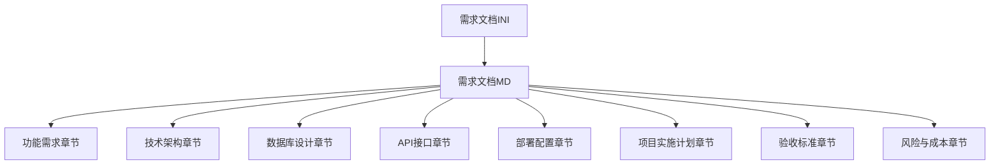
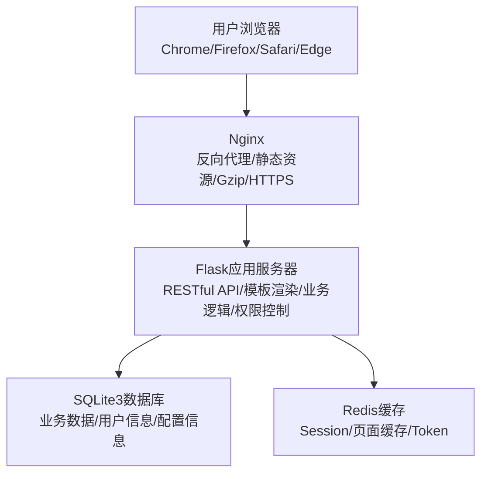
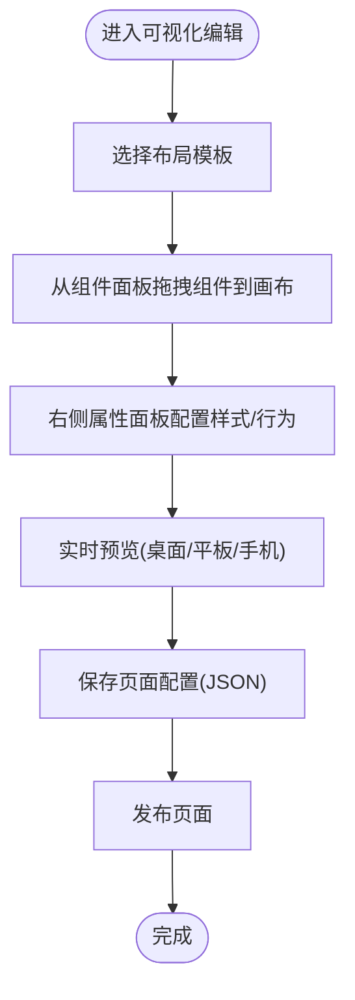
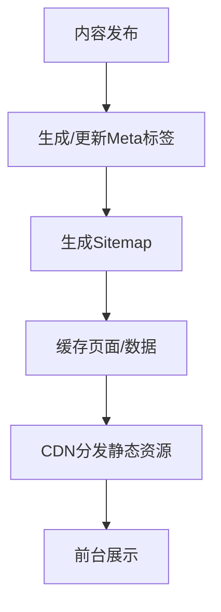
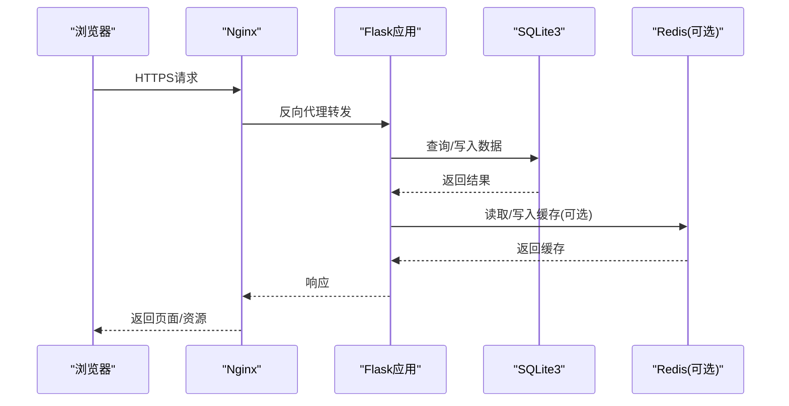
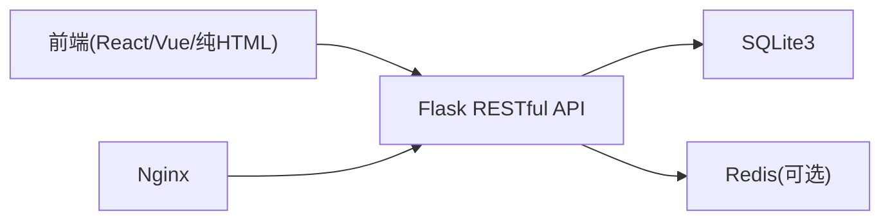

# 项目范围与交付物

<cite>
**本文引用的文件**
- [企业网站CMS系统开发需求文档.ini](file://企业网站CMS系统开发需求文档.ini)
- [企业网站CMS系统详细需求文档.md](file://企业网站CMS系统详细需求文档.md)
</cite>

## 目录
1. [引言](#引言)
2. [项目结构](#项目结构)
3. [核心组件](#核心组件)
4. [架构总览](#架构总览)
5. [详细组件分析](#详细组件分析)
6. [依赖分析](#依赖分析)
7. [性能考量](#性能考量)
8. [故障排除指南](#故障排除指南)
9. [结论](#结论)
10. [附录](#附录)

## 引言
本文件旨在明确“企业网站CMS系统”的项目范围与交付物，依据仓库中的两份需求文档，系统梳理包含内容与不包含内容，并给出完整的交付物清单。该系统采用前后端分离架构，后端基于 Python Flask，前端可选 React/Vue 或纯 HTML 模板渲染，部署于 Windows Server + Nginx 环境，数据库采用 SQLite3，兼顾易部署与中小规模业务需求。

## 项目结构
- 项目由两份核心文档构成：
  - 《企业网站CMS系统开发需求文档.ini》：概述项目背景、目标、范围、里程碑与验收标准，明确包含与不包含内容及交付物清单。
  - 《企业网站CMS系统详细需求文档.md》：详述功能需求、技术架构、数据库设计、API 接口、安全设计、部署配置、项目实施计划、验收标准、风险与成本等。



**图表来源**
- [企业网站CMS系统开发需求文档.ini](file://企业网站CMS系统开发需求文档.ini#L1-L191)
- [企业网站CMS系统详细需求文档.md](file://企业网站CMS系统详细需求文档.md#L1-L2026)

**章节来源**
- [企业网站CMS系统开发需求文档.ini](file://企业网站CMS系统开发需求文档.ini#L1-L191)
- [企业网站CMS系统详细需求文档.md](file://企业网站CMS系统详细需求文档.md#L1-L200)

## 核心组件
- 前端可视化编辑模块：拖拽布局配置、内容组件库（文本、图片、视频、表单、导航、社交等）、组件通用配置（样式、显示、高级配置）。
- 后台管理模块：用户权限管理（角色、权限、用户管理）、内容管理（文章、页面、媒体库、分类）、系统配置（网站设置、SEO、URL、邮件、安全、性能、备份）。
- 核心功能：多语言支持、SEO优化、性能优化（页面缓存、数据缓存、静态资源缓存、图片懒加载、CDN）。
- 技术栈：后端 Python Flask + SQLite3；前端可选 React/Vue/纯 HTML；部署 Nginx + Windows Server；可选 Redis 缓存。

**章节来源**
- [企业网站CMS系统详细需求文档.md](file://企业网站CMS系统详细需求文档.md#L61-L549)

## 架构总览
系统采用前后端分离架构，Nginx 作为反向代理与静态资源服务，Flask 提供 RESTful API 与模板渲染，SQLite3 作为主数据库，Redis 可选用于缓存与会话。



**图表来源**
- [企业网站CMS系统详细需求文档.md](file://企业网站CMS系统详细需求文档.md#L22-L57)

**章节来源**
- [企业网站CMS系统详细需求文档.md](file://企业网站CMS系统详细需求文档.md#L22-L57)

## 详细组件分析

### 前端可视化编辑模块
- 拖拽布局配置：预置多种布局模板、栅格系统、响应式断点、拖拽排序与实时预览。
- 内容组件库：文本编辑器、图片组件（轮播图、画廊、单图）、视频组件、表单组件、导航组件、社交媒体组件，以及若干高级组件（Tab、折叠面板、统计数字、时间轴、团队成员、客户案例/合作伙伴）。
- 通用配置：边距、背景、边框、阴影、动画、显示控制、条件显示、自定义CSS/HTML属性、锚点ID。



**图表来源**
- [企业网站CMS系统详细需求文档.md](file://企业网站CMS系统详细需求文档.md#L65-L232)

**章节来源**
- [企业网站CMS系统详细需求文档.md](file://企业网站CMS系统详细需求文档.md#L63-L232)

### 后台管理模块
- 用户权限管理：角色体系（超级管理员、管理员、编辑、作者、访客）、RBAC 权限模型、用户注册/登录/密码管理、登录日志与锁定机制。
- 内容管理：文章管理（列表/编辑/分类/标签/SEO/定时发布/版本历史）、页面管理（树形结构/模板/状态/访问权限）、媒体库管理（上传/网格/筛选/编辑/存储）。
- 系统配置：网站设置、SEO配置、URL配置、邮件配置、安全设置、性能配置、备份管理。

```mermaid
classDiagram
class 用户 {
+id
+用户名
+邮箱
+密码哈希
+状态
+创建时间
}
class 角色 {
+id
+名称
+描述
+创建时间
}
class 权限 {
+id
+名称
+编码
+描述
+模块
}
class 用户角色关联 {
+用户id
+角色id
}
class 角色权限关联 {
+角色id
+权限id
}
用户 "1" <--* 用户角色关联 "n"
角色 "1" <--* 用户角色关联 "n"
角色 "1" <--* 角色权限关联 "n"
权限 "1" <--* 角色权限关联 "n"
```

**图表来源**
- [企业网站CMS系统详细需求文档.md](file://企业网站CMS系统详细需求文档.md#L716-L768)

**章节来源**
- [企业网站CMS系统详细需求文档.md](file://企业网站CMS系统详细需求文档.md#L235-L446)

### 核心功能模块
- 多语言支持：语言切换、内容多语言版本、界面多语言、翻译管理。
- SEO优化：友好URL、Meta标签、Sitemap、Robots、面包屑、图片ALT自动填充。
- 性能优化：页面缓存（Redis）、数据缓存、静态资源缓存、图片懒加载、响应式图片、CDN。



**图表来源**
- [企业网站CMS系统详细需求文档.md](file://企业网站CMS系统详细需求文档.md#L482-L548)

**章节来源**
- [企业网站CMS系统详细需求文档.md](file://企业网站CMS系统详细需求文档.md#L448-L549)

### 技术架构与部署
- 技术栈：后端 Flask + SQLite3；前端可选 React/Vue/纯 HTML；Nginx + Windows Server；可选 Redis。
- 部署：Nginx 反向代理 + 静态资源服务 + Gzip + HTTPS；Flask 应用通过 Waitress/NSSM 注册为 Windows 服务；数据库文件集中管理；可选云存储与邮件服务。



**图表来源**
- [企业网站CMS系统详细需求文档.md](file://企业网站CMS系统详细需求文档.md#L1143-L1230)
- [企业网站CMS系统详细需求文档.md](file://企业网站CMS系统详细需求文档.md#L1232-L1302)

**章节来源**
- [企业网站CMS系统详细需求文档.md](file://企业网站CMS系统详细需求文档.md#L551-L659)

## 依赖分析
- 组件耦合：前端与后端通过 RESTful API 通信；编辑器与页面渲染解耦，页面配置以 JSON 存储；缓存层与业务层解耦。
- 外部依赖：Nginx、Flask 生态（SQLAlchemy、RESTful、CORS、Babel、JWT、Caching 等）、SQLite3、可选 Redis、前端 UI 库与拖拽库。
- 风险与缓解：Windows 环境兼容性、拖拽性能、数据库性能瓶颈、需求变更、人员变动、数据泄露等均有应对措施。



**图表来源**
- [企业网站CMS系统详细需求文档.md](file://企业网站CMS系统详细需求文档.md#L555-L628)

**章节来源**
- [企业网站CMS系统详细需求文档.md](file://企业网站CMS系统详细需求文档.md#L1865-L1924)

## 性能考量
- 响应时间：首页 < 2 秒，内页 < 3 秒，API < 500ms，数据库查询 < 100ms。
- 并发与资源：支持 1000+ 并发用户，内存 < 2GB，CPU < 70%，磁盘 IO < 80%。
- 优化手段：页面缓存、数据缓存、静态资源缓存、图片懒加载、响应式图片、CDN。

**章节来源**
- [企业网站CMS系统详细需求文档.md](file://企业网站CMS系统详细需求文档.md#L1360-L1441)

## 故障排除指南
- 常见问题：Windows 服务注册失败、Nginx 404/502、JWT 过期、文件上传失败、缓存不生效。
- 排查步骤：检查服务状态与日志、确认 Nginx 反代配置、验证数据库文件路径与权限、核对 Redis 连接、检查 CORS 与 HTTPS 配置。
- 建议：使用 NSSM 管理服务，启用访问/错误日志，定期备份数据库文件，监控系统指标。

**章节来源**
- [企业网站CMS系统详细需求文档.md](file://企业网站CMS系统详细需求文档.md#L1324-L1356)

## 结论
本项目范围明确，交付物完整，涵盖前后端系统开发、基础模板与组件库、用户手册与技术文档、部署与配置支持。不包含第三方服务集成、定制化设计服务与长期运维支持。在 8 天 MVP 周期内，可交付具备核心功能的 CMS 系统，并提供相应的培训与文档。

## 附录

### 项目范围与交付物清单

- 包含内容
  - 完整的前后端系统开发
  - 基础模板和组件库
  - 用户手册和技术文档
  - 部署和配置支持

- 不包含内容
  - 第三方服务集成（如支付、CRM）
  - 定制化设计服务
  - 长期运维支持（需另行约定）

- 交付物清单
  - 代码交付
    - 完整源代码
    - 数据库脚本
    - 部署文档
    - API 文档
  - 文档交付
    - 需求规格说明书
    - 系统设计文档
    - 用户操作手册
    - 技术架构文档
  - 培训交付
    - 管理员培训
    - 内容编辑培训
    - 技术支持文档

**章节来源**
- [企业网站CMS系统开发需求文档.ini](file://企业网站CMS系统开发需求文档.ini#L121-L151)