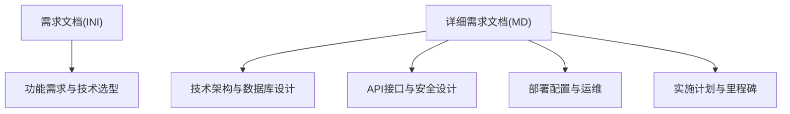
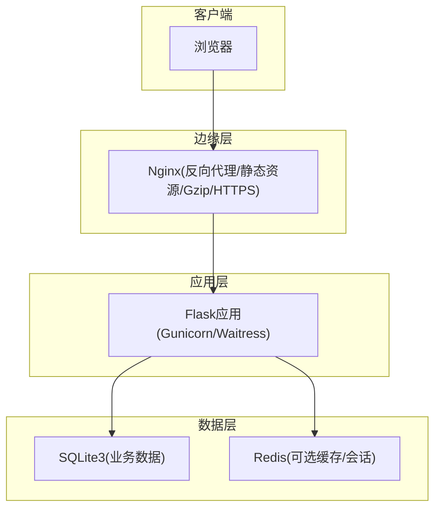
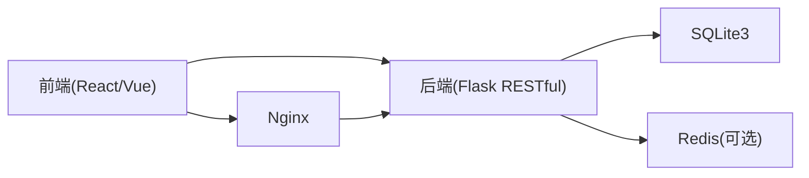

# 项目里程碑

<cite>
**本文引用的文件**
- [企业网站CMS系统开发需求文档.ini](file://企业网站CMS系统开发需求文档.ini)
- [企业网站CMS系统详细需求文档.md](file://企业网站CMS系统详细需求文档.md)
</cite>

## 目录
1. [引言](#引言)
2. [项目结构](#项目结构)
3. [核心组件](#核心组件)
4. [架构总览](#架构总览)
5. [详细组件分析](#详细组件分析)
6. [依赖分析](#依赖分析)
7. [性能考量](#性能考量)
8. [故障排查指南](#故障排查指南)
9. [结论](#结论)
10. [附录](#附录)

## 引言
本项目旨在开发一套面向中小企业的可视化企业官网内容管理系统（CMS），具备“所见即所得”的可视化编辑能力、完善的后台管理与内容编排能力，并在 Windows Server + Nginx 的环境下稳定运行。项目采用 Python Flask + SQLite3 的轻量化技术栈，结合 React/Vue 前端与拖拽组件库，实现快速交付与低运维成本。

## 项目结构
- 需求文档分为两部分：
  - 初步需求文档（INI）：概述项目背景、目标、功能需求、技术需求、非功能需求、项目范围、交付物清单、项目里程碑与验收标准。
  - 详细需求文档（Markdown）：明确技术架构、数据库设计、API 接口、安全设计、部署配置、实施计划、里程碑与验收标准等。

**章节来源**
- file://企业网站CMS系统开发需求文档.ini#L1-L191
- file://企业网站CMS系统详细需求文档.md#L1-L2026

## 核心组件
- 前端可视化编辑模块：拖拽布局配置、内容组件库、实时预览与响应式布局。
- 后台管理模块：用户权限管理、内容管理（文章/页面/媒体）、系统配置。
- 核心功能：多语言支持、SEO优化、性能优化（缓存、懒加载、CDN）。
- 技术栈：Python Flask（后端）、React/Vue（前端）、SQLite3（数据库）、Redis（可选缓存）、Nginx（反向代理与静态资源）、Windows Server（部署环境）。

**章节来源**
- file://企业网站CMS系统开发需求文档.ini#L14-L120
- file://企业网站CMS系统详细需求文档.md#L22-L629

## 架构总览
系统采用前后端分离架构，Nginx 作为反向代理与静态资源服务，Flask 提供 RESTful API 与模板渲染，SQLite3 存储业务数据，Redis 可选用于缓存与会话。前端可选 React/Vue 或纯 HTML 模板渲染。

**图表来源**
- [企业网站CMS系统详细需求文档.md](file://企业网站CMS系统详细需求文档.md#L28-L57)

**章节来源**
- file://企业网站CMS系统详细需求文档.md#L22-L629

## 详细组件分析

### 阶段一：需求分析与设计（2周）
- 目标：完成需求确认、技术选型、系统设计与原型设计。
- 关键交付物：需求规格说明书、系统设计文档、原型图、技术架构文档。
- 质量标准：需求覆盖完整、技术方案可行、原型验证通过。

**章节来源**
- file://企业网站CMS系统开发需求文档.ini#L153-L179

### 阶段二：核心功能开发（6周）
- 目标：完成后台管理系统、前端基础框架与核心组件开发。
- 关键交付物：后端 API、管理后台界面、核心组件（文本、图片、容器、按钮、表单）。
- 质量标准：API 接口完备、权限控制有效、组件可用、前后端联调通过。

**章节来源**
- file://企业网站CMS系统开发需求文档.ini#L153-L179
- file://企业网站CMS系统详细需求文档.md#L1463-L1771

### 阶段三：可视化编辑器开发（4周）
- 目标：完成拖拽系统、组件库与实时预览功能。
- 关键交付物：可视化编辑器（拖拽面板、画布、属性面板）、组件库（5个核心组件）、实时预览。
- 质量标准：拖拽流畅、组件配置可持久化、预览一致。

**章节来源**
- file://企业网站CMS系统开发需求文档.ini#L153-L179
- file://企业网站CMS系统详细需求文档.md#L1656-L1694

### 阶段四：测试与优化（2周）
- 目标：功能测试、性能优化、安全加固。
- 关键交付物：测试报告、性能优化方案、安全加固报告。
- 质量标准：功能通过率≥90%、响应时间达标、安全测试通过。

**章节来源**
- file://企业网站CMS系统开发需求文档.ini#L153-L179
- file://企业网站CMS系统详细需求文档.md#L1695-L1725

### 阶段五：部署与培训（1周）
- 目标：系统部署、用户培训、项目交付。
- 关键交付物：部署文档、用户手册、技术文档、运维文档、培训材料。
- 质量标准：系统上线运行、用户验收通过、文档齐全。

**章节来源**
- file://企业网站CMS系统开发需求文档.ini#L153-L179
- file://企业网站CMS系统详细需求文档.md#L1726-L1771

### 里程碑计划
- 阶段一：需求与设计（2周）
- 阶段二：核心功能开发（6周）
- 阶段三：可视化编辑器开发（4周）
- 阶段四：测试与优化（2周）
- 阶段五：部署与培训（1周）

**章节来源**
- file://企业网站CMS系统开发需求文档.ini#L153-L179

## 依赖分析
- 技术栈依赖：Flask 生态（ORM、迁移、认证、缓存、国际化、RESTful、CORS、JWT）；前端可选 React/Vue + 拖拽库 + 富文本编辑器；数据库 SQLite3 + Redis（可选）；Nginx + Windows Server。
- 组件耦合：前端通过 RESTful API 与后端交互；编辑器组件与后端组件配置 JSON 结构对应；媒体上传依赖后端文件存储与前端上传组件。
- 外部依赖：SSL 证书、CDN（可选）、云存储（可选）。

**图表来源**
- [企业网站CMS系统详细需求文档.md](file://企业网站CMS系统详细需求文档.md#L553-L659)

**章节来源**
- file://企业网站CMS系统详细需求文档.md#L553-L659

## 性能考量
- 页面缓存：Redis 全页面缓存、缓存预热与失效策略。
- 数据缓存：查询结果缓存、API 响应缓存。
- 静态资源优化：浏览器缓存、版本号/哈希更新、关键 CSS 内联、异步加载。
- 数据库优化：索引优化、避免 N+1 查询、连接池配置、慢查询日志。
- CDN：静态资源加速、CDN 域名配置与缓存刷新。

**章节来源**
- file://企业网站CMS系统详细需求文档.md#L512-L548

## 故障排查指南
- 常见问题：
  - 登录失败/权限不足：检查 JWT Token 生成与刷新、权限装饰器是否生效。
  - 文件上传失败：检查 MIME 类型白名单、大小限制、存储路径权限。
  - 拖拽编辑器卡顿：限制单页组件数量、使用虚拟滚动、组件懒加载。
  - 前台页面空白：检查 Nginx 静态资源路径、SPA 路由回退配置。
- 排查步骤：
  - 查看后端日志与错误堆栈。
  - 使用浏览器开发者工具检查网络请求与响应。
  - 核对 Nginx 与 Flask 配置文件。
  - 验证数据库连接与权限。

**章节来源**
- file://企业网站CMS系统详细需求文档.md#L1865-L1924

## 结论
本项目以“MVP”为核心策略，在紧凑的时间窗口内优先实现用户登录/权限、文章管理、媒体库、简化版可视化编辑器与前台展示，确保系统可运行并满足核心业务需求。后续可通过迭代逐步完善高级组件、多语言、复杂权限与高级 SEO 功能。

## 附录

### 附录A：项目里程碑与验收标准
- 阶段一：需求与设计完成（2周）
- 阶段二：核心功能开发完成（6周）
- 阶段三：可视化编辑器开发完成（4周）
- 阶段四：测试与优化完成（2周）
- 阶段五：部署与培训完成（1周）

**章节来源**
- file://企业网站CMS系统开发需求文档.ini#L153-L179
- file://企业网站CMS系统详细需求文档.md#L1774-L1784

### 附录B：关键节点与质量标准
- 功能验收：MVP 必须实现的功能清单与通过率要求。
- 性能验收：页面加载时间、API 响应时间、并发用户支持、数据库查询响应。
- 安全验收：XSS、CSRF、SQL 注入、文件上传安全、HTTPS 强制跳转、密码加密。
- 兼容性验收：主流浏览器、移动端、分辨率支持。
- 文档验收：需求、设计、数据库、API、部署运维、用户手册齐全。

**章节来源**
- file://企业网站CMS系统详细需求文档.md#L1804-L1862