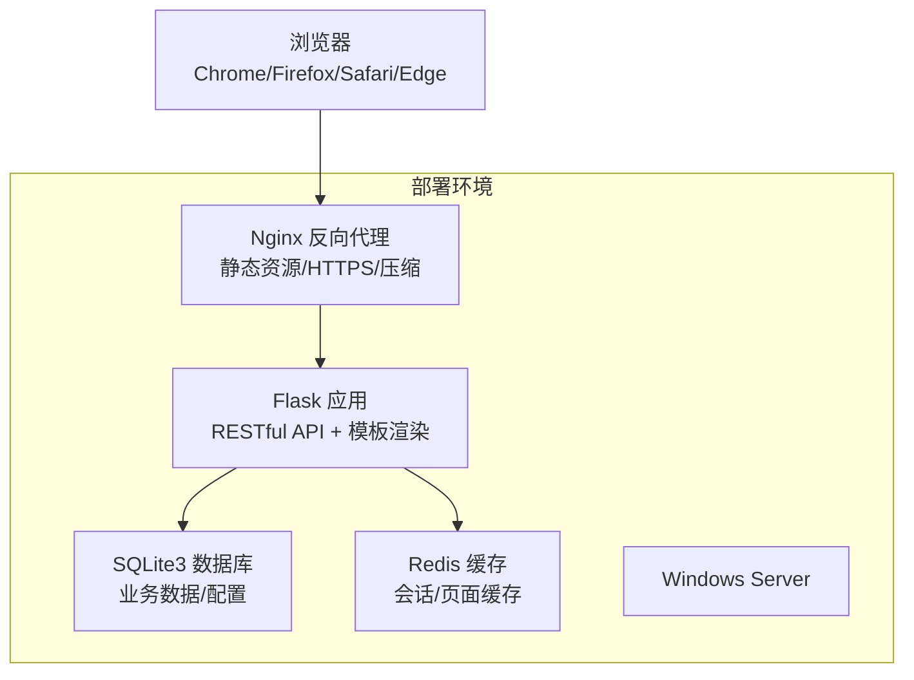
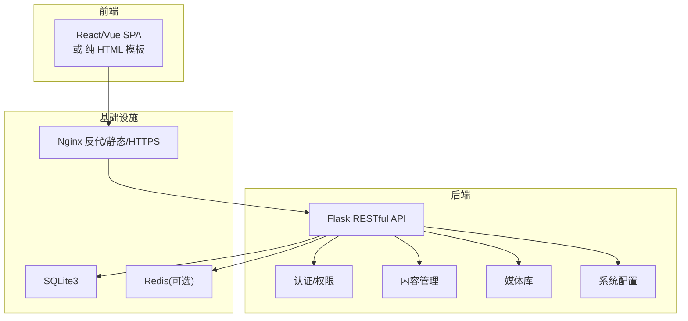
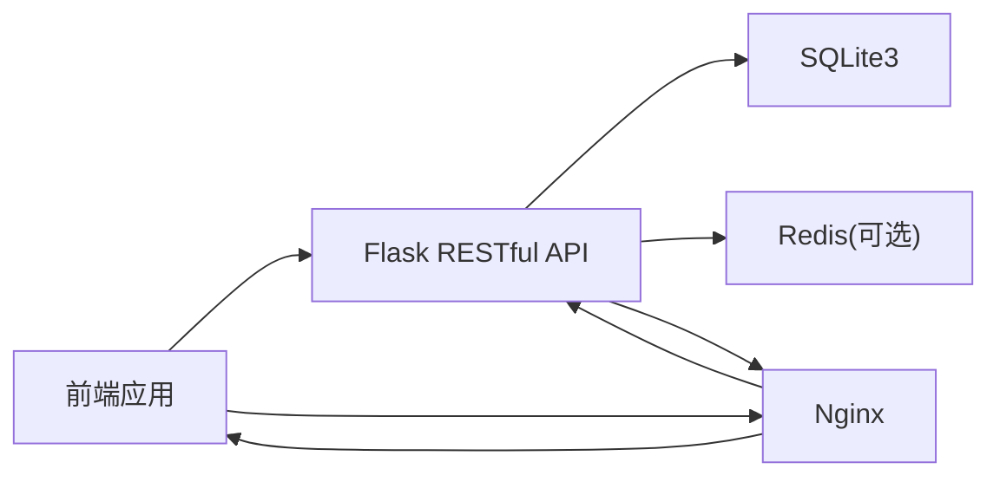

# 验收标准

<cite>
**本文引用的文件**
- [企业网站CMS系统开发需求文档.ini](file://企业网站CMS系统开发需求文档.ini)
- [企业网站CMS系统详细需求文档.md](file://企业网站CMS系统详细需求文档.md)
</cite>

## 目录
1. [引言](#引言)
2. [项目结构](#项目结构)
3. [核心组件](#核心组件)
4. [架构总览](#架构总览)
5. [详细组件分析](#详细组件分析)
6. [依赖分析](#依赖分析)
7. [性能考虑](#性能考虑)
8. [故障排查指南](#故障排查指南)
9. [结论](#结论)
10. [附录](#附录)

## 引言
本验收标准文档面向“企业网站CMS系统”，依据项目需求文档，明确验收条件与质量标准，覆盖五大维度：功能完整性、性能达标、安全测试通过、用户验收测试通过、文档齐全完整。文档还提供验收流程、验收方法、验收责任与通过条件，并给出验收测试用例、性能基准测试与安全评估标准，确保项目交付质量与客户满意度。

## 项目结构
本项目采用前后端分离架构，后端基于 Python Flask + SQLite3，前端可选 React/Vue 或纯 HTML 模板渲染；通过 Nginx 提供反向代理、静态资源服务与 HTTPS 终止；部署于 Windows Server 环境，使用 Waitress/Gunicorn + NSSM 注册服务的方式运行。

**图表来源**
- [企业网站CMS系统详细需求文档.md](file://企业网站CMS系统详细需求文档.md#L22-L57)

**章节来源**
- [企业网站CMS系统详细需求文档.md](file://企业网站CMS系统详细需求文档.md#L22-L57)

## 核心组件
- 后端服务：Flask + RESTful API，支持认证、内容管理、媒体库、系统配置等模块。
- 前端管理后台：React/Vue 或纯 HTML 模板，提供登录、文章/页面/媒体管理、SEO 设置等功能。
- 可视化编辑器：简化版拖拽编辑器，支持基础组件布局与属性配置。
- 前台展示：根据页面组件配置渲染静态页面，支持响应式与 SEO。
- 部署与运维：Nginx + Windows 服务 + 环境变量配置，支持 HTTPS、Gzip 压缩、日志与备份。

**章节来源**
- [企业网站CMS系统详细需求文档.md](file://企业网站CMS系统详细需求文档.md#L551-L628)
- [企业网站CMS系统详细需求文档.md](file://企业网站CMS系统详细需求文档.md#L1141-L1230)
- [企业网站CMS系统详细需求文档.md](file://企业网站CMS系统详细需求文档.md#L1324-L1356)

## 架构总览
系统采用“前后端分离 + 混合模式”的架构：前端可为 SPA 或纯 HTML 模板渲染；后端提供 RESTful API；Nginx 作为反向代理与静态资源服务；数据库采用 SQLite3，缓存可选 Redis；部署于 Windows Server，使用 Waitress/Gunicorn + NSSM。

**图表来源**
- [企业网站CMS系统详细需求文档.md](file://企业网站CMS系统详细需求文档.md#L22-L57)
- [企业网站CMS系统详细需求文档.md](file://企业网站CMS系统详细需求文档.md#L551-L628)

## 详细组件分析

### 功能验收标准
- MVP 必须实现的功能清单：
  - 用户登录与权限管理
  - 文章管理（增删改查）
  - 分类管理
  - 媒体库（图片上传）
  - 简化版可视化编辑器（5个核心组件）
  - 前台展示页面
  - 基础 SEO 功能
- V2 版本延后功能（不在本次验收范围内）：
  - 高级组件（轮播图、Tab 等）
  - 多语言支持（中英文）
  - 复杂权限控制
  - 数据统计图表
  - 高级 SEO 功能
  - 数据备份恢复界面
- 功能测试用例通过率：≥ 90%（MVP 版本）

**章节来源**
- [企业网站CMS系统详细需求文档.md](file://企业网站CMS系统详细需求文档.md#L1806-L1826)

### 性能验收标准
- 页面加载时间：
  - 首页加载：< 2 秒
  - 内页加载：< 3 秒
- API 响应时间：< 500ms
- 数据库查询响应：< 100ms
- 文件上传速度：正常（示例：5MB < 5 秒）
- 并发用户：至少支持 10 个并发用户（MVP 阶段）
- SQLite 读取性能：正常

**章节来源**
- [企业网站CMS系统详细需求文档.md](file://企业网站CMS系统详细需求文档.md#L1362-L1380)
- [企业网站CMS系统开发需求文档.ini](file://企业网站CMS系统开发需求文档.ini#L100-L104)

### 安全验收标准
- XSS 防护：输入过滤 + 输出转义
- CSRF 防护：Token 验证
- SQL 注入防护：ORM 参数化
- 文件上传安全：类型白名单 + 大小限制 + 名称随机化
- 传输安全：HTTPS 强制跳转 + HSTS
- 密码安全：bcrypt 加密，强度要求与历史记录
- 审计日志：登录、操作、错误、安全事件日志
- API 限流：基于 IP/用户限流

**章节来源**
- [企业网站CMS系统详细需求文档.md](file://企业网站CMS系统详细需求文档.md#L1381-L1401)
- [企业网站CMS系统详细需求文档.md](file://企业网站CMS系统详细需求文档.md#L1078-L1141)

### 兼容性验收标准
- 浏览器兼容：Chrome、Firefox、Safari、Edge 最新版本
- 移动端兼容：iOS 13+、Android 8+
- 响应式设计：支持 320px ~ 1920px
- 分辨率支持：桌面 1366×768 ~ 1920×1080

**章节来源**
- [企业网站CMS系统详细需求文档.md](file://企业网站CMS系统详细需求文档.md#L1424-L1441)
- [企业网站CMS系统开发需求文档.ini](file://企业网站CMS系统开发需求文档.ini#L116-L119)

### 文档验收标准
- 需求规格说明书
- 系统设计文档
- 数据库设计文档
- API 接口文档（Swagger）
- 部署运维文档
- 用户操作手册
- 代码注释覆盖率 > 30%

**章节来源**
- [企业网站CMS系统详细需求文档.md](file://企业网站CMS系统详细需求文档.md#L1853-L1862)
- [企业网站CMS系统开发需求文档.ini](file://企业网站CMS系统开发需求文档.ini#L142-L151)

## 依赖分析
- 技术栈与组件：
  - 后端：Flask + SQLAlchemy + RESTful + JWT + Babel + CORS + Caching
  - 前端：React/Vue（可选）或纯 HTML 模板
  - 数据库：SQLite3（默认），可选 Redis
  - 部署：Nginx + Windows 服务（Waitress/NSSM）
- 关键依赖关系：
  - 前端通过 /api/* 代理到 Flask
  - Flask 读写 SQLite3，可选 Redis 缓存
  - Nginx 提供 HTTPS、静态资源缓存与 Gzip 压缩

**图表来源**
- [企业网站CMS系统详细需求文档.md](file://企业网站CMS系统详细需求文档.md#L551-L628)
- [企业网站CMS系统详细需求文档.md](file://企业网站CMS系统详细需求文档.md#L1141-L1230)

**章节来源**
- [企业网站CMS系统详细需求文档.md](file://企业网站CMS系统详细需求文档.md#L551-L628)
- [企业网站CMS系统详细需求文档.md](file://企业网站CMS系统详细需求文档.md#L1141-L1230)

## 性能考虑
- 页面缓存：Redis 全页面缓存，登录用户不缓存
- 数据缓存：查询结果与 API 响应缓存
- 静态资源缓存：浏览器缓存 + 版本号/哈希更新策略
- 资源优化：图片懒加载、响应式图片、WebP、CSS/JS 压缩合并、关键 CSS 内联
- 数据库优化：索引优化、避免 N+1 查询、连接池配置、慢查询日志
- CDN：静态资源加速与缓存刷新

**章节来源**
- [企业网站CMS系统详细需求文档.md](file://企业网站CMS系统详细需求文档.md#L512-L548)

## 故障排查指南
- 日志与监控：
  - Flask 应用日志：logging + RotatingFileHandler
  - Nginx 访问/错误日志：C:/logs/nginx/
  - 可选性能监控与错误追踪（Flask-Profiler/Sentry）
- 常见问题定位：
  - API 401/403：检查 JWT Token 是否有效、刷新机制是否正确
  - 文件上传失败：检查 MIME 白名单、大小限制、存储路径权限
  - 页面加载缓慢：检查缓存策略、CDN 配置、数据库索引
- 备份与恢复：
  - SQLite 数据库文件直接复制备份
  - 媒体文件定期备份，支持恢复与云存储归档

**章节来源**
- [企业网站CMS系统详细需求文档.md](file://企业网站CMS系统详细需求文档.md#L655-L659)
- [企业网站CMS系统详细需求文档.md](file://企业网站CMS系统详细需求文档.md#L1417-L1422)

## 结论
本验收标准以需求文档为基础，明确了功能、性能、安全、兼容性与文档五大维度的验收条件与通过标准。结合项目实施计划与里程碑，建议在交付前完成全面的功能测试、性能压测与安全评估，并确保文档齐全、培训到位，最终达成用户验收测试通过与项目正式交付。

## 附录

### 验收流程与方法
- 验收流程：
  - 功能演示与测试：逐项验证 MVP 功能清单
  - 性能测试：页面加载时间、API 响应时间、并发用户测试
  - 安全评估：XSS/CSRF/SQL 注入测试、文件上传安全验证、HTTPS 强制跳转
  - 兼容性验证：主流浏览器与移动端适配
  - 文档检查：核对交付物清单与注释覆盖率
- 验收方法：
  - 自动化测试（如适用）+ 手工回归测试
  - 基准测试工具（如 Apache Bench/JMeter）进行压力测试
  - 安全扫描工具（如 OWASP ZAP）进行渗透测试
  - 用户验收测试（UAT）模拟真实使用场景

**章节来源**
- [企业网站CMS系统详细需求文档.md](file://企业网站CMS系统详细需求文档.md#L1695-L1771)

### 验收责任与通过条件
- 验收责任：
  - 开发团队：完成功能实现、修复缺陷、准备测试与文档
  - 测试团队：执行测试、出具测试报告、提出改进建议
  - 用户方：参与 UAT、确认功能符合业务需求
- 通过条件：
  - 所有功能需求完整实现（MVP）
  - 性能指标达标
  - 安全测试通过
  - 用户验收测试通过
  - 文档齐全完整

**章节来源**
- [企业网站CMS系统详细需求文档.md](file://企业网站CMS系统详细需求文档.md#L1804-L1863)

### 验收测试用例（示例）
- 功能用例
  - 用户登录/登出：成功登录、Token 刷新、权限拦截
  - 文章 CRUD：创建、编辑、发布、删除、批量删除
  - 媒体上传：图片上传、缩略图生成、文件信息编辑、删除
  - 页面管理：页面创建、组件配置、状态管理、SEO 设置
  - 可视化编辑器：组件拖拽、属性配置、保存与预览
- 性能用例
  - 首页加载时间 < 2 秒、内页 < 3 秒
  - API 响应时间 < 500ms
  - 并发用户 10+ 正常访问
- 安全用例
  - XSS/CSRF/SQL 注入防护验证
  - 文件上传类型与大小限制
  - HTTPS 强制跳转与 HSTS 头
- 兼容性用例
  - Chrome/Firefox/Safari/Edge 正常运行
  - 移动端响应式适配与常见分辨率支持

**章节来源**
- [企业网站CMS系统详细需求文档.md](file://企业网站CMS系统详细需求文档.md#L1699-L1709)
- [企业网站CMS系统详细需求文档.md](file://企业网站CMS系统详细需求文档.md#L1808-L1826)

### 性能基准测试（示例）
- 基准指标
  - 页面加载时间：首页 < 2 秒，内页 < 3 秒
  - API 响应时间：< 500ms
  - 数据库查询：< 100ms
  - 并发用户：≥ 10（MVP 阶段）
  - 文件上传：5MB < 5 秒
- 测试方法
  - 使用基准测试工具模拟多用户并发访问
  - 分析 Nginx/Flask/SQLite 的响应时间与资源占用
  - 优化缓存策略与静态资源处理

**章节来源**
- [企业网站CMS系统详细需求文档.md](file://企业网站CMS系统详细需求文档.md#L1362-L1380)

### 安全评估标准（示例）
- 认证与授权
  - JWT Token 有效期与刷新机制
  - 密码加密（bcrypt）、强度要求与历史记录
- 数据与传输安全
  - ORM 参数化查询、输入/输出过滤、CSP 头
  - HTTPS 强制跳转、HSTS、敏感数据加密
- API 安全
  - Flask-Limiter 限流、CSRF Token、SameSite Cookie
  - 文件上传白名单与病毒扫描（可选）

**章节来源**
- [企业网站CMS系统详细需求文档.md](file://企业网站CMS系统详细需求文档.md#L1078-L1141)