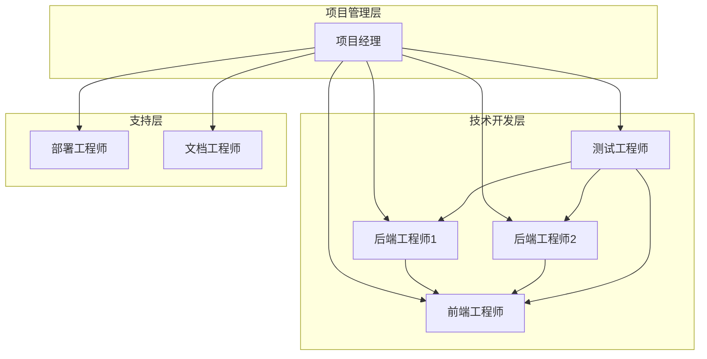
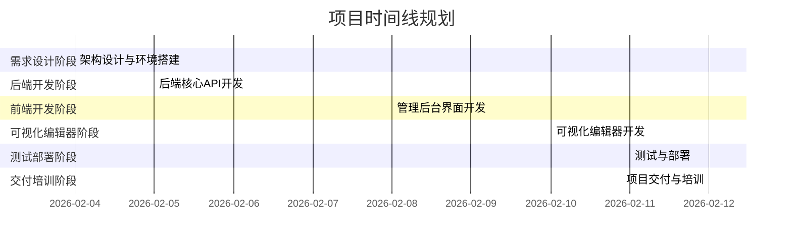

# 团队配置与资源分配

<cite>
**本文档引用的文件**
- [企业网站CMS系统开发需求文档.ini](file://企业网站CMS系统开发需求文档.ini)
- [企业网站CMS系统详细需求文档.md](file://企业网站CMS系统详细需求文档.md)
</cite>

## 目录
1. [项目概述](#项目概述)
2. [团队组织架构](#团队组织架构)
3. [核心团队成员角色](#核心团队成员角色)
4. [职责分工详解](#职责分工详解)
5. [技能要求标准](#技能要求标准)
6. [资源分配方案](#资源分配方案)
7. [开发工具配置](#开发工具配置)
8. [测试环境配置](#测试环境配置)
9. [服务器资源配置](#服务器资源配置)
10. [第三方服务集成](#第三方服务集成)
11. [团队沟通机制](#团队沟通机制)
12. [项目里程碑规划](#项目里程碑规划)
13. [风险管理与应急预案](#风险管理与应急预案)
14. [成本预算分析](#成本预算分析)
15. [总结与建议](#总结与建议)

## 项目概述

本项目为企业官网内容管理系统（CMS）开发项目，旨在构建一套功能完善、易于维护的企业网站管理系统。项目采用前后端分离架构，后端基于Python Flask框架，前端采用React/Vue技术栈，支持可视化拖拽配置，降低技术门槛，提升网站管理效率。

**项目特点**：
- 支持多终端适配和SEO优化
- 提供直观的可视化编辑体验
- 确保系统安全性和可扩展性
- 适合中小企业的快速搭建和运维

## 团队组织架构

基于项目的复杂性和8天的紧凑开发周期，建议采用以下团队组织架构：

**图表来源**
- [企业网站CMS系统详细需求文档.md](file://企业网站CMS系统详细需求文档.md#L1786-L1802)

## 核心团队成员角色

### 项目经理（PM）
**角色定位**：项目总负责人，协调各方资源，确保项目按时高质量交付

**主要职责**：
- 制定项目计划和里程碑
- 协调团队成员工作分配
- 跟踪项目进度和风险
- 与客户沟通需求变更
- 组织项目评审和验收

### 后端开发工程师（BE）
**角色定位**：负责后端API开发、数据库设计和系统架构

**主要职责**：
- Flask应用开发和维护
- API接口设计和实现
- 数据库模型设计和优化
- 用户权限管理和认证系统
- 系统安全和性能优化

### 前端开发工程师（FE）
**角色定位**：负责管理后台界面开发和用户体验优化

**主要职责**：
- React/Vue管理后台界面开发
- 用户交互和界面设计实现
- 组件库开发和维护
- 响应式设计和移动端适配
- 与后端API对接和数据交互

### 测试工程师（TEST）
**角色定位**：负责系统测试、质量保证和问题跟踪

**主要职责**：
- 编写和执行测试用例
- 功能测试和回归测试
- 性能测试和安全测试
- 缺陷跟踪和修复验证
- 用户验收测试支持

### 部署工程师（DEVOPS）
**角色定位**：负责系统部署、运维和环境配置

**主要职责**：
- Windows Server环境配置
- Nginx和Flask服务部署
- 数据库初始化和备份
- SSL证书配置和安全加固
- 监控和故障排除

## 职责分工详解

### 项目管理职责
**项目经理职责矩阵**：

| 职责类别 | 具体任务 | 时间分配 | 关键交付物 |
|---------|---------|---------|-----------|
| 项目规划 | 需求分析和范围确认 | 第1天 | 需求确认书 |
| 团队协调 | 任务分配和进度跟踪 | 全程 | 进度报告 |
| 风险管理 | 技术风险评估和应对 | 全程 | 风险登记表 |
| 质量控制 | 代码审查和测试监督 | 全程 | 质量评估报告 |
| 客户沟通 | 需求变更和验收确认 | 全程 | 验收报告 |

**章节来源**
- [企业网站CMS系统详细需求文档.md](file://企业网站CMS系统详细需求文档.md#L1786-L1802)

### 后端开发职责
**后端工程师职责矩阵**：

| 开发阶段 | 核心任务 | 技术要点 | 质量标准 |
|---------|---------|---------|---------|
| 架构设计 | Flask应用结构设计 | 蓝图模式、配置管理 | 代码结构清晰 |
| 认证系统 | JWT Token实现 | 密码加密、权限验证 | 安全性达标 |
| API开发 | RESTful接口实现 | 参数验证、错误处理 | 接口文档完整 |
| 数据库 | 模型设计和优化 | 索引设计、查询优化 | 性能基准达成 |
| 测试 | 单元测试和集成测试 | 测试覆盖率≥80% | 测试报告完整 |

**章节来源**
- [企业网站CMS系统详细需求文档.md](file://企业网站CMS系统详细需求文档.md#L1532-L1608)

### 前端开发职责
**前端工程师职责矩阵**：

| 开发阶段 | 核心任务 | 技术要点 | 质量标准 |
|---------|---------|---------|---------|
| 框架搭建 | React/Vue项目初始化 | Vite构建、路由配置 | 开发环境就绪 |
| 管理界面 | 后台管理页面开发 | 组件化开发、状态管理 | 界面交互流畅 |
| 组件库 | 可视化编辑器开发 | 拖拽系统、组件面板 | 功能完整可用 |
| 响应式 | 移动端适配 | 媒体查询、触摸事件 | 兼容性达标 |
| 集成测试 | 与后端API对接 | 数据绑定、错误处理 | 接口联调通过 |

**章节来源**
- [企业网站CMS系统详细需求文档.md](file://企业网站CMS系统详细需求文档.md#L1609-L1694)

### 测试职责
**测试工程师职责矩阵**：

| 测试阶段 | 测试类型 | 测试内容 | 交付标准 |
|---------|---------|---------|---------|
| 单元测试 | 功能测试 | 用户登录、文章管理 | 测试用例覆盖≥90% |
| 集成测试 | 接口测试 | API连通性和数据正确性 | 接口测试通过 |
| 系统测试 | 端到端测试 | 完整业务流程 | 业务流程完整 |
| 兼容性测试 | 浏览器测试 | Chrome、Firefox、Safari | 浏览器兼容性 |
| 性能测试 | 压力测试 | 并发用户和响应时间 | 性能指标达标 |

**章节来源**
- [企业网站CMS系统详细需求文档.md](file://企业网站CMS系统详细需求文档.md#L1695-L1771)

## 技能要求标准

### 技术技能要求

**后端工程师技能要求**：
- Python 3.9+ 和 Flask 2.3+ 开发经验
- SQL数据库设计和优化能力
- RESTful API设计和实现
- JWT认证和RBAC权限控制
- Linux/Windows服务器部署经验
- Git版本控制和代码审查

**前端工程师技能要求**：
- React或Vue.js 3.0+ 开发经验
- TypeScript编程语言
- CSS3和响应式设计
- 拖拽系统的实现能力
- 状态管理和组件化开发
- 浏览器兼容性测试

**测试工程师技能要求**：
- 自动化测试框架使用
- API测试工具（Postman、JMeter）
- 性能测试和安全测试
- 缺陷跟踪和报告
- 测试用例设计和执行

**部署工程师技能要求**：
- Windows Server 2019/2022配置
- Nginx反向代理配置
- Flask应用部署和监控
- SSL证书配置和安全加固
- 数据库备份和恢复

### 软技能要求

**团队协作能力**：
- 良好的沟通和表达能力
- 团队合作精神和责任意识
- 问题分析和解决能力
- 学习能力和适应性

**项目管理能力**：
- 时间管理和优先级排序
- 风险识别和应对能力
- 质量控制和标准执行
- 客户需求理解和转化

## 资源分配方案

### 开发工具资源

**开发环境配置**：

| 工具类别 | 工具名称 | 版本要求 | 用途说明 |
|---------|---------|---------|---------|
| 开发语言 | Python | 3.9+ | 后端开发 |
| 开发语言 | Node.js | 16+ | 前端开发 |
| IDE | VS Code | 最新版 | 代码编辑 |
| IDE | PyCharm | 专业版 | Python开发 |
| 数据库 | SQLite Studio | 最新版 | 数据库管理 |
| 版本控制 | Git | 2.0+ | 代码版本管理 |
| API测试 | Postman | 最新版 | 接口测试 |

**章节来源**
- [企业网站CMS系统详细需求文档.md](file://企业网站CMS系统详细需求文档.md#L1304-L1322)

### 测试环境资源

**测试环境配置**：

| 环境类型 | 配置要求 | 资源分配 | 管理方式 |
|---------|---------|---------|---------|
| 开发环境 | Windows 10/11 | 1台 | 开发者个人使用 |
| 测试环境 | Windows Server 2022 | 1台 | 集中式管理 |
| 生产环境 | Windows Server 2022 | 1台 | 线上运行 |
| 备份环境 | 云存储 | 1个 | 自动备份 |
| 监控环境 | 日志服务器 | 1台 | 性能监控 |

### 服务器资源配置

**硬件资源配置**：

| 服务器类型 | 配置规格 | 数量 | 用途 |
|---------|---------|---------|---------|
| 开发服务器 | i7-12700K, 32GB, 1TB SSD | 2台 | 开发和测试 |
| 测试服务器 | Ryzen 7 5800X, 32GB, 1TB SSD | 1台 | 集成测试 |
| 生产服务器 | Xeon E5-2690, 64GB, 2TB SSD | 1台 | 正式上线 |
| 备份服务器 | i5-12400F, 16GB, 2TB HDD | 1台 | 数据备份 |
| 监控服务器 | i5-12400F, 16GB, 500GB SSD | 1台 | 系统监控 |

**章节来源**
- [企业网站CMS系统详细需求文档.md](file://企业网站CMS系统详细需求文档.md#L1939-L1957)

## 开发工具配置

### 后端开发工具

**Python开发环境**：
- Python虚拟环境管理
- Flask框架和扩展库
- SQLAlchemy ORM工具
- JWT认证和权限控制
- 缓存和会话管理
- 日志和错误处理

**开发辅助工具**：
- 数据库设计工具（SQLite Studio）
- API文档生成（Swagger）
- 代码格式化和检查
- 单元测试框架
- 性能分析工具

### 前端开发工具

**JavaScript开发环境**：
- Vite构建工具
- React或Vue框架
- TypeScript编译器
- 组件库（Ant Design/Element Plus）
- 拖拽系统（dnd-kit/react-beautiful-dnd）
- 富文本编辑器（Quill/TinyMCE）

**开发辅助工具**：
- 浏览器开发者工具
- 移动端调试工具
- 性能监控工具
- 代码分割和懒加载
- 缓存策略配置

### 版本控制和协作工具

**Git配置**：
- 分支管理策略（Git Flow）
- 提交消息规范
- 代码审查流程
- 版本标签管理
- 合并冲突解决

**协作工具**：
- 项目管理工具（Trello/Asana）
- 文档协作（Confluence/Wiki）
- 即时通讯（企业微信/钉钉）
- 视频会议（腾讯会议/Zoom）
- 在线代码评审

## 测试环境配置

### 测试环境搭建

**测试环境要求**：
- 与生产环境相似的配置
- 独立的数据库实例
- 隔离的网络环境
- 完整的测试数据集
- 自动化测试脚本

**测试数据管理**：
- 测试数据生成工具
- 数据库快照管理
- 测试环境数据同步
- 敏感数据脱敏处理
- 测试数据生命周期管理

### 测试策略

**测试金字塔**：
- 单元测试（70%）：核心业务逻辑
- 集成测试（20%）：API接口和组件
- 系统测试（10%）：端到端流程

**自动化测试**：
- 单元测试自动化
- 接口测试自动化
- 性能测试自动化
- 回归测试自动化
- 部署测试自动化

## 服务器资源配置

### Windows Server环境

**操作系统配置**：
- Windows Server 2019/2022
- 最小化安装和安全加固
- 防火墙和安全策略
- 用户权限管理
- 系统更新和补丁管理

**服务配置**：
- IIS或Nginx Web服务器
- Flask应用服务
- 数据库服务（SQLite）
- 缓存服务（可选Redis）
- 备份服务和监控

### 网络配置

**网络架构**：
- DMZ区域划分
- 内外网隔离
- 负载均衡配置
- SSL证书管理
- DNS和域名解析

**安全配置**：
- 防火墙规则
- 入侵检测系统
- 数据加密传输
- 访问控制列表
- 审计日志记录

## 第三方服务集成

### 云存储服务

**OSS集成方案**：
- 阿里云OSS SDK集成
- 腾讯云COS SDK集成
- 七牛云存储SDK集成
- 本地存储和云存储统一管理
- 存储成本优化策略

**文件处理**：
- 图片压缩和格式转换
- 视频转码和预览
- 文档在线预览
- 文件安全扫描
- 存储空间监控

### 邮件服务

**SMTP配置**：
- Gmail SMTP服务
- QQ企业邮箱
- Exchange Online
- 邮件模板系统
- 邮件队列管理

**邮件功能**：
- 用户注册验证
- 密码重置邮件
- 通知和提醒邮件
- 批量邮件发送
- 邮件统计和分析

### CDN加速

**CDN配置**：
- 阿里云CDN
- 腾讯云CDN
- 七牛云CDN
- 静态资源缓存
- 边缘节点优化

**性能优化**：
- 资源压缩和合并
- 按需加载和懒加载
- 缓存策略配置
- 带宽和流量控制
- 性能监控和分析

## 团队沟通机制

### 会议制度

**日常站会**：
- 时间：每天上午9:00-9:15
- 内容：昨日进展、今日计划、遇到问题
- 参与：全体开发团队成员
- 工具：站立会议板或在线工具

**周例会**：
- 时间：每周五下午15:00-16:00
- 内容：本周总结、下周计划、风险评估
- 参与：项目经理、技术负责人、测试负责人
- 工具：项目管理软件

**评审会议**：
- 需求评审：开发前的需求确认
- 设计评审：架构和设计方案评审
- 代码评审：代码质量和规范检查
- 测试评审：测试计划和用例评审

### 协作工具

**项目管理工具**：
- Jira：任务分配和进度跟踪
- Confluence：文档协作和知识管理
- Trello：敏捷看板管理
- Monday.com：项目可视化管理

**即时通讯工具**：
- 企业微信：内部沟通和通知
- 钉钉：视频会议和远程协作
- Slack：跨部门协作
- Microsoft Teams：企业级协作

**代码协作**：
- GitHub/GitLab：代码托管和版本管理
- CodeClimate：代码质量分析
- SonarQube：代码审查和质量度量
- Jenkins：持续集成和部署

### 问题解决流程

**问题分类**：
- 紧急问题（Critical）：影响系统运行的问题
- 重要问题（High）：影响功能使用的问题
- 普通问题（Medium）：影响用户体验的问题
- 建议问题（Low）：优化和改进建议

**解决流程**：
1. 问题发现和记录
2. 问题分类和优先级确定
3. 问题分配给责任人
4. 解决方案制定和实施
5. 问题验证和关闭
6. 问题分析和改进

## 项目里程碑规划

### 项目时间线

**项目总周期**：2026年2月4日 - 2月12日（9个工作日）

**章节来源**
- [企业网站CMS系统详细需求文档.md](file://企业网站CMS系统详细需求文档.md#L1463-L1500)

### 关键里程碑

**里程碑1：架构搭建完成**
- 日期：2026年2月4日 18:00
- 验收标准：Flask项目可运行，数据库表创建完成
- 交付物：可运行的Flask应用，SQLite数据库文件

**里程碑2：后端API完成**
- 日期：2026年2月6日 18:00
- 验收标准：所有核心API开发完成，Postman测试通过
- 交付物：完整的API接口，测试报告

**里程碑3：管理后台完成**
- 日期：2026年2月9日 18:00
- 验收标准：所有管理页面完成，功能可正常使用
- 交付物：完整的管理后台界面

**里程碑4：系统部署完成**
- 日期：2026年2月11日 18:00
- 验收标准：系统部署成功，测试通过
- 交付物：部署到生产环境的系统

**章节来源**
- [企业网站CMS系统详细需求文档.md](file://企业网站CMS系统详细需求文档.md#L1774-L1785)

## 风险管理与应急预案

### 技术风险

**Windows Server环境兼容性风险**：
- **风险等级**：中等
- **概率**：低
- **应对措施**：
  - 使用Waitress替代Gunicorn（Windows友好）
  - 提前在Windows环境测试
  - 准备Docker容器化方案作为备选

**拖拽编辑器性能风险**：
- **风险等级**：高
- **概率**：中等
- **应对措施**：
  - 使用虚拟滚动优化长列表
  - 组件懒加载
  - 限制单页组件数量
  - 性能监控和优化

**数据库性能瓶颈风险**：
- **风险等级**：高
- **概率**：中等
- **应对措施**：
  - 合理设计索引
  - 查询优化
  - Redis缓存
  - 数据库读写分离（如需要）

### 项目风险

**需求变更频繁风险**：
- **风险等级**：高
- **概率**：中等
- **应对措施**：
  - 需求评审严格把关
  - 变更流程控制
  - 预留20%缓冲时间

**人员变动风险**：
- **风险等级**：高
- **概率**：低
- **应对措施**：
  - 代码规范和文档完善
  - 知识共享和培训
  - 关键角色备份

### 安全风险

**数据泄露风险**：
- **风险等级**：高
- **概率**：低
- **应对措施**：
  - 安全开发培训
  - 代码安全审计
  - 渗透测试
  - 日志监控

**章节来源**
- [企业网站CMS系统详细需求文档.md](file://企业网站CMS系统详细需求文档.md#L1865-L1924)

## 成本预算分析

### 人力成本

**开发团队成本估算**：
- 项目经理：16周 × 1人 = 16人月
- 后端工程师：32周 × 2人 = 64人月
- 前端工程师：32周 × 1人 = 32人月
- UI设计师：8周 × 1人 = 8人月
- 测试工程师：4周 × 1人 = 4人月

**总人力成本**：124人月

### 软硬件成本

**服务器成本**（第一年）：
- Windows Server 2022许可：¥5,000
- 服务器硬件/云服务器：¥8,000/年
- SSL证书：¥1,000/年
- 域名：¥100/年
- 备份存储：¥1,000/年

**软件许可成本**：
- SQLite3：免费（公有领域）
- Redis：免费（开源，可选）
- Nginx：免费（开源）
- Python/Flask：免费（开源）

**第三方服务成本**：
- 云存储(OSS)：¥1,000/年（可选）
- 邮件服务：¥500/年
- CDN加速：¥2,000/年（可选）

**总成本估算**：约¥15,600/年

**章节来源**
- [企业网站CMS系统详细需求文档.md](file://企业网站CMS系统详细需求文档.md#L1926-L1958)

## 总结与建议

### 项目成功关键因素

**技术层面**：
- 采用合适的MVP策略，聚焦核心功能
- 选择合适的技术栈，确保开发效率
- 建立完善的测试体系，保证质量
- 实施合理的性能优化策略

**管理层面**：
- 明确的职责分工和协作机制
- 有效的风险识别和应对策略
- 充分的资源准备和工具配置
- 良好的沟通和问题解决流程

### 实施建议

**短期建议**：
1. 立即开始团队组建和技能培训
2. 完善开发环境和工具配置
3. 制定详细的开发计划和里程碑
4. 建立完善的测试和质量保证体系

**长期建议**：
1. 建立持续集成和部署流程
2. 完善监控和日志系统
3. 制定系统维护和升级计划
4. 建立知识库和最佳实践文档

**项目交付成果**：
- 完整的CMS系统源代码
- 详细的用户操作手册
- 完整的技术文档和API文档
- 部署和运维指南
- 培训材料和验收报告

通过合理的团队配置和资源分配，本项目能够在8天的紧凑时间内高质量地完成MVP版本的开发和交付，为企业提供一套功能完善、易于使用的官网内容管理系统。