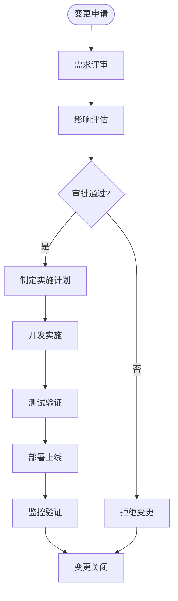
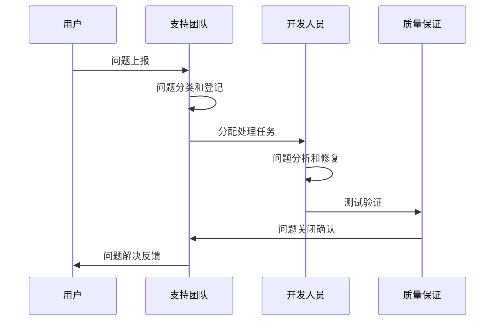
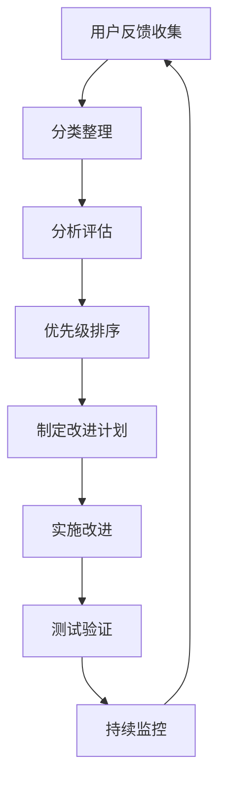

# 质量保证与风险管理

<cite>
**本文档引用的文件**
- [企业网站CMS系统开发需求文档.ini](file://企业网站CMS系统开发需求文档.ini)
- [企业网站CMS系统详细需求文档.md](file://企业网站CMS系统详细需求文档.md)
</cite>

## 目录
1. [项目概述](#项目概述)
2. [质量保证体系](#质量保证体系)
3. [风险管理策略](#风险管理策略)
4. [变更控制流程](#变更控制流程)
5. [问题跟踪机制](#问题跟踪机制)
6. [性能监控体系](#性能监控体系)
7. [用户体验评估](#用户体验评估)
8. [测试策略](#测试策略)
9. [安全质量保障](#安全质量保障)
10. [持续改进机制](#持续改进机制)
11. [结论](#结论)

## 项目概述

本企业网站CMS系统是一个基于Python Flask + Nginx + Windows Server的技术栈构建的内容管理系统。项目采用MVP（最小可行产品）策略，在8天紧凑时间内完成核心功能开发，包括用户权限管理、文章管理、媒体库、简化版可视化编辑器和前台展示页面。

项目采用前后端分离架构，后端提供RESTful API，前端支持React/Vue技术栈，系统具备多语言支持、SEO优化、性能优化等核心功能特性。

**章节来源**
- [企业网站CMS系统详细需求文档.md](file://企业网站CMS系统详细需求文档.md#L1-L50)

## 质量保证体系

### 代码质量标准

#### 编码规范
- **Python**: 遵循PEP 8编码规范，函数复杂度控制在10以内
- **JavaScript**: 使用ESLint进行代码质量检查
- **代码注释**: 注释覆盖率要求超过30%
- **命名规范**: 统一的变量、函数、类命名约定

#### 代码审查制度
- **Pull Request流程**: 所有代码变更必须通过Pull Request审查
- **审查标准**: 代码风格、功能正确性、性能影响、安全考虑
- **审查人员**: 至少一名资深开发者进行代码审查
- **审查时机**: 任何功能开发完成后必须经过代码审查

#### 版本控制管理
- **Git Flow**: 采用Git Flow分支管理模式
- **版本标签**: 使用语义化版本控制（SemVer）
- **提交规范**: 标准化的Git提交消息格式
- **分支策略**: develop、feature、release、hotfix分支管理

**章节来源**
- [企业网站CMS系统详细需求文档.md](file://企业网站CMS系统详细需求文档.md#L1442-L1460)

### 测试质量保障

#### 测试金字塔
- **单元测试**: 核心业务逻辑测试，覆盖率≥80%
- **集成测试**: API接口测试，使用Postman进行接口验证
- **端到端测试**: 用户操作流程测试
- **性能测试**: 响应时间、并发用户数测试

#### 测试环境管理
- **测试数据**: 使用独立的测试数据库
- **测试隔离**: 测试环境与生产环境完全隔离
- **自动化测试**: 关键功能的自动化回归测试

**章节来源**
- [企业网站CMS系统详细需求文档.md](file://企业网站CMS系统详细需求文档.md#L1825-L1833)

## 风险管理策略

### 技术风险识别与应对

#### Windows Server环境兼容性风险
- **风险等级**: 中等
- **概率**: 低
- **应对措施**:
  - 使用Waitress替代Gunicorn（Windows友好）
  - 提前在Windows环境进行全面测试
  - 准备Docker容器化方案作为备选方案

#### 拖拽编辑器性能风险
- **风险等级**: 高
- **概率**: 中等
- **应对措施**:
  - 使用虚拟滚动优化长列表性能
  - 实施组件懒加载机制
  - 限制单页组件数量在合理范围内
  - 建立性能监控和优化机制

#### 数据库性能瓶颈风险
- **风险等级**: 高
- **概率**: 中等
- **应对措施**:
  - 合理设计数据库索引策略
  - 实施查询优化和N+1问题预防
  - 部署Redis缓存层
  - 建立数据库性能监控

**章节来源**
- [企业网站CMS系统详细需求文档.md](file://企业网站CMS系统详细需求文档.md#L1867-L1894)

### 项目风险管控

#### 需求变更风险
- **风险等级**: 高
- **概率**: 中等
- **应对措施**:
  - 严格的变更评审流程
  - 预留20%的项目缓冲时间
  - 变更影响评估机制
  - 需求冻结期管理

#### 人员变动风险
- **风险等级**: 高
- **概率**: 低
- **应对措施**:
  - 完善的代码文档和注释
  - 知识共享和培训机制
  - 关键角色备份计划
  - 标准化的开发流程

**章节来源**
- [企业网站CMS系统详细需求文档.md](file://企业网站CMS系统详细需求文档.md#L1895-L1912)

### 安全风险防控

#### 数据泄露风险
- **风险等级**: 高
- **概率**: 低
- **应对措施**:
  - 定期安全开发培训
  - 代码安全审计机制
  - 渗透测试定期执行
  - 完善的日志监控系统

#### API安全风险
- **应对措施**:
  - JWT Token安全机制
  - Flask-Limiter限流配置
  - CSRF防护措施
  - 输入验证和过滤

**章节来源**
- [企业网站CMS系统详细需求文档.md](file://企业网站CMS系统详细需求文档.md#L1913-L1923)

## 变更控制流程

### 变更申请流程

#### 变更识别
- **变更类型**: 功能变更、性能优化、安全加固、文档更新
- **变更来源**: 客户需求、技术债务、合规要求、性能问题
- **变更影响评估**: 对现有功能、性能、安全的影响分析

#### 变更审批流程

#### 变更实施控制
- **版本管理**: 每个变更对应独立的版本标签
- **回滚机制**: 建立完整的变更回滚预案
- **变更记录**: 详细的变更日志和影响说明

**章节来源**
- [企业网站CMS系统详细需求文档.md](file://企业网站CMS系统详细需求文档.md#L1897-L1904)

## 问题跟踪机制

### 问题上报流程

#### 问题分类
- **紧急问题**: 系统崩溃、数据丢失、安全漏洞
- **高优先级**: 功能缺陷、性能严重下降
- **中优先级**: 用户界面问题、小功能异常
- **低优先级**: 界面微调、文档问题

#### 问题上报渠道
- **内部渠道**: Jira/Trello问题跟踪系统
- **外部渠道**: 邮件、电话、在线表单
- **自动监控**: 系统监控告警自动上报

#### 问题处理时限

#### 问题解决时限标准
- **紧急问题**: 4小时内响应，24小时内解决
- **高优先级**: 24小时内响应，72小时内解决
- **中优先级**: 48小时内响应，5个工作日内解决
- **低优先级**: 72小时内响应，2周内解决

**章节来源**
- [企业网站CMS系统详细需求文档.md](file://企业网站CMS系统详细需求文档.md#L1835-L1843)

## 性能监控体系

### 性能指标监控

#### 响应时间监控
- **页面加载时间**: 首页<2秒，内页<3秒
- **API响应时间**: <500ms
- **数据库查询时间**: <100ms
- **文件上传速度**: <5秒/5MB

#### 并发性能监控
- **并发用户数**: 支持1000+并发用户
- **QPS指标**: 500+每秒查询
- **数据库连接池**: 50连接池大小

#### 资源使用监控
- **内存使用**: <2GB
- **CPU使用**: <70%
- **磁盘IO**: <80%

### 性能优化策略

#### 缓存策略
- **页面缓存**: Redis全页面缓存
- **数据缓存**: 查询结果缓存
- **静态资源缓存**: 浏览器缓存策略
- **缓存失效**: 登录用户不缓存

#### 数据库优化
- **索引优化**: 合理的索引设计
- **查询优化**: 避免N+1查询问题
- **连接池配置**: 优化数据库连接管理

**章节来源**
- [企业网站CMS系统详细需求文档.md](file://企业网站CMS系统详细需求文档.md#L1362-L1380)

## 用户体验评估

### 用户体验指标

#### 功能可用性
- **任务完成率**: 用户能够顺利完成主要操作
- **错误率**: 用户操作错误发生频率
- **学习曲线**: 新用户掌握系统的时间
- **满意度评分**: 用户对系统的整体满意度

#### 界面友好性
- **导航清晰度**: 用户能够轻松找到所需功能
- **视觉层次**: 信息展示的优先级和层次
- **一致性**: 界面元素和交互的一致性
- **可访问性**: 对不同用户群体的友好程度

#### 性能体验
- **响应速度**: 系统响应的及时性
- **稳定性**: 系统运行的可靠性
- **离线能力**: 在网络不稳定时的表现
- **加载体验**: 页面加载和切换的流畅度

### 用户反馈收集

#### 反馈渠道
- **内置反馈**: 系统内的反馈收集功能
- **调查问卷**: 定期用户满意度调查
- **用户访谈**: 深入了解用户需求
- **行为分析**: 用户操作行为数据分析

#### 反馈处理流程

**章节来源**
- [企业网站CMS系统详细需求文档.md](file://企业网站CMS系统详细需求文档.md#L1424-L1441)

## 测试策略

### 测试类型与覆盖

#### 单元测试
- **测试范围**: 核心业务逻辑、数据处理函数
- **覆盖率**: ≥80%
- **测试框架**: pytest/unittest
- **测试数据**: 独立的测试数据库

#### 集成测试
- **API测试**: 使用Postman进行接口验证
- **数据库测试**: 数据库操作和事务处理
- **第三方服务测试**: 邮件、云存储等服务集成

#### 系统测试
- **功能测试**: 完整业务流程验证
- **兼容性测试**: 浏览器和设备兼容性
- **性能测试**: 压力测试和负载测试
- **安全测试**: 渗透测试和安全漏洞扫描

#### 用户验收测试
- **测试场景**: 基于用户故事的实际使用场景
- **验收标准**: 满足业务需求和用户体验要求
- **测试参与**: 业务用户参与测试过程

### 测试环境管理

#### 环境隔离
- **开发环境**: 开发人员专用环境
- **测试环境**: 集成测试专用环境
- **预生产环境**: 上线前最终验证环境
- **生产环境**: 正式运行环境

#### 测试数据管理
- **数据准备**: 测试所需的模拟数据
- **数据清理**: 测试完成后数据清理
- **数据安全**: 测试数据的安全保护

**章节来源**
- [企业网站CMS系统详细需求文档.md](file://企业网站CMS系统详细需求文档.md#L1806-L1825)

## 安全质量保障

### 安全防护体系

#### 认证与授权
- **JWT Token机制**: 2小时有效期的访问令牌
- **刷新令牌**: 7天有效期的刷新令牌
- **权限控制**: 基于角色的访问控制（RBAC）
- **会话管理**: Redis存储的会话管理

#### 数据安全
- **密码加密**: bcrypt加密，成本因子12
- **SQL注入防护**: ORM参数化查询
- **XSS防护**: 输入过滤和输出转义
- **CSRF防护**: Flask-WTF CSRF Token

#### 文件上传安全
- **文件类型验证**: 白名单文件类型检查
- **文件大小限制**: 50MB上传限制
- **文件名随机化**: 防止恶意文件名
- **病毒扫描**: 可选的文件病毒扫描

### 安全测试

#### 安全测试内容
- **渗透测试**: 模拟黑客攻击测试
- **漏洞扫描**: 自动化安全漏洞扫描
- **代码审计**: 人工代码安全审查
- **配置检查**: 安全配置检查和加固

#### 安全监控
- **日志监控**: 安全日志的实时监控
- **异常检测**: 异常登录和操作检测
- **入侵检测**: 入侵行为的自动检测
- **安全事件响应**: 安全事件的快速响应机制

**章节来源**
- [企业网站CMS系统详细需求文档.md](file://企业网站CMS系统详细需求文档.md#L1078-L1140)

## 持续改进机制

### 质量改进流程

#### 质量度量
- **代码质量指标**: 复杂度、重复率、注释率
- **测试质量指标**: 覆盖率、缺陷密度、测试执行率
- **性能指标**: 响应时间、吞吐量、资源利用率
- **用户满意度指标**: 用户评分、使用频率、留存率

#### 改进计划
- **定期回顾**: 每周质量回顾会议
- **趋势分析**: 质量指标的趋势分析
- **根因分析**: 问题的根本原因分析
- **改进实施**: 制定和实施改进措施

#### 知识管理
- **最佳实践**: 总结和分享开发最佳实践
- **经验教训**: 项目经验的总结和传承
- **培训计划**: 团队技能提升培训
- **文档更新**: 项目文档的持续更新

### 风险预警机制

#### 风险监控
- **风险识别**: 定期的风险识别和评估
- **风险量化**: 风险影响和概率的量化分析
- **风险跟踪**: 风险状态的持续跟踪
- **预警机制**: 风险超阈值的自动预警

#### 应急预案
- **应急响应**: 风险事件的快速响应机制
- **恢复计划**: 系统和服务的快速恢复
- **沟通机制**: 风险事件的内外部沟通
- **事后总结**: 风险事件的总结和改进

**章节来源**
- [企业网站CMS系统详细需求文档.md](file://企业网站CMS系统详细需求文档.md#L1865-L1924)

## 结论

本质量保证与风险管理文档建立了完善的项目质量管理体系和风险控制机制。通过明确的质量标准、严格的测试策略、全面的风险管控和有效的监控机制，确保企业网站CMS系统在8天MVP开发周期内能够高质量地交付。

关键要点包括：
- 建立了从代码规范到测试验证的完整质量保证体系
- 制定了针对Windows Server环境的特殊风险应对措施
- 建立了标准化的问题跟踪和变更控制流程
- 实施了多层次的性能监控和用户体验评估机制
- 完善了安全质量保障和持续改进机制

这些措施将确保项目在有限的时间内高质量完成，同时为后续的功能扩展和系统优化奠定坚实的基础。