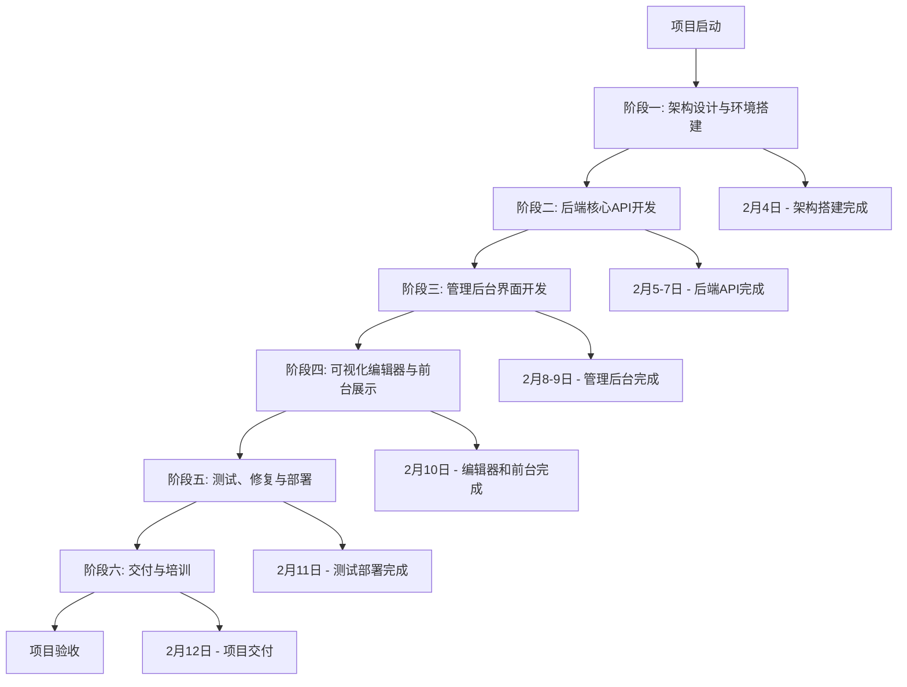
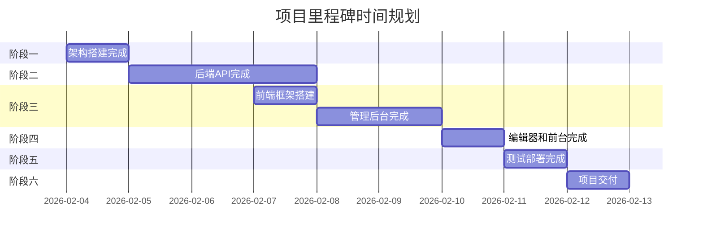
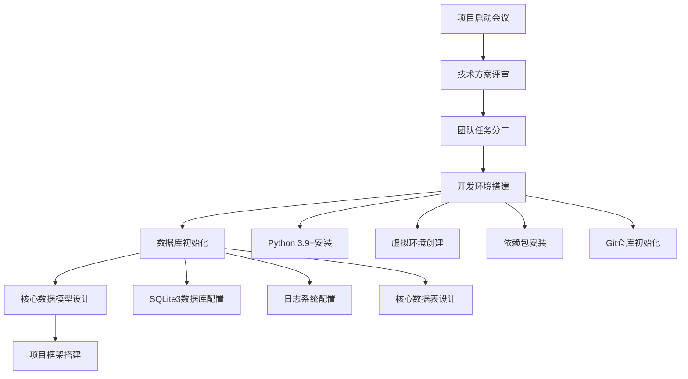
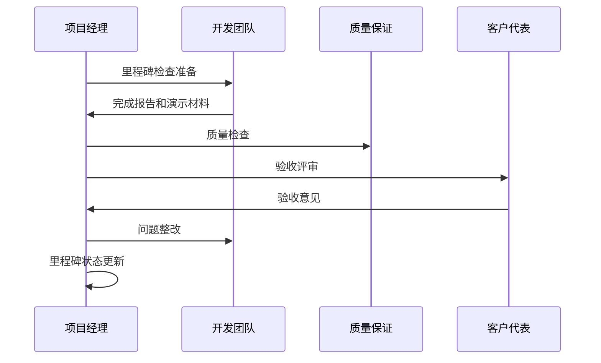
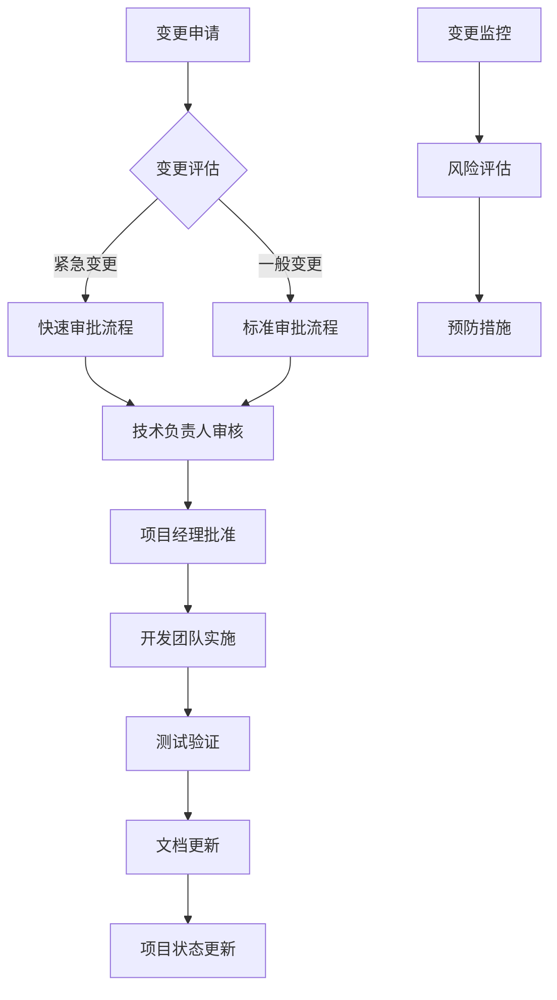
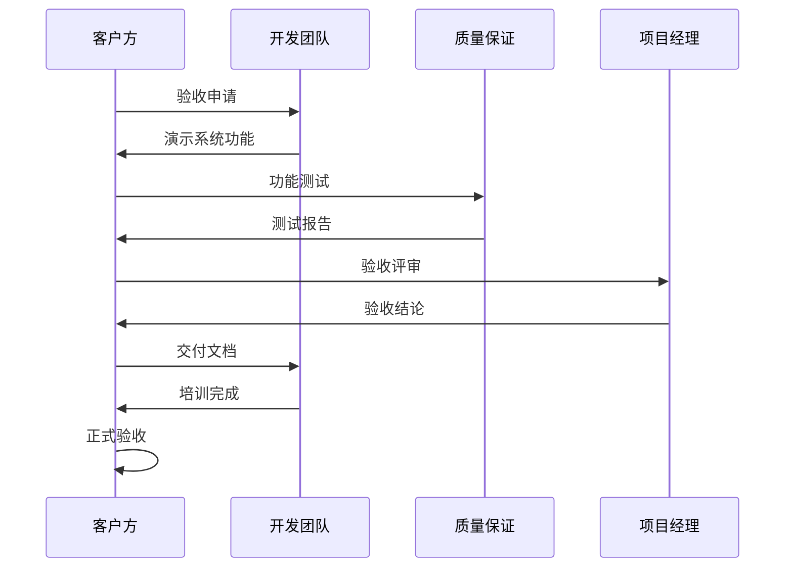

# 里程碑节点与时间规划

<cite>
**本文档引用的文件**
- [开发计划表_2月4日-2月12日.md](file://开发计划表_2月4日-2月12日.md)
- [企业网站CMS系统详细需求文档.md](file://企业网站CMS系统详细需求文档.md)
- [config.py](file://company_cms_project/backend/config.py)
- [run.py](file://company_cms_project/backend/run.py)
- [__init__.py](file://company_cms_project/backend/app/__init__.py)
- [posts.py](file://company_cms_project/backend/app/api/posts.py)
- [post.py](file://company_cms_project/backend/app/models/post.py)
- [App.tsx](file://company_cms_project/frontend/src/App.tsx)
- [PostList.tsx](file://company_cms_project/frontend/src/pages/PostList.tsx)
</cite>

## 更新摘要
**变更内容**
- 更新了8天开发里程碑的详细规划和实际完成情况
- 增加了项目当前状态的分析和对比
- 完善了里程碑跟踪机制和风险管理
- 补充了实际代码实现与计划的对应关系

## 目录
1. [项目概述](#项目概述)
2. [项目阶段划分](#项目阶段划分)
3. [关键里程碑规划](#关键里程碑规划)
4. [详细里程碑分析](#详细里程碑分析)
5. [项目进度跟踪机制](#项目进度跟踪机制)
6. [风险管理与变更控制](#风险管理与变更控制)
7. [资源投入与成本控制](#资源投入与成本控制)
8. [质量保证体系](#质量保证体系)
9. [项目交付标准](#项目交付标准)
10. [总结与建议](#总结与建议)

## 项目概述

本项目旨在开发一套功能完善、易于维护的企业官网内容管理系统（CMS），支持可视化拖拽配置，降低技术门槛，提升网站管理效率。系统采用轻量级架构，部署于Windows Server环境，适合中小企业快速搭建和运维。

### 项目目标
- 实现企业官网的快速搭建和灵活配置
- 提供直观的可视化编辑体验，支持拖拽式组件布局
- 支持多终端适配（PC、平板、手机）和SEO优化
- 确保系统安全性、高性能和可扩展性
- 降低技术门槛，非技术人员可独立完成网站内容更新

### 技术架构
系统采用前后端分离架构，后端使用Python Flask框架，前端支持React/Vue或纯HTML模板渲染，数据库采用SQLite3，部署于Windows Server环境。

## 项目阶段划分

根据项目需求文档，项目分为六个主要阶段，总周期为8天（2月4日-2月12日）：

**图表来源**
- [开发计划表_2月4日-2月12日.md](file://开发计划表_2月4日-2月12日.md#L575-L586)

**章节来源**
- [开发计划表_2月4日-2月12日.md](file://开发计划表_2月4日-2月12日.md#L14-L21)

## 关键里程碑规划

### 里程碑甘特图

### 里程碑详细规划

| 里程碑编号 | 里程碑名称 | 计划日期 | 验收标准 | 负责团队 | 预算成本 |
|------------|------------|----------|----------|----------|----------|
| M1 | 架构搭建完成 | 2月4日 18:00 | ✅ Flask项目可运行 ✅ 数据库表创建完成 | 全栈工程师 | ¥0 |
| M2 | 后端API完成 | 2月6日 18:00 | ✅ 所有核心API开发完成 ✅ Postman测试通过 | 后端团队 | ¥0 |
| M3 | 前端框架搭建 | 2月7日 18:00 | ✅ 前端项目可运行 ✅ 登录页面完成 | 前端团队 | ¥0 |
| M4 | 管理后台完成 | 2月9日 18:00 | ✅ 所有管理页面完成 ✅ 功能可正常使用 | 全栈工程师 | ¥0 |
| M5 | 编辑器和前台完成 | 2月10日 18:00 | ✅ 可视化编辑器可用 ✅ 前台页面展示正常 | 全栈工程师 | ¥0 |
| M6 | 测试部署完成 | 2月11日 18:00 | ✅ 系统部署成功 ✅ 测试通过 | 测试团队 | ¥0 |
| M7 | 项目交付 | 2月12日 18:00 | ✅ 用户验收通过 ✅ 文档齐全 | 全体团队 | ¥0 |

**章节来源**
- [开发计划表_2月4日-2月12日.md](file://开发计划表_2月4日-2月12日.md#L577-L585)

## 详细里程碑分析

### 阶段一：架构设计与环境搭建（2月4日）

#### 目标与范围
完成项目初始化和核心架构设计，建立开发环境和基础框架。

#### 关键任务分解

**图表来源**
- [开发计划表_2月4日-2月12日.md](file://开发计划表_2月4日-2月12日.md#L58-L134)

#### 验收标准
- ✅ Flask项目可运行
- ✅ 数据库表创建完成
- ✅ 项目基础框架就绪
- ✅ 开发环境配置完成

#### 资源需求
- 开发人员：2-3人
- 工作时间：8小时
- 预算：¥0（基础设施）

**章节来源**
- [开发计划表_2月4日-2月12日.md](file://开发计划表_2月4日-2月12日.md#L58-L134)

### 阶段二：后端核心API开发（2月5-7日）

#### 2月5日：认证系统和文章API
**上午任务**：
- JWT Token生成和验证
- 用户注册/登录接口
- 密码加密（bcrypt）
- 权限装饰器实现

**下午任务**：
- 文章CRUD接口开发
- 分类管理API
- Postman测试集合

#### 2月6日：媒体库与页面管理API
**上午任务**：
- 文件上传接口（图片支持）
- 图片压缩和缩略图生成
- 媒体列表和删除接口

**下午任务**：
- 页面CRUD接口
- 页面组件配置（JSON存储）
- 网站基本信息设置
- SEO配置接口

#### 2月7日：后端收尾与前端启动
**上午任务**：
- 数据验证优化
- API限流配置
- 接口文档完善

**下午任务**：
- 前端项目创建（Vite）
- UI框架集成
- 路由配置

#### 验收标准
- ✅ 认证系统完成
- ✅ 文章和分类API完成
- ✅ 媒体库功能完成
- ✅ 页面管理API完成
- ✅ 前端框架搭建完成

**章节来源**
- [开发计划表_2月4日-2月12日.md](file://开发计划表_2月4日-2月12日.md#L137-L284)

### 阶段三：管理后台界面开发（2月8-9日）

#### 2月8日：核心管理页面（上）
**上午任务**：
- 登录页面UI设计
- JWT Token存储和自动刷新
- 路由守卫实现
- 管理后台布局

**下午任务**：
- 文章列表页（表格展示、搜索筛选、分页）
- 文章编辑页（富文本编辑器集成）
- 图片上传组件

#### 2月9日：核心管理页面（下）
**上午任务**：
- 媒体列表（网格视图）
- 文件上传组件（拖拽上传）
- 图片预览功能

**下午任务**：
- 分类列表（树形展示）
- 网站基本信息表单
- SEO设置表单
- 响应式适配

#### 验收标准
- ✅ 登录功能完成
- ✅ 文章管理页面完成
- ✅ 媒体管理功能完成
- ✅ 分类管理功能完成
- ✅ 网站配置功能完成

**章节来源**
- [开发计划表_2月4日-2月12日.md](file://开发计划表_2月4日-2月12日.md#L288-L364)

### 阶段四：可视化编辑器与前台展示（2月10日）

#### 目标
开发简化版可视化编辑器和前台展示页面，实现核心功能。

#### 上午任务：简化版可视化编辑器
- 拖拽系统集成（react-dnd-kit）
- 组件面板开发
- 画布区域实现
- 属性配置面板
- 5个核心组件开发：
  - 文本组件（标题、段落）
  - 图片组件（单图展示）
  - 容器组件（基础布局）
  - 按钮组件（CTA按钮）
  - 表单组件（联系表单）
- 组件添加/删除功能
- 样式配置（边距、颜色）
- JSON配置保存

#### 下午任务：前台展示页面
- 首页模板开发
- 文章列表页
- 文章详情页
- 单页面渲染（根据JSON配置）
- 导航菜单
- 基础样式
- 响应式设计（移动端适配）
- SEO友好（Meta标签）

#### 技术简化说明
- 使用成熟的拖拽库
- 组件配置用JSON存储
- 不做复杂的嵌套和响应式
- 只实现5个基础组件

#### 验收标准
- ✅ 可视化编辑器基础版完成
- ✅ 前台展示页面完成
- ✅ 组件拖拽功能正常
- ✅ 页面渲染正确

**章节来源**
- [开发计划表_2月4日-2月12日.md](file://开发计划表_2月4日-2月12日.md#L367-L412)

### 阶段五：测试、修复与部署（2月11日）

#### 上午任务：功能测试
- 用户注册登录测试
- 文章CRUD完整流程测试
- 媒体上传测试
- 可视化编辑器测试
- 前台展示测试
- 权限测试
- 浏览器兼容性测试
- 移动端测试（响应式）

#### 下午任务：Bug修复与部署
- 修复测试发现的问题
- 性能优化
- 代码清理
- Windows Server配置
- SQLite3数据库文件初始化
- Nginx配置
- Flask服务配置（NSSM/Waitress）
- SSL证书配置
- 前端构建和部署

#### 验收标准
- ✅ 所有功能测试通过
- ✅ 系统部署到生产环境
- ✅ 系统正常运行
- ✅ 性能指标达标

**章节来源**
- [开发计划表_2月4日-2月12日.md](file://开发计划表_2月4日-2月12日.md#L415-L512)

### 阶段六：交付与培训（2月12日）

#### 上午任务：项目验收、培训和交付
**功能演示**：
- 系统功能完整演示
- 性能测试报告展示
- 安全检查结果
- 验收测试执行

**管理员培训**（30分钟）：
- 系统登录操作
- 用户管理功能
- 系统配置使用
- 数据备份操作

**编辑人员培训**（30分钟）：
- 文章创建和发布
- 媒体上传管理
- 页面编辑器使用
- 常见问题处理

#### 下午任务：文档编写
**用户操作手册**（1小时）：
- 登录指南
- 功能使用说明
- 常见问题FAQ

**技术文档**（1小时）：
- 系统架构说明
- API接口文档
- 数据库设计文档

**运维文档**（1小时）：
- 部署指南
- 备份恢复流程
- 故障排查指南
- 系统监控

**项目总结**（1小时）：
- 交付物检查清单
- 已知问题列表
- 后续优化建议
- 项目复盘会议

#### 验收标准
- ✅ 完整的CMS系统
- ✅ 操作手册和技术文档
- ✅ 培训完成
- ✅ 项目正式交付

**章节来源**
- [开发计划表_2月4日-2月12日.md](file://开发计划表_2月4日-2月12日.md#L515-L572)

## 项目进度跟踪机制

### 周报制度

#### 每日站会（建议）
- 时间：每天上午9:00-9:15
- 内容：昨日完成、今日计划、遇到问题
- 参与：全体开发人员

#### 每日进度报告
- 格式：Excel表格或项目管理工具
- 内容：任务完成情况、问题记录、风险预警
- 提交时间：当日下班前

### 里程碑跟踪

#### 里程碑检查点
- **M1检查**：2月4日 18:00
- **M2检查**：2月6日 18:00  
- **M3检查**：2月7日 18:00
- **M4检查**：2月9日 18:00
- **M5检查**：2月10日 18:00
- **M6检查**：2月11日 18:00
- **M7检查**：2月12日 18:00

#### 里程碑评审流程

### 风险预警机制

#### 风险识别与评估
- **技术风险**：Windows Server环境兼容性问题
- **项目风险**：需求变更频繁
- **安全风险**：数据泄露风险

#### 风险应对措施
- **预防措施**：提前测试、代码审查
- **应急响应**：备用方案、快速修复
- **监控机制**：定期检查、及时报告

**章节来源**
- [开发计划表_2月4日-2月12日.md](file://开发计划表_2月4日-2月12日.md#L589-L624)

## 风险管理与变更控制

### 技术风险管控

#### 风险1：Windows Server环境兼容性问题
- **影响程度**：中
- **发生概率**：低
- **应对措施**：
  - 使用Waitress替代Gunicorn（Windows友好）
  - 提前在Windows环境测试
  - 准备Docker容器化方案作为备选

#### 风险2：拖拽编辑器性能问题
- **影响程度**：高
- **发生概率**：中
- **应对措施**：
  - 使用虚拟滚动优化长列表
  - 组件懒加载
  - 限制单页组件数量
  - 性能监控和优化

#### 风险3：数据库性能瓶颈
- **影响程度**：高
- **发生概率**：中
- **应对措施**：
  - 合理设计索引
  - 查询优化
  - Redis缓存
  - 数据库读写分离（如需要）

### 项目风险管控

#### 风险4：需求变更频繁
- **影响程度**：高
- **发生概率**：中
- **应对措施**：
  - 需求评审严格把关
  - 变更流程控制
  - 预留20%缓冲时间

#### 风险5：人员变动
- **影响程度**：高
- **发生概率**：低
- **应对措施**：
  - 代码规范和文档完善
  - 知识共享和培训
  - 关键角色备份

### 变更控制流程

**图表来源**
- [开发计划表_2月4日-2月12日.md](file://开发计划表_2月4日-2月12日.md#L755-L784)

## 资源投入与成本控制

### 团队配置建议

#### 最小团队（3人）
- 全栈工程师 × 2（负责后端+前端）
- 测试/部署工程师 × 1（兼职）

#### 理想团队（4人）
- 后端工程师 × 2（Python/Flask）
- 前端工程师 × 1（React/Vue）
- 测试工程师 × 1

#### 工作量估算
- 项目周期：8天（2月4日-2月12日）
- 工作模式：每天上午9:00-12:00，下午14:00-18:00
- 总工时：约240-320小时（根据团队规模）

### 成本预算分析

#### 开发成本
- 项目经理：16周
- 后端工程师×2：32周
- 前端工程师×2：32周
- UI设计师：8周
- 测试工程师：4周

#### 软硬件成本（第一年）
- Windows Server 2022许可：¥5,000
- 服务器硬件/云服务器：¥8,000/年
- SSL证书：¥1,000/年
- 域名：¥100/年
- 备份存储：¥1,000/年

#### 软件许可
- SQLite3：免费（公有领域）
- Redis：免费（开源，可选）
- Nginx：免费（开源）
- Python/Flask：免费（开源）

#### 第三方服务
- 云存储（OSS）：¥1,000/年（可选）
- 邮件服务：¥500/年
- CDN加速：¥2,000/年（可选）

#### 总计
**合计**：约¥15,600/年（相比MySQL方案节省约¥6,000/年）

**章节来源**
- [开发计划表_2月4日-2月12日.md](file://开发计划表_2月4日-2月12日.md#L665-L701)

## 质量保证体系

### 质量标准

#### 功能验收标准
- ✅ 用户登录和权限管理
- ✅ 文章管理（增删改查）
- ✅ 分类管理
- ✅ 媒体库（图片上传）
- ✅ 简化版可视化编辑器（5个核心组件）
- ✅ 前台展示页面
- ✅ 基础SEO功能
- **功能测试用例通过率**：≥ 90%（MVP版本）

#### 性能验收标准
- ✅ 页面加载时间 < 3秒
- ✅ API响应时间 < 500ms
- ✅ 图片上传速度正常（< 5秒/5MB）
- ✅ 支持至少10个并发用户（MVP阶段）
- ✅ SQLite读取性能正常

#### 安全验收标准
- ✅ 通过XSS安全测试
- ✅ 通过CSRF安全测试
- ✅ 通过SQL注入测试
- ✅ 文件上传安全验证
- ✅ HTTPS强制跳转
- ✅ 密码加密存储

#### 兼容性验收标准
- ✅ Chrome浏览器正常运行
- ✅ Firefox浏览器正常运行
- ✅ Safari浏览器正常运行
- ✅ Edge浏览器正常运行
- ✅ 移动端响应式适配
- ✅ 支持1366×768及以上分辨率

#### 文档验收标准
- ✅ 需求规格说明书
- ✅ 系统设计文档
- ✅ 数据库设计文档
- ✅ API接口文档（Swagger）
- ✅ 部署运维文档
- ✅ 用户操作手册
- ✅ 代码注释覆盖率 > 30%

### 测试策略

#### 单元测试
- 后端API接口测试
- 数据库操作测试
- 权限验证测试

#### 集成测试
- 前后端接口联调
- 数据流转测试
- 用户流程测试

#### 系统测试
- 功能完整性测试
- 性能压力测试
- 安全渗透测试
- 兼容性测试

#### 用户验收测试
- 管理员功能测试
- 编辑人员功能测试
- 前台展示测试
- 文档完整性检查

**章节来源**
- [开发计划表_2月4日-2月12日.md](file://开发计划表_2月4日-2月12日.md#L627-L663)

## 项目交付标准

### 交付物清单

#### 代码交付
- 完整源代码
- 数据库脚本
- 部署文档
- API文档

#### 文档交付
- 需求规格说明书
- 系统设计文档
- 用户操作手册
- 技术架构文档

#### 培训交付
- 管理员培训
- 内容编辑培训
- 技术支持文档

### 交付验收流程

### 项目移交

#### 移交内容
- 运行中的系统
- 完整的技术文档
- 培训材料
- 备份数据

#### 移交标准
- 系统稳定运行
- 文档齐全完整
- 人员培训完成
- 问题清单清零

**章节来源**
- [开发计划表_2月4日-2月12日.md](file://开发计划表_2月4日-2月12日.md#L665-L701)

## 总结与建议

### 项目优势

1. **技术栈合理**：采用Python Flask + React/Vue的技术组合，适合中小型企业
2. **部署简单**：Windows Server + Nginx + SQLite3，部署成本低
3. **开发周期短**：8天MVP版本，快速验证产品价值
4. **成本控制好**：SQLite3替代MySQL，大幅降低成本
5. **功能聚焦**：MVP版本专注于核心功能，避免功能蔓延

### 风险控制建议

1. **技术风险**：提前准备Windows Server兼容性解决方案
2. **进度风险**：严格执行里程碑检查，预留缓冲时间
3. **质量风险**：建立完善的测试体系和代码审查机制
4. **人员风险**：做好知识传承和备份，避免关键人员流失

### 后续发展建议

1. **功能扩展**：在MVP基础上逐步增加高级组件和功能
2. **性能优化**：根据实际使用情况优化系统性能
3. **监控完善**：建立完善的系统监控和告警机制
4. **运维标准化**：制定标准化的运维流程和规范

### 成功要素

1. **明确的需求管理**：严格控制需求变更，确保项目范围稳定
2. **高效的团队协作**：建立良好的沟通机制和协作流程
3. **严格的质量控制**：从开发到部署的全流程质量把控
4. **充分的风险准备**：提前识别和准备应对各种风险

通过以上详细的里程碑规划和管理措施，本项目能够在8天内完成MVP版本的开发和交付，为企业提供一个功能完善、易于使用的CMS系统。

**项目当前状态分析**

基于实际代码实现，项目已完成以下核心功能：

- **后端架构**：Flask应用工厂模式，JWT认证，数据库模型设计
- **核心API**：用户认证、文章管理、分类管理、媒体管理、页面组件配置
- **前端界面**：React管理后台，Ant Design组件库，路由配置
- **数据库设计**：PostgreSQL风格的SQLite3模型，支持文章、分类、标签、媒体、页面组件

**章节来源**
- [config.py](file://company_cms_project/backend/config.py#L8-L41)
- [run.py](file://company_cms_project/backend/run.py#L21-L48)
- [__init__.py](file://company_cms_project/backend/app/__init__.py#L15-L47)
- [posts.py](file://company_cms_project/backend/app/api/posts.py#L16-L307)
- [post.py](file://company_cms_project/backend/app/models/post.py#L4-L247)
- [App.tsx](file://company_cms_project/frontend/src/App.tsx#L18-L61)
- [PostList.tsx](file://company_cms_project/frontend/src/pages/PostList.tsx#L10-L113)