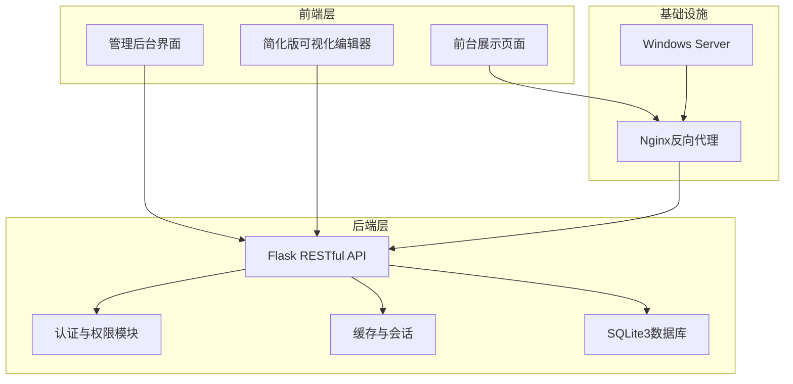
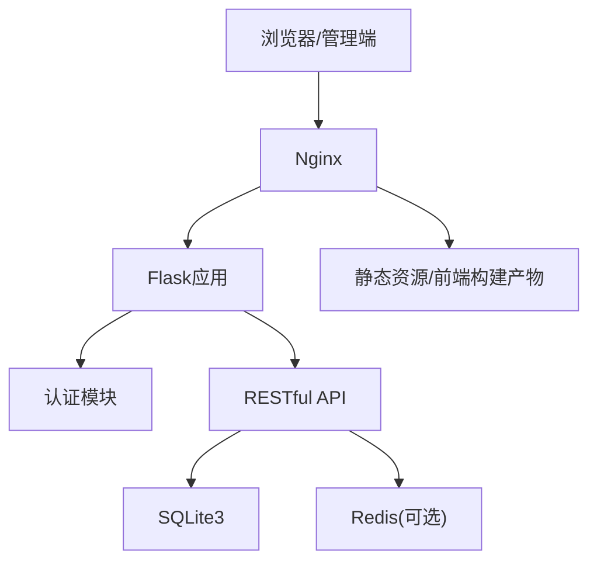
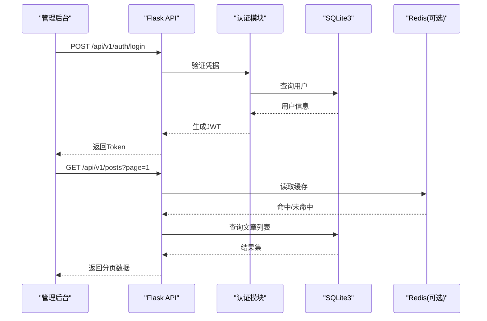
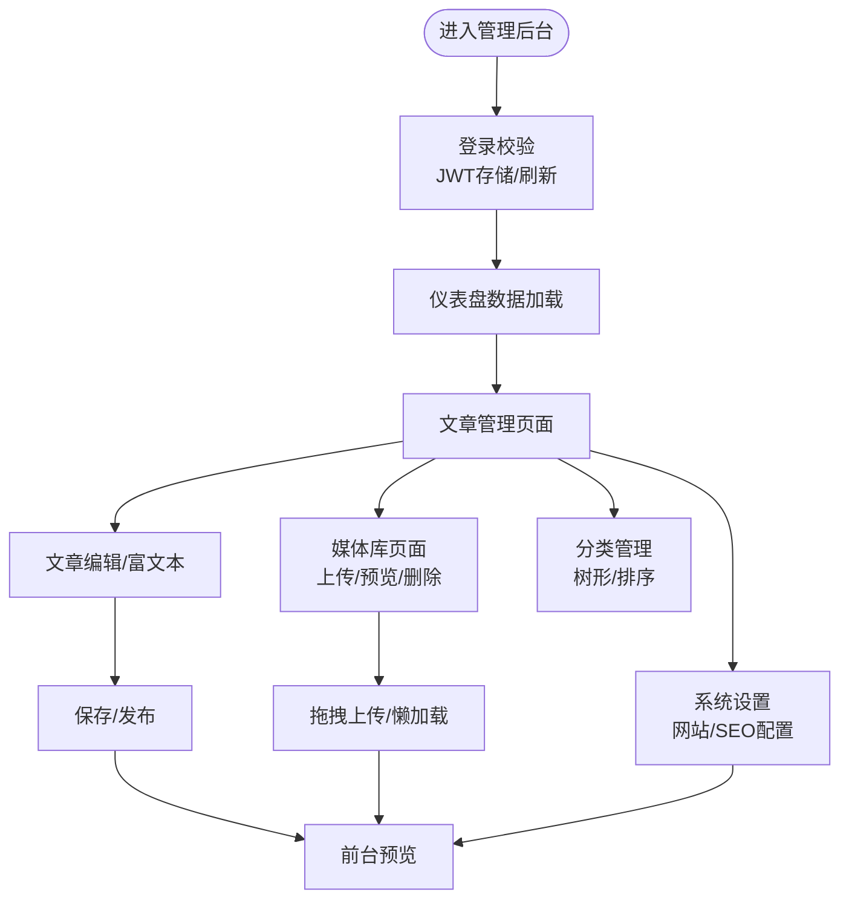
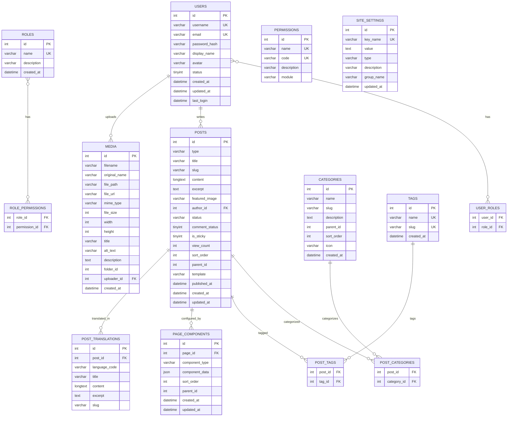
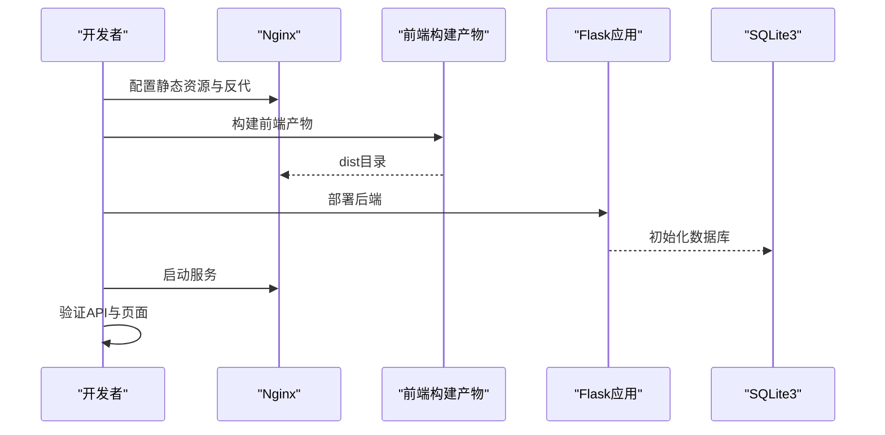
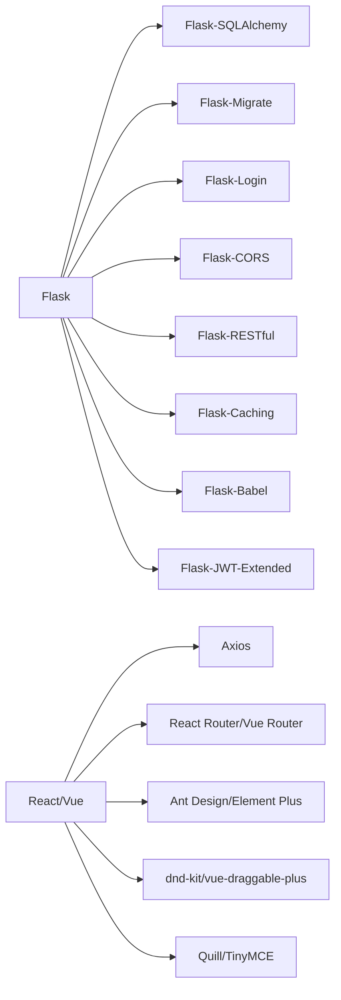

# 开发实施阶段

<cite>
**本文引用的文件**
- [企业网站CMS系统开发需求文档.ini](file://企业网站CMS系统开发需求文档.ini)
- [企业网站CMS系统详细需求文档.md](file://企业网站CMS系统详细需求文档.md)
- [开发计划表_2月4日-2月12日.md](file://开发计划表_2月4日-2月12日.md)
</cite>

## 目录
1. [引言](#引言)
2. [项目结构](#项目结构)
3. [核心组件](#核心组件)
4. [架构总览](#架构总览)
5. [详细组件分析](#详细组件分析)
6. [依赖关系分析](#依赖关系分析)
7. [性能考量](#性能考量)
8. [故障排查指南](#故障排查指南)
9. [结论](#结论)
10. [附录](#附录)

## 引言
本文件面向“开发实施阶段”，系统化梳理从编码实现到功能集成的完整开发流程，覆盖后端API开发、前端组件开发、数据库开发、系统集成以及开发规范与质量控制。文档依据项目需求与开发计划，结合技术架构与接口规范，给出可执行的实施路径与最佳实践，帮助团队在8天MVP周期内高质量交付。

## 项目结构
项目采用前后端分离架构，后端基于Python Flask + SQLite3，前端采用React/Vue + Vite，通过Nginx反向代理统一对外提供服务。开发计划将8天分为需求设计、后端开发、前端开发、可视化编辑器、测试部署、交付培训六个阶段，确保按里程碑推进。

**图表来源**
- [企业网站CMS系统详细需求文档.md](file://企业网站CMS系统详细需求文档.md#L28-L57)
- [开发计划表_2月4日-2月12日.md](file://开发计划表_2月4日-2月12日.md#L92-L105)

**章节来源**
- [开发计划表_2月4日-2月12日.md](file://开发计划表_2月4日-2月12日.md#L10-L22)
- [企业网站CMS系统详细需求文档.md](file://企业网站CMS系统详细需求文档.md#L22-L57)

## 核心组件
- 后端API层：提供认证、内容管理、媒体库、页面配置、系统设置等RESTful接口，统一JSON响应格式与JWT鉴权。
- 前端管理后台：基于React/Vue，采用Ant Design/Element Plus，实现登录、仪表盘、文章管理、媒体库、分类管理、系统设置等页面。
- 可视化编辑器：简化版拖拽编辑器，支持基础组件（文本、图片、容器、按钮、表单）的添加、删除与样式配置。
- 前台展示：根据页面组件配置渲染，支持响应式布局与SEO基础配置。
- 数据库：SQLite3作为主数据库，配合Redis（可选）实现缓存与会话；使用FTS5虚拟表实现全文检索。
- 部署与运维：Nginx反向代理、Windows服务注册（NSSM）、Waitress WSGI服务器、日志与备份策略。

**章节来源**
- [开发计划表_2月4日-2月12日.md](file://开发计划表_2月4日-2月12日.md#L137-L189)
- [企业网站CMS系统详细需求文档.md](file://企业网站CMS系统详细需求文档.md#L940-L1076)

## 架构总览
系统采用前后端分离架构，后端提供RESTful API，前端通过HTTP客户端调用接口；Nginx统一接入，负责静态资源、HTTPS终止、Gzip压缩与反向代理。认证采用JWT，权限控制基于RBAC模型，数据库使用SQLite3，高并发场景可引入Redis缓存。

**图表来源**
- [企业网站CMS系统详细需求文档.md](file://企业网站CMS系统详细需求文档.md#L43-L56)
- [开发计划表_2月4日-2月12日.md](file://开发计划表_2月4日-2月12日.md#L440-L506)

**章节来源**
- [企业网站CMS系统详细需求文档.md](file://企业网站CMS系统详细需求文档.md#L22-L57)
- [开发计划表_2月4日-2月12日.md](file://开发计划表_2月4日-2月12日.md#L440-L506)

## 详细组件分析

### 后端API开发
- 接口规范：统一JSON请求/响应格式、HTTP状态码、分页结构；API前缀为/api/v1/，鉴权采用Bearer Token。
- 认证与权限：
  - JWT：Access Token短时效，Refresh Token较长，支持刷新与登出。
  - 权限装饰器：@login_required，RBAC模型，角色-权限映射。
- 核心模块：
  - 用户管理：注册、登录、刷新、当前用户信息、分配角色。
  - 文章管理：列表、详情、创建、更新、删除、批量删除、状态变更。
  - 页面管理：页面CRUD、组件配置（JSON存储）、状态管理。
  - 分类/标签：树形分类、标签管理。
  - 媒体库：上传、列表、详情、更新、删除、批量上传。
  - 系统配置：网站设置、SEO配置、备份与恢复。
- 错误处理：统一异常捕获、返回标准错误码与消息；接口文档与单元测试（时间允许时）。

**图表来源**
- [企业网站CMS系统详细需求文档.md](file://企业网站CMS系统详细需求文档.md#L940-L1076)
- [开发计划表_2月4日-2月12日.md](file://开发计划表_2月4日-2月12日.md#L150-L174)

**章节来源**
- [企业网站CMS系统详细需求文档.md](file://企业网站CMS系统详细需求文档.md#L940-L1076)
- [开发计划表_2月4日-2月12日.md](file://开发计划表_2月4日-2月12日.md#L137-L189)

### 前端组件开发
- 技术栈：React/Vue + TypeScript + Vite + Ant Design/Element Plus + Axios + 路由与状态管理。
- 管理后台页面：
  - 登录与路由守卫：JWT存储、自动刷新、权限拦截。
  - 仪表盘：基础数据统计。
  - 文章管理：表格、搜索筛选、分页、批量操作、富文本编辑器集成。
  - 媒体库：网格视图、拖拽上传、图片预览、懒加载、批量删除。
  - 分类管理：树形展示、拖拽排序。
  - 系统设置：网站信息与SEO配置。
- 响应式与交互：Bootstrap/Tailwind或UI库栅格系统，Modal确认、Loading状态、错误提示优化。
- 可视化编辑器：组件面板、画布区域、属性面板；基础拖拽（react-dnd-kit）、组件添加/删除、样式配置、保存为JSON。

**图表来源**
- [开发计划表_2月4日-2月12日.md](file://开发计划表_2月4日-2月12日.md#L292-L360)

**章节来源**
- [开发计划表_2月4日-2月12日.md](file://开发计划表_2月4日-2月12日.md#L288-L364)

### 数据库开发
- 选型与优势：SQLite3单文件、零配置、ACID事务、简化部署与备份；适合中小规模网站。
- 核心表结构：
  - 用户与权限：users、roles、permissions、user_roles、role_permissions。
  - 内容管理：posts、categories、post_categories、tags、post_tags。
  - 媒体库：media。
  - 页面配置：page_components、site_settings。
  - 多语言：post_translations。
- 全文检索：FTS5虚拟表与触发器同步，支持关键词搜索。
- 索引与优化：常见查询字段建立索引，避免N+1查询，慢查询日志。
- 备份与恢复：数据库文件复制备份，保留策略与云存储归档。

**图表来源**
- [企业网站CMS系统详细需求文档.md](file://企业网站CMS系统详细需求文档.md#L714-L904)

**章节来源**
- [企业网站CMS系统详细需求文档.md](file://企业网站CMS系统详细需求文档.md#L660-L938)

### 系统集成工作
- 前后端联调：接口契约一致（请求/响应格式、鉴权头、分页结构），使用Postman与Swagger验证；前端路由守卫与权限拦截。
- 第三方服务集成：邮件SMTP配置、可选云存储SDK（阿里云OSS/腾讯云COS/七牛云）；文件上传安全策略（类型白名单、大小限制、随机化文件名）。
- API对接：Nginx反向代理/api/到后端服务，静态资源指向前端构建目录；WebSocket支持（如需）。
- 部署集成：Windows服务（NSSM）注册Flask应用，Waitress作为WSGI服务器；SSL/TLS、CSP、HSTS等安全头配置。

**图表来源**
- [开发计划表_2月4日-2月12日.md](file://开发计划表_2月4日-2月12日.md#L440-L506)

**章节来源**
- [开发计划表_2月4日-2月12日.md](file://开发计划表_2月4日-2月12日.md#L440-L506)

## 依赖关系分析
- 后端依赖：Flask生态（SQLAlchemy、Migrate、Login、WTF、CORS、RESTful、Caching、Babel、JWT-Extended），Pillow、bcrypt、requests、waitress等。
- 前端依赖：React/Vue + TypeScript + Vite + UI库 + Axios + 路由与状态管理 + 拖拽库 + 富文本编辑器。
- 基础设施：Nginx、Windows Server、Redis（可选）、日志与备份。

**图表来源**
- [企业网站CMS系统详细需求文档.md](file://企业网站CMS系统详细需求文档.md#L555-L622)

**章节来源**
- [企业网站CMS系统详细需求文档.md](file://企业网站CMS系统详细需求文档.md#L555-L622)

## 性能考量
- 响应时间：页面加载<3秒，API响应<500ms，数据库查询<100ms；图片上传速度合理。
- 缓存策略：Redis缓存（可选）用于页面与数据缓存，登录用户不缓存；静态资源浏览器缓存与版本化。
- 资源优化：图片懒加载、响应式图片、WebP、CSS/JS压缩合并、关键CSS内联。
- 数据库优化：索引优化、避免N+1查询、慢查询日志、SQLite WAL模式。
- 并发与部署：Waitress（Windows友好）、多worker进程、负载均衡（可选）。

**章节来源**
- [企业网站CMS系统详细需求文档.md](file://企业网站CMS系统详细需求文档.md#L1360-L1441)
- [开发计划表_2月4日-2月12日.md](file://开发计划表_2月4日-2月12日.md#L440-L506)

## 故障排查指南
- 认证问题：检查JWT生成/刷新流程、Token存储与过期策略、CORS与SameSite配置。
- 数据库问题：确认SQLite文件路径与权限、FTS5触发器是否同步、索引是否存在。
- 文件上传问题：检查文件类型白名单、大小限制、存储路径权限、缩略图生成。
- 前端联调问题：核对API前缀、鉴权头、分页字段、错误提示与Loading状态。
- 部署问题：确认Nginx反代配置、静态资源路径、Windows服务状态、SSL证书与日志。

**章节来源**
- [企业网站CMS系统详细需求文档.md](file://企业网站CMS系统详细需求文档.md#L1078-L1140)
- [开发计划表_2月4日-2月12日.md](file://开发计划表_2月4日-2月12日.md#L440-L506)

## 结论
本开发实施阶段文档基于MVP策略，在8天内完成认证、内容管理、媒体库、简化版可视化编辑器与前台展示的核心功能，并配套完善的接口规范、数据库设计、部署与运维方案。通过严格的里程碑与质量控制，确保项目按时高质量交付，并为后续V2版本的功能增强与性能优化奠定基础。

## 附录
- 快速启动指南：后端克隆、虚拟环境、依赖安装、数据库初始化、开发服务器启动；前端依赖安装、开发与构建命令；默认账号提醒。
- 交付清单：源代码、requirements/package.json、环境变量模板、数据库文件、部署配置、API文档、运维文档、用户手册、培训记录。

**章节来源**
- [开发计划表_2月4日-2月12日.md](file://开发计划表_2月4日-2月12日.md#L850-L907)