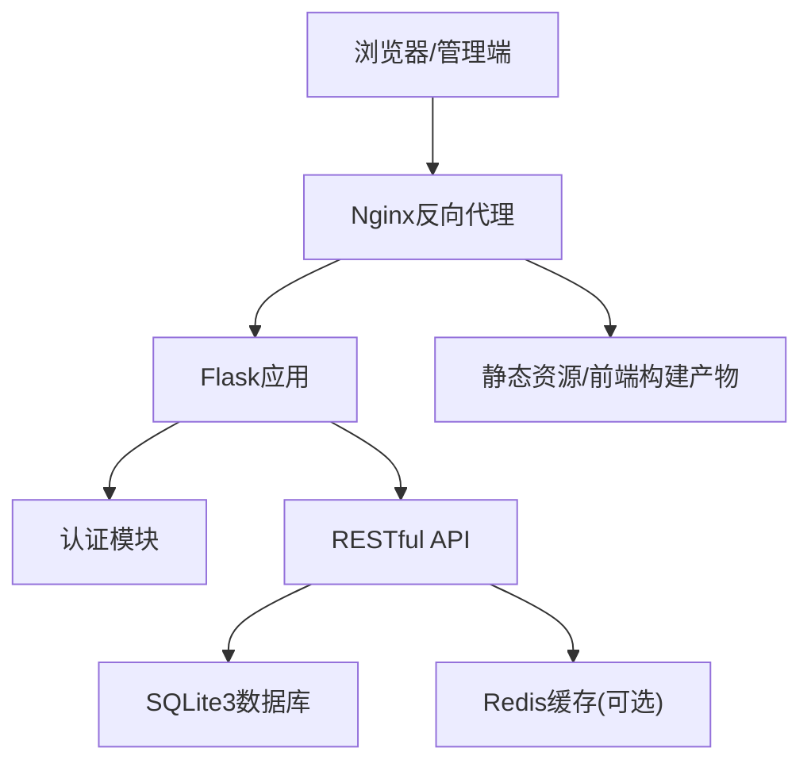
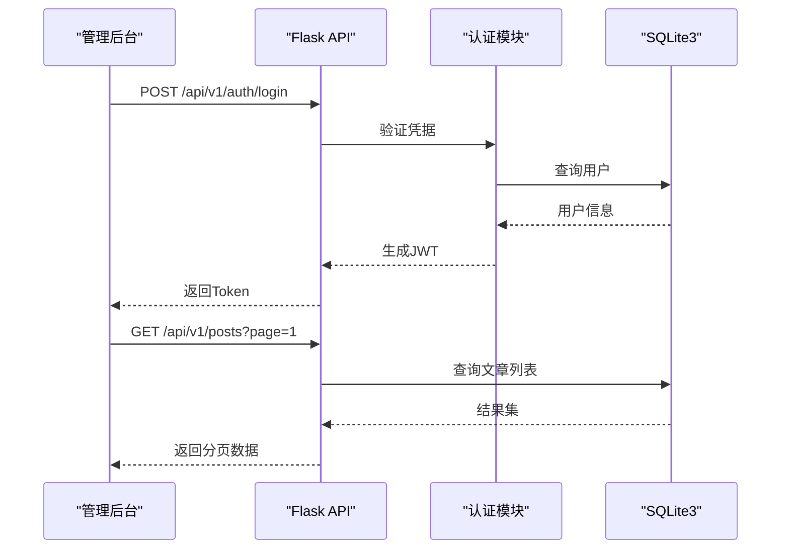
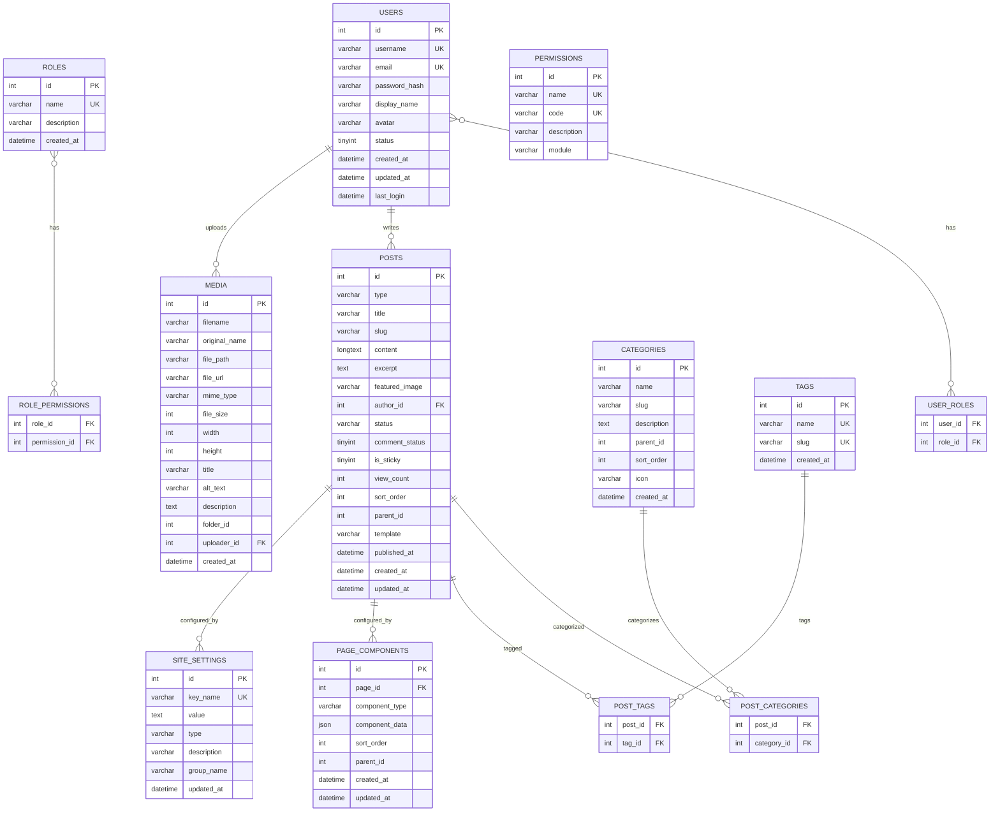
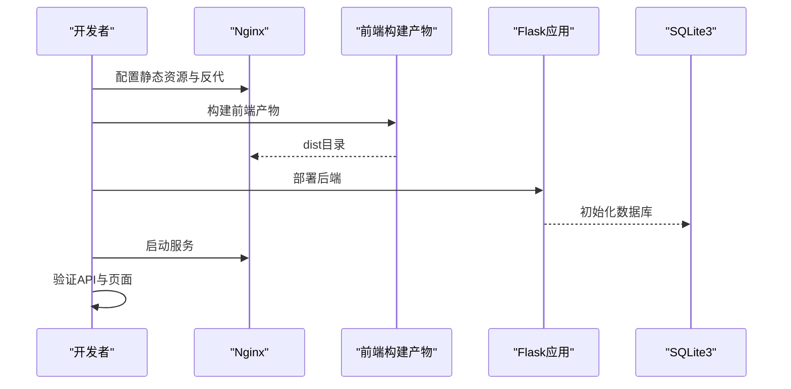
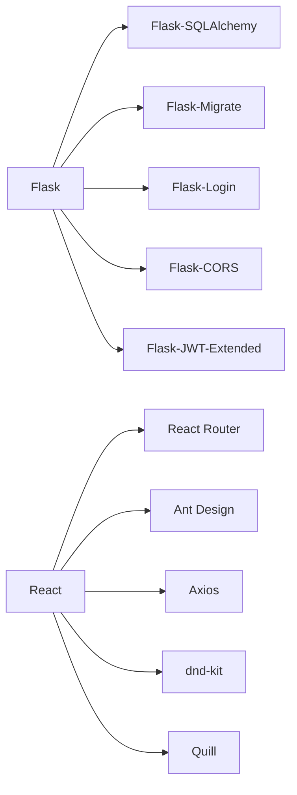

# 开发实施阶段

<cite>
**本文引用的文件**
- [开发计划表_2月4日-2月12日.md](file://docs/开发计划表_2月4日-2月12日.md)
- [企业网站CMS系统详细需求文档.md](file://docs/企业网站CMS系统详细需求文档.md)
- [企业网站CMS系统开发需求文档.ini](file://docs/企业网站CMS系统开发需求文档.ini)
- [config.py](file://company_cms_project/backend/config.py)
- [run.py](file://company_cms_project/backend/run.py)
- [__init__.py](file://company_cms_project/backend/app/__init__.py)
- [posts.py](file://company_cms_project/backend/app/api/posts.py)
- [post.py](file://company_cms_project/backend/app/models/post.py)
- [App.tsx](file://company_cms_project/frontend/src/App.tsx)
</cite>

## 更新摘要
**变更内容**
- 更新了8天MVP开发计划的详细实施流程
- 新增了完整的项目阶段划分和里程碑管理
- 完善了前后端开发的具体任务安排
- 增强了可视化编辑器和前台展示的开发指导
- 补充了测试部署和交付培训的详细流程

## 目录
1. [引言](#引言)
2. [项目概览](#项目概览)
3. [8天MVP开发计划](#8天mvp开发计划)
4. [核心组件](#核心组件)
5. [架构总览](#架构总览)
6. [详细组件分析](#详细组件分析)
7. [依赖关系分析](#依赖关系分析)
8. [性能考量](#性能考量)
9. [故障排查指南](#故障排查指南)
10. [结论](#结论)
11. [附录](#附录)

## 引言
本文件面向"开发实施阶段"，基于完整的8天MVP开发计划，系统化梳理从编码实现到功能集成的完整开发流程。项目采用敏捷开发方法，严格按照里程碑推进，确保在紧凑的时间内高质量交付企业网站CMS系统的最小可行产品。

## 项目概览

### 项目周期与目标
- **项目周期**: 2026年2月4日 ~ 2026年2月12日 (8天)
- **交付日期**: 2026年2月12日
- **技术栈**: Python Flask + SQLite3 + Nginx + Windows Server
- **开发策略**: MVP(最小可行产品)策略，聚焦核心功能

### 团队配置
- **最小团队(3人)**: 全栈工程师×2 + 测试/部署工程师×1
- **理想团队(4人)**: 后端工程师×2 + 前端工程师×1 + 测试工程师×1

### MVP功能范围
**必须实现**:
- ✅ 用户登录/权限管理
- ✅ 文章管理(CRUD)
- ✅ 分类管理
- ✅ 媒体库(图片上传)
- ✅ 简化版可视化编辑器(3-5个核心组件)
- ✅ 前台展示页面
- ✅ 基础SEO功能

**V2版本延后**:
- ⏸ 高级组件(轮播图、Tab等)
- ⏸ 多语言支持
- ⏸ 复杂权限控制
- ⏸ 数据统计图表
- ⏸ 高级SEO功能

**章节来源**
- [开发计划表_2月4日-2月12日.md](file://docs/开发计划表_2月4日-2月12日.md#L3-L53)

## 8天MVP开发计划

### 阶段一：需求设计与架构搭建 (第1天)
**目标**: 完成项目初始化和核心架构设计

**上午 (9:00-12:00)** - 需求确认与技术方案评审
- 团队会议，确认MVP功能范围
- 技术方案评审
- 任务分工明确

**下午 (14:00-18:00)** - 开发环境搭建
- 安装Python 3.9+, 创建虚拟环境
- 安装依赖包(Flask, SQLAlchemy等)
- Git仓库初始化
- IDE配置(VSCode/PyCharm)
- 前端环境(Node.js, npm/yarn)

**核心产出**:
```
company_cms/
├── backend/          # Flask后端
├── frontend/         # React/Vue前端
├── requirements.txt
├── .gitignore
└── README.md
```

**章节来源**
- [开发计划表_2月4日-2月12日.md](file://docs/开发计划表_2月4日-2月12日.md#L58-L134)

### 阶段二：后端核心API开发 (第2-3天)
**目标**: 完成认证系统和基础CRUD API

**第2天 (2月5日)** - 用户认证系统
- JWT Token生成和验证
- 用户注册接口
- 用户登录接口
- Token刷新接口
- 密码加密(bcrypt)
- 权限装饰器(@login_required)

**第3天 (2月6日)** - 媒体库与页面管理API
- 文件上传接口(支持图片)
- 图片压缩和缩略图生成(Pillow)
- 媒体列表接口
- 页面管理API
- 系统配置API

**章节来源**
- [开发计划表_2月4日-2月12日.md](file://docs/开发计划表_2月4日-2月12日.md#L137-L238)

### 阶段三：前端开发与集成 (第4-6天)
**目标**: 完成管理后台界面和可视化编辑器

**第4天 (2月7日)** - 后端收尾与前端启动
- 后端功能完善(数据验证、API限流、缓存配置)
- 前端项目初始化(React/Vue + Vite + UI框架)

**第5天 (2月8日)** - 管理后台界面开发(上)
- 登录页面与路由守卫
- 管理后台布局
- 首页仪表盘
- 文章管理页面

**第6天 (2月9日)** - 管理后台界面开发(下)
- 媒体库页面
- 分类管理页面
- 系统设置页面
- 界面优化

**章节来源**
- [开发计划表_2月4日-2月12日.md](file://docs/开发计划表_2月4日-2月12日.md#L242-L364)

### 阶段四：可视化编辑器与前台展示 (第7天)
**目标**: 完成简化版编辑器和前台页面

**上午 (9:00-12:00)** - 简化版可视化编辑器
**MVP组件库**(仅5个核心组件):
1. 文本组件: 标题、段落(富文本)
2. 图片组件: 单图展示
3. 容器组件: 基础布局容器
4. 按钮组件: CTA按钮
5. 表单组件: 联系表单

**下午 (14:00-18:00)** - 前台展示页面
- 首页模板
- 文章列表页
- 文章详情页
- 导航菜单
- 基础样式

**章节来源**
- [开发计划表_2月4日-2月12日.md](file://docs/开发计划表_2月4日-2月12日.md#L367-L412)

### 阶段五：测试部署与交付 (第8-9天)
**目标**: 全面测试、Bug修复、生产环境部署

**第8天 (2月11日)** - 测试、修复与部署
- 功能测试与兼容性测试
- Bug修复与性能优化
- 生产环境部署

**第9天 (2月12日)** - 交付与培训
- 项目验收
- 用户培训
- 文档编写与项目总结

**章节来源**
- [开发计划表_2月4日-2月12日.md](file://docs/开发计划表_2月4日-2月12日.md#L415-L571)

## 核心组件

### 后端API层
- **认证与权限**: JWT Token管理，@login_required装饰器，RBAC权限控制
- **内容管理**: 文章CRUD、分类管理、标签系统
- **媒体库**: 图片上传、缩略图生成、文件管理
- **页面管理**: JSON组件配置、页面状态管理
- **系统配置**: 网站设置、SEO配置、备份恢复

### 前端管理后台
- **技术栈**: React + TypeScript + Vite + Ant Design
- **核心页面**: 登录、仪表盘、文章管理、媒体库、分类管理、系统设置
- **交互功能**: 表格、表单、模态框、拖拽上传、富文本编辑

### 可视化编辑器
- **简化版拖拽**: react-dnd-kit拖拽库
- **核心组件**: 文本、图片、容器、按钮、表单
- **配置存储**: JSON格式组件配置
- **实时预览**: 编辑模式与预览模式切换

### 前台展示系统
- **响应式设计**: 移动端适配
- **SEO优化**: Meta标签、友好URL
- **页面渲染**: 根据JSON配置动态渲染

**章节来源**
- [开发计划表_2月4日-2月12日.md](file://docs/开发计划表_2月4日-2月12日.md#L34-L53)
- [企业网站CMS系统详细需求文档.md](file://docs/企业网站CMS系统详细需求文档.md#L61-L233)

## 架构总览

系统采用前后端分离架构，后端提供RESTful API，前端通过HTTP客户端调用接口；Nginx统一接入，负责静态资源、HTTPS终止、Gzip压缩与反向代理。



**图表来源**
- [企业网站CMS系统详细需求文档.md](file://docs/企业网站CMS系统详细需求文档.md#L22-L57)
- [开发计划表_2月4日-2月12日.md](file://docs/开发计划表_2月4日-2月12日.md#L440-L506)

**章节来源**
- [企业网站CMS系统详细需求文档.md](file://docs/企业网站CMS系统详细需求文档.md#L22-L57)
- [开发计划表_2月4日-2月12日.md](file://docs/开发计划表_2月4日-2月12日.md#L440-L506)

## 详细组件分析

### 后端API开发

#### 认证系统
- **JWT配置**: Access Token短时效(2小时)，Refresh Token长时效(30天)
- **用户管理**: 注册、登录、刷新、登出、当前用户信息
- **权限控制**: @login_required装饰器，RBAC模型

#### 内容管理API
- **文章管理**: 列表(支持分页、筛选、搜索)、详情、创建、更新、删除
- **分类管理**: 树形结构、创建/更新/删除
- **标签系统**: 标签管理、文章关联

#### 媒体库API
- **文件上传**: 支持JPG、PNG、GIF、WebP格式，最大5MB
- **图片处理**: 自动缩略图生成(300x300)
- **媒体管理**: 列表、详情、更新、删除



**图表来源**
- [企业网站CMS系统详细需求文档.md](file://docs/企业网站CMS系统详细需求文档.md#L940-L1076)
- [开发计划表_2月4日-2月12日.md](file://docs/开发计划表_2月4日-2月12日.md#L150-L174)

**章节来源**
- [开发计划表_2月4日-2月12日.md](file://docs/开发计划表_2月4日-2月12日.md#L137-L189)
- [posts.py](file://company_cms_project/backend/app/api/posts.py#L16-L308)

### 前端组件开发

#### 管理后台页面
- **登录与路由**: JWT存储、自动刷新、权限拦截
- **仪表盘**: 基础数据统计
- **文章管理**: 表格、搜索筛选、分页、批量操作
- **媒体库**: 网格视图、拖拽上传、图片预览
- **分类管理**: 树形展示、拖拽排序
- **系统设置**: 网站信息与SEO配置

#### 可视化编辑器
- **组件面板**: 左侧拖拽组件
- **画布区域**: 中间编辑区域
- **属性面板**: 右侧样式配置
- **基础拖拽**: react-dnd-kit实现
- **样式配置**: 边距、颜色、字体等


**图表来源**
- [开发计划表_2月4日-2月12日.md](file://docs/开发计划表_2月4日-2月12日.md#L292-L360)

**章节来源**
- [开发计划表_2月4日-2月12日.md](file://docs/开发计划表_2月4日-2月12日.md#L288-L364)
- [App.tsx](file://company_cms_project/frontend/src/App.tsx#L18-L62)

### 数据库开发

#### SQLite3选型
- **零配置**: 单文件数据库，无需安装服务
- **简化部署**: 随应用一起部署
- **轻松备份**: 直接复制.db文件
- **ACID支持**: 完整事务支持

#### 核心表结构
- **用户与权限**: users、roles、permissions、user_roles、role_permissions
- **内容管理**: posts、categories、post_categories、tags、post_tags
- **媒体库**: media
- **页面配置**: page_components、site_settings



**图表来源**
- [企业网站CMS系统详细需求文档.md](file://docs/企业网站CMS系统详细需求文档.md#L714-L904)

**章节来源**
- [企业网站CMS系统详细需求文档.md](file://docs/企业网站CMS系统详细需求文档.md#L660-L938)
- [post.py](file://company_cms_project/backend/app/models/post.py#L4-L248)

### 系统集成工作

#### 前后端联调
- **接口契约**: 统一JSON格式、HTTP状态码、分页结构
- **鉴权机制**: Bearer Token、CORS配置
- **路由守卫**: 前端权限拦截、自动刷新

#### 部署集成
- **Windows环境**: Waitress WSGI服务器、NSSM服务管理
- **Nginx配置**: 反向代理、静态资源、HTTPS
- **文件存储**: D:/cms/media/目录结构



**图表来源**
- [开发计划表_2月4日-2月12日.md](file://docs/开发计划表_2月4日-2月12日.md#L440-L506)

**章节来源**
- [开发计划表_2月4日-2月12日.md](file://docs/开发计划表_2月4日-2月12日.md#L440-L506)

## 依赖关系分析

### 后端依赖
- **Flask生态**: Flask-SQLAlchemy、Flask-Migrate、Flask-Login、Flask-CORS
- **认证**: Flask-JWT-Extended、bcrypt
- **文件处理**: Pillow、requests
- **WSGI服务器**: Waitress(Windows友好)

### 前端依赖
- **React生态**: React Router、Ant Design、Axios
- **拖拽**: dnd-kit、react-beautiful-dnd
- **富文本**: Quill、TinyMCE
- **状态管理**: Redux Toolkit、Zustand

### 基础设施
- **Web服务器**: Nginx 1.24+
- **操作系统**: Windows Server 2019/2022
- **进程管理**: NSSM服务管理器



**图表来源**
- [企业网站CMS系统详细需求文档.md](file://docs/企业网站CMS系统详细需求文档.md#L555-L622)

**章节来源**
- [企业网站CMS系统详细需求文档.md](file://docs/企业网站CMS系统详细需求文档.md#L555-L622)

## 性能考量

### 性能指标
- **页面加载**: < 3秒
- **API响应**: < 500ms
- **图片上传**: 正常速度(< 5秒/5MB)
- **并发用户**: 支持至少10个并发用户

### 优化策略
- **缓存策略**: Redis缓存(可选)、页面缓存、静态资源缓存
- **资源优化**: 图片懒加载、响应式图片、WebP格式
- **数据库优化**: 索引优化、避免N+1查询、SQLite WAL模式
- **部署优化**: Waitress服务器、多worker进程

**章节来源**
- [开发计划表_2月4日-2月12日.md](file://docs/开发计划表_2月4日-2月12日.md#L715-L728)
- [企业网站CMS系统详细需求文档.md](file://docs/企业网站CMS系统详细需求文档.md#L1360-L1441)

## 故障排查指南

### 常见问题
- **认证问题**: JWT生成/刷新流程、Token存储、CORS配置
- **数据库问题**: SQLite文件路径、索引、权限
- **文件上传**: 文件类型验证、大小限制、存储权限
- **前端联调**: API前缀、鉴权头、分页字段
- **部署问题**: Nginx配置、Windows服务、SSL证书

### 质量保证
- **代码规范**: PEP 8、ESLint配置、Git提交规范
- **测试策略**: 单元测试、功能测试、用户验收测试
- **每日检查**: 代码提交、任务进度、问题记录

**章节来源**
- [开发计划表_2月4日-2月12日.md](file://docs/开发计划表_2月4日-2月12日.md#L627-L662)
- [企业网站CMS系统详细需求文档.md](file://docs/企业网站CMS系统详细需求文档.md#L1078-L1140)

## 结论
本开发实施阶段文档基于8天MVP开发计划，在紧凑的时间内完成认证、内容管理、媒体库、简化版可视化编辑器与前台展示的核心功能。通过严格的里程碑管理、每日站会和并行开发，确保项目按时高质量交付。完整的测试部署流程和用户培训计划为后续V2版本的功能增强奠定了坚实基础。

## 附录

### 快速启动指南
**后端启动**:
```bash
# 克隆代码
git clone <repository>
cd backend

# 创建虚拟环境
python -m venv venv
venv\Scripts\activate  # Windows
# pip install -r requirements.txt

# 初始化数据库
flask db upgrade
python init_data.py

# 启动开发服务器
flask run
# 访问: http://localhost:5000
```

**前端启动**:
```bash
# 安装依赖
cd frontend
npm install

# 启动开发服务器
npm run dev
# 访问: http://localhost:3000

# 生产构建
npm run build
```

**默认账号**:
```
用户名: admin
密码: admin123
```

### 交付清单
- **代码交付**: 完整源代码、requirements/package.json、.env.example
- **数据库交付**: SQLite数据库文件、表结构文档、迁移脚本
- **部署交付**: 生产环境、Nginx配置、Windows服务配置
- **文档交付**: 用户手册、API文档、部署运维文档
- **培训交付**: 管理员培训记录、编辑人员培训记录

**章节来源**
- [开发计划表_2月4日-2月12日.md](file://docs/开发计划表_2月4日-2月12日.md#L850-L907)