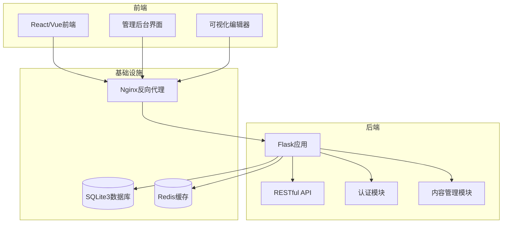
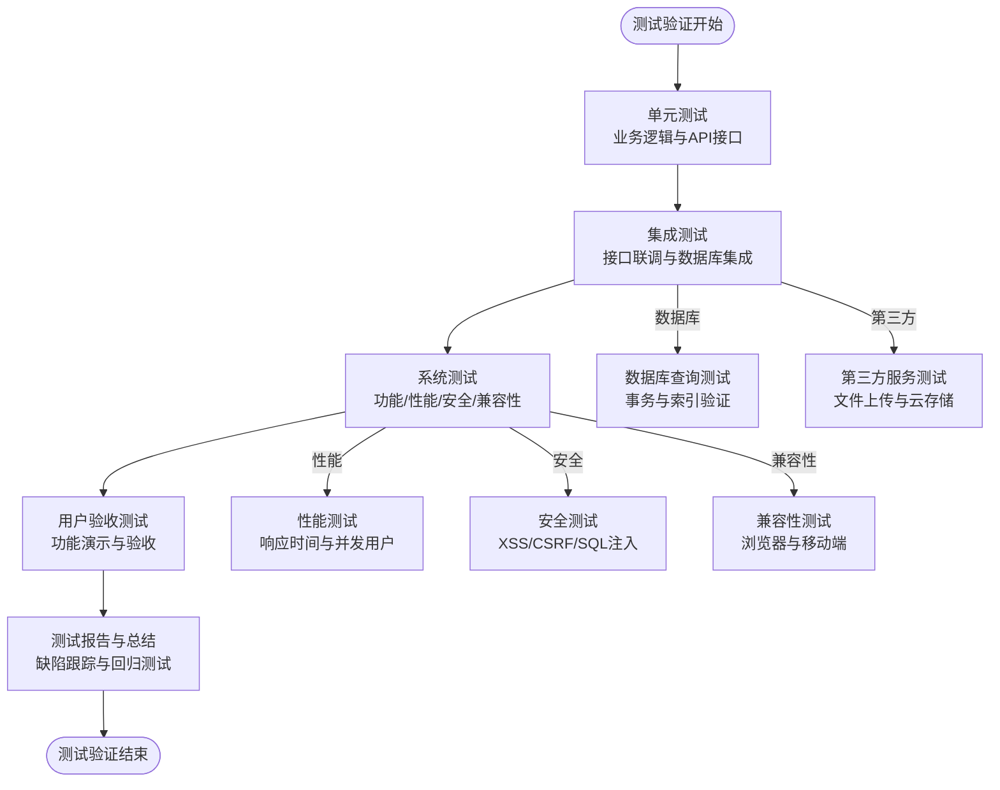
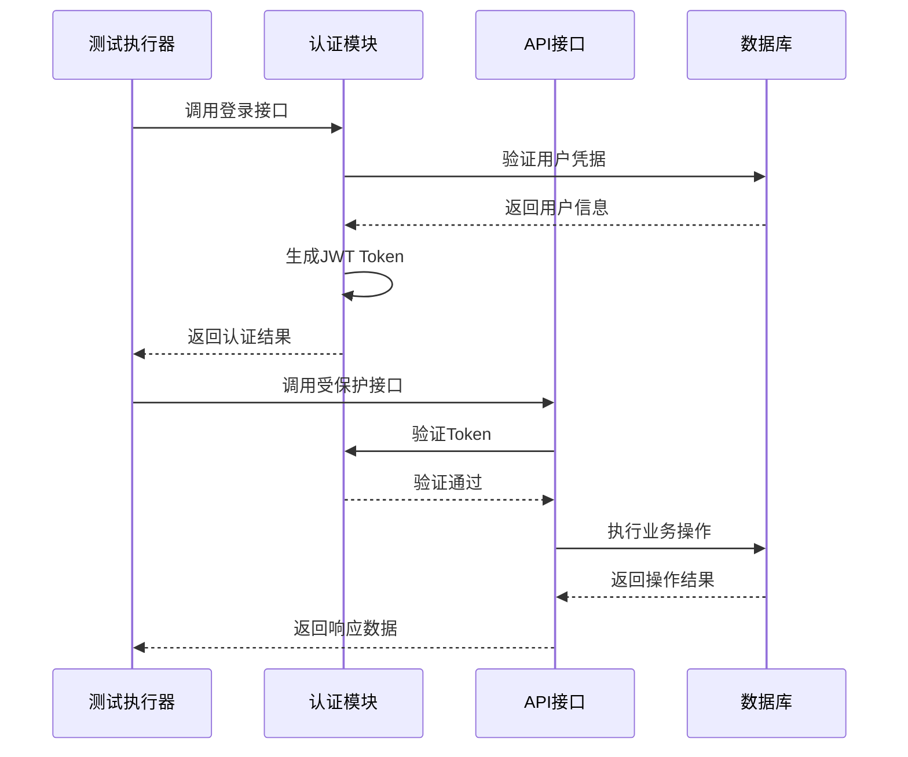
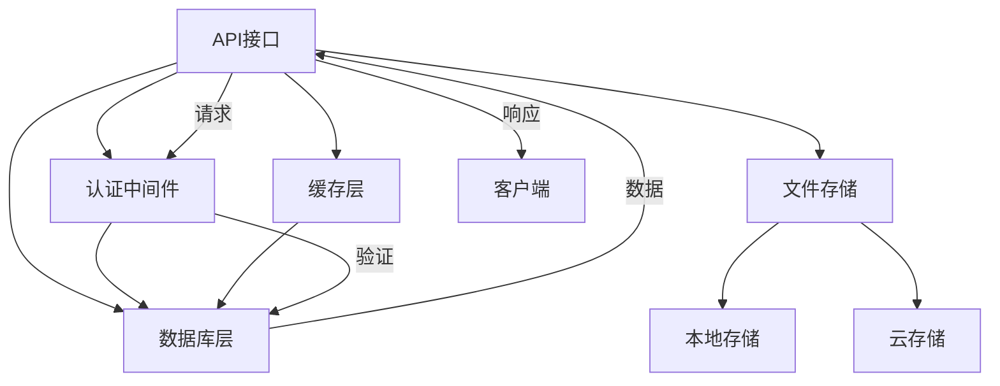
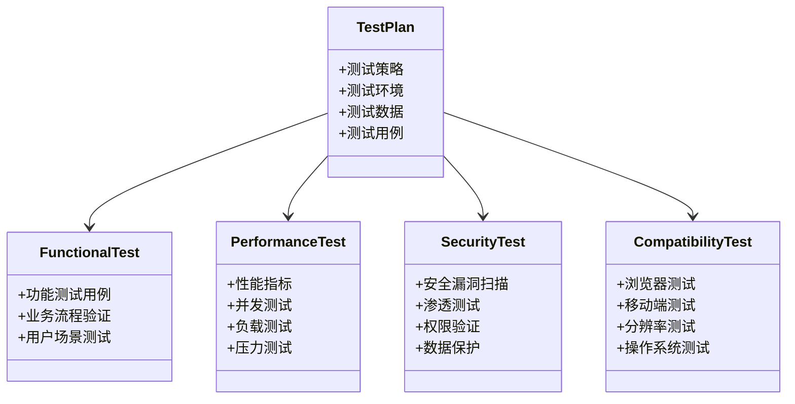
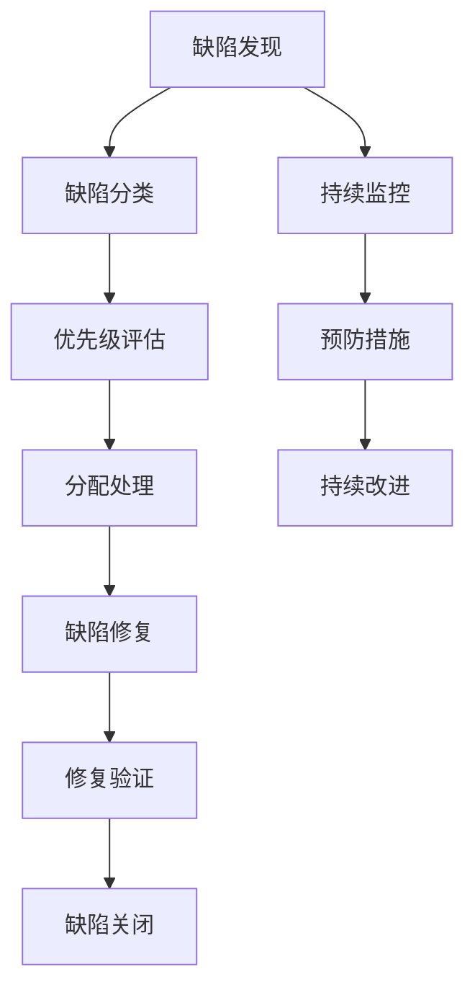
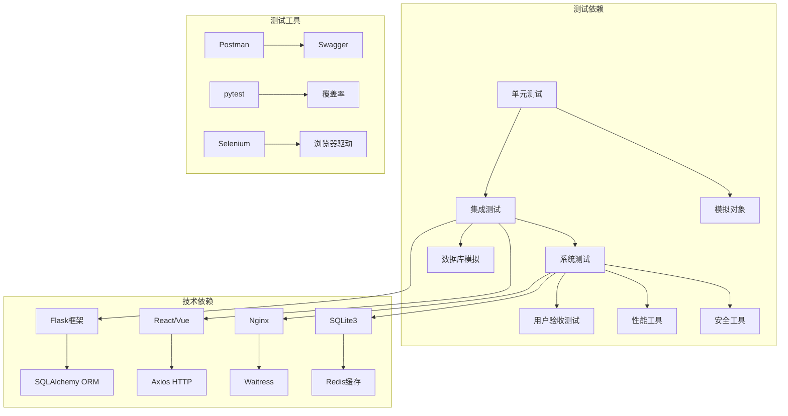

# 测试验证阶段

<cite>
**本文档引用的文件**
- [企业网站CMS系统开发需求文档.ini](file://企业网站CMS系统开发需求文档.ini)
- [企业网站CMS系统详细需求文档.md](file://企业网站CMS系统详细需求文档.md)
- [开发计划表_2月4日-2月12日.md](file://开发计划表_2月4日-2月12日.md)
</cite>

## 目录
1. [引言](#引言)
2. [项目结构](#项目结构)
3. [核心组件](#核心组件)
4. [架构总览](#架构总览)
5. [详细组件分析](#详细组件分析)
6. [依赖关系分析](#依赖关系分析)
7. [性能考量](#性能考量)
8. [故障排除指南](#故障排除指南)
9. [结论](#结论)
10. [附录](#附录)

## 引言
本文件面向企业网站CMS系统的测试验证阶段，提供从单元测试到系统验收的完整测试流程指导。文档基于项目需求文档和开发计划表，结合MVP（最小可行产品）策略，制定了覆盖功能测试、性能测试、安全测试、兼容性测试以及缺陷管理与测试报告的质量保证体系。测试策略强调在8天紧凑开发周期内的快速迭代与持续验证，确保系统按时高质量交付。

## 项目结构
项目采用前后端分离架构，后端基于Python Flask + SQLite3，前端采用React/Vue技术栈，通过Nginx进行反向代理和静态资源服务。开发计划明确了各阶段的测试重点与验收标准，确保测试活动与开发进度紧密衔接。

**图表来源**
- [企业网站CMS系统详细需求文档.md](file://企业网站CMS系统详细需求文档.md#L22-L57)
- [开发计划表_2月4日-2月12日.md](file://开发计划表_2月4日-2月12日.md#L92-L105)

**章节来源**
- [企业网站CMS系统详细需求文档.md](file://企业网站CMS系统详细需求文档.md#L22-L57)
- [开发计划表_2月4日-2月12日.md](file://开发计划表_2月4日-2月12日.md#L92-L105)

## 核心组件
测试验证阶段的核心组件包括：
- 认证与权限测试：JWT登录、权限装饰器、角色权限验证
- 内容管理API测试：文章CRUD、分类管理、媒体库上传
- 可视化编辑器测试：组件拖拽、布局配置、属性面板
- 前台展示测试：页面渲染、SEO标签、响应式适配
- 系统配置测试：网站设置、SEO配置、备份管理

**章节来源**
- [开发计划表_2月4日-2月12日.md](file://开发计划表_2月4日-2月12日.md#L150-L174)
- [开发计划表_2月4日-2月12日.md](file://开发计划表_2月4日-2月12日.md#L205-L212)

## 架构总览
测试验证阶段遵循"自底向上"的测试金字塔原则：
- 单元测试：核心业务逻辑与API接口验证（时间充裕时）
- 集成测试：接口联调、数据库集成、第三方服务测试
- 系统测试：功能测试、性能测试、安全测试、兼容性测试
- 验收测试：用户验收测试与质量评估

**图表来源**
- [开发计划表_2月4日-2月12日.md](file://开发计划表_2月4日-2月12日.md#L636-L648)
- [企业网站CMS系统详细需求文档.md](file://企业网站CMS系统详细需求文档.md#L1381-L1441)

## 详细组件分析

### 测试策略制定
测试策略基于MVP原则，在8天开发周期内合理分配测试资源：

#### 测试类型选择
- **单元测试**：核心业务逻辑与API接口验证（时间充裕时）
- **集成测试**：接口联调、数据库集成、第三方服务测试
- **系统测试**：功能测试、性能测试、安全测试、兼容性测试
- **验收测试**：用户验收测试与质量评估

#### 测试环境准备
- **开发环境**：Python虚拟环境 + Flask应用 + SQLite3数据库
- **测试环境**：独立的测试数据库实例
- **生产环境**：Windows Server + Nginx + Waitress/Gunicorn
- **监控工具**：日志系统、性能监控、错误追踪

#### 测试数据准备
- **用户数据**：管理员、编辑者、访客角色
- **内容数据**：文章、分类、媒体文件
- **配置数据**：网站设置、SEO配置、权限规则
- **测试用例**：正向用例、边界用例、异常用例

**章节来源**
- [开发计划表_2月4日-2月12日.md](file://开发计划表_2月4日-2月12日.md#L636-L648)
- [开发计划表_2月4日-2月12日.md](file://开发计划表_2月4日-2月12日.md#L441-L506)

### 单元测试实施
单元测试重点关注核心业务逻辑与API接口的正确性：

#### 后端API测试
- **认证接口测试**：注册、登录、登出、Token刷新
- **文章管理测试**：CRUD操作、分页筛选、状态管理
- **分类管理测试**：树形结构、父子关系、排序功能
- **媒体库测试**：文件上传、类型验证、缩略图生成

#### 前端组件测试
- **管理后台组件**：表格、表单、模态框、路由守卫
- **可视化编辑器**：拖拽功能、组件配置、属性面板
- **前台展示组件**：页面渲染、SEO标签、响应式布局

#### 数据库查询测试
- **ORM模型测试**：数据模型定义、关系映射
- **查询优化测试**：索引使用、慢查询日志
- **事务测试**：ACID特性验证、并发写入

**图表来源**
- [开发计划表_2月4日-2月12日.md](file://开发计划表_2月4日-2月12日.md#L150-L157)
- [开发计划表_2月4日-2月12日.md](file://开发计划表_2月4日-2月12日.md#L167-L174)

**章节来源**
- [开发计划表_2月4日-2月12日.md](file://开发计划表_2月4日-2月12日.md#L150-L174)
- [开发计划表_2月4日-2月12日.md](file://开发计划表_2月4日-2月12日.md#L205-L212)

### 集成测试执行
集成测试验证模块间的协同工作能力：

#### 接口联调测试
- **认证流程测试**：登录→Token验证→权限检查
- **内容流程测试**：创建→编辑→发布→展示
- **文件流程测试**：上传→处理→存储→访问

#### 数据库集成测试
- **事务一致性测试**：多表关联操作的原子性
- **索引性能测试**：查询优化与索引使用
- **并发控制测试**：SQLite并发写入限制

#### 第三方服务测试
- **文件上传测试**：本地存储与云存储切换
- **CDN集成测试**：静态资源加速与缓存策略
- **邮件服务测试**：SMTP配置与邮件发送

**图表来源**
- [企业网站CMS系统详细需求文档.md](file://企业网站CMS系统详细需求文档.md#L555-L594)
- [开发计划表_2月4日-2月12日.md](file://开发计划表_2月4日-2月12日.md#L441-L499)

**章节来源**
- [企业网站CMS系统详细需求文档.md](file://企业网站CMS系统详细需求文档.md#L555-L594)
- [开发计划表_2月4日-2月12日.md](file://开发计划表_2月4日-2月12日.md#L441-L499)

### 系统测试开展
系统测试全面验证系统的功能、性能、安全和兼容性：

#### 功能测试
- **用户登录测试**：用户名密码验证、Token管理
- **文章管理测试**：CRUD完整流程、批量操作
- **媒体库测试**：文件上传、预览、删除
- **可视化编辑器测试**：组件拖拽、布局配置、保存

#### 性能测试
- **页面加载测试**：响应时间、并发用户支持
- **API性能测试**：接口响应时间、吞吐量
- **数据库性能测试**：查询响应、连接池使用
- **文件上传测试**：上传速度、并发限制

#### 安全测试
- **XSS防护测试**：输入过滤与输出转义
- **CSRF防护测试**：Token验证机制
- **SQL注入测试**：ORM参数化查询
- **文件上传安全测试**：类型检查与大小限制

#### 兼容性测试
- **浏览器兼容性**：Chrome、Firefox、Safari、Edge
- **移动端适配**：响应式设计、触摸操作
- **分辨率支持**：1366×768及以上
- **操作系统兼容**：Windows Server环境

**图表来源**
- [开发计划表_2月4日-2月12日.md](file://开发计划表_2月4日-2月12日.md#L642-L648)
- [企业网站CMS系统详细需求文档.md](file://企业网站CMS系统详细需求文档.md#L1825-L1851)

**章节来源**
- [开发计划表_2月4日-2月12日.md](file://开发计划表_2月4日-2月12日.md#L642-L648)
- [企业网站CMS系统详细需求文档.md](file://企业网站CMS系统详细需求文档.md#L1825-L1851)

### 缺陷管理与测试报告
缺陷管理贯穿整个测试过程，确保问题及时发现、跟踪和解决：

#### 缺陷跟踪
- **缺陷分类**：功能缺陷、性能问题、安全漏洞、兼容性问题
- **严重程度**：阻塞性、高优先级、中优先级、低优先级
- **生命周期**：发现→分析→修复→验证→关闭
- **跟踪工具**：项目管理工具中的缺陷跟踪看板

#### 回归测试
- **测试范围**：修复的功能、相关功能、系统整体
- **测试策略**：自动化回归测试 + 手动回归测试
- **测试时机**：每次修复后、集成测试前、验收测试前
- **测试用例**：覆盖主要业务流程和关键功能

#### 测试总结
- **测试结果统计**：通过率、缺陷密度、修复率
- **质量评估**：功能完整性、性能达标率、安全合规性
- **经验总结**：测试过程中的问题与改进措施
- **后续建议**：V2版本的功能增强与优化方向

**图表来源**
- [开发计划表_2月4日-2月12日.md](file://开发计划表_2月4日-2月12日.md#L658-L662)
- [开发计划表_2月4日-2月12日.md](file://开发计划表_2月4日-2月12日.md#L787-L800)

**章节来源**
- [开发计划表_2月4日-2月12日.md](file://开发计划表_2月4日-2月12日.md#L658-L662)
- [开发计划表_2月4日-2月12日.md](file://开发计划表_2月4日-2月12日.md#L787-L800)

## 依赖关系分析
测试验证阶段涉及多个层面的依赖关系：

**图表来源**
- [企业网站CMS系统详细需求文档.md](file://企业网站CMS系统详细需求文档.md#L555-L594)
- [开发计划表_2月4日-2月12日.md](file://开发计划表_2月4日-2月12日.md#L811-L814)

**章节来源**
- [企业网站CMS系统详细需求文档.md](file://企业网站CMS系统详细需求文档.md#L555-L594)
- [开发计划表_2月4日-2月12日.md](file://开发计划表_2月4日-2月12日.md#L811-L814)

## 性能考量
基于项目需求文档中的性能要求，测试验证阶段重点关注以下性能指标：

### 性能测试指标
- **页面加载时间**：< 3秒
- **API响应时间**：< 500ms
- **并发用户支持**：≥ 10个（MVP阶段）
- **数据库查询响应**：< 100ms
- **图片上传速度**：< 5秒/5MB

### 性能优化策略
- **缓存策略**：Redis页面缓存、数据缓存、静态资源缓存
- **数据库优化**：索引优化、查询优化、连接池配置
- **静态资源优化**：CDN加速、压缩合并、懒加载
- **并发处理**：Waitress异步处理、SQLite WAL模式

**章节来源**
- [企业网站CMS系统详细需求文档.md](file://企业网站CMS系统详细需求文档.md#L100-L103)
- [开发计划表_2月4日-2月12日.md](file://开发计划表_2月4日-2月12日.md#L717-L720)

## 故障排除指南
针对测试过程中可能遇到的问题，提供相应的故障排除方法：

### 常见问题与解决方案
- **认证失败**：检查JWT配置、Token有效期、用户状态
- **数据库连接问题**：验证SQLite文件权限、连接字符串、WAL模式
- **文件上传失败**：检查文件大小限制、MIME类型、存储路径
- **页面加载缓慢**：分析缓存配置、数据库查询、静态资源优化
- **浏览器兼容性问题**：检查Polyfill、CSS前缀、JavaScript语法

### 测试环境问题
- **开发环境配置**：Python虚拟环境、依赖包安装、环境变量
- **测试环境隔离**：独立数据库、测试数据管理、环境配置
- **生产环境部署**：Nginx配置、服务注册、SSL证书
- **监控告警**：日志收集、性能监控、错误追踪

**章节来源**
- [开发计划表_2月4日-2月12日.md](file://开发计划表_2月4日-2月12日.md#L441-L506)
- [企业网站CMS系统详细需求文档.md](file://企业网站CMS系统详细需求文档.md#L655-L658)

## 结论
测试验证阶段通过系统化的测试策略和严格的执行流程，确保企业网站CMS系统在8天紧凑开发周期内按时高质量交付。基于MVP原则，测试重点覆盖核心功能与关键路径，同时为后续V2版本的功能增强和性能优化奠定基础。通过完善的缺陷管理与测试报告机制，项目团队能够持续改进测试质量，提升系统稳定性和用户体验。

## 附录

### 测试用例清单
- **认证测试用例**：登录、登出、Token刷新、权限验证
- **内容管理测试用例**：文章CRUD、分类管理、媒体库操作
- **可视化编辑器测试用例**：组件拖拽、布局配置、属性设置
- **系统配置测试用例**：网站设置、SEO配置、备份管理
- **性能测试用例**：页面加载、API响应、并发用户
- **安全测试用例**：XSS防护、CSRF防护、SQL注入测试
- **兼容性测试用例**：浏览器兼容、移动端适配、分辨率支持

### 验收标准
- **功能完整性**：核心功能100%实现，MVP功能通过率≥90%
- **性能达标**：页面加载时间<3秒，API响应时间<500ms
- **安全合规**：通过XSS、CSRF、SQL注入安全测试
- **兼容性验证**：主流浏览器正常运行，移动端适配良好
- **文档齐全**：需求文档、设计文档、API文档、运维文档

**章节来源**
- [开发计划表_2月4日-2月12日.md](file://开发计划表_2月4日-2月12日.md#L1825-L1861)
- [企业网站CMS系统详细需求文档.md](file://企业网站CMS系统详细需求文档.md#L1825-L1861)