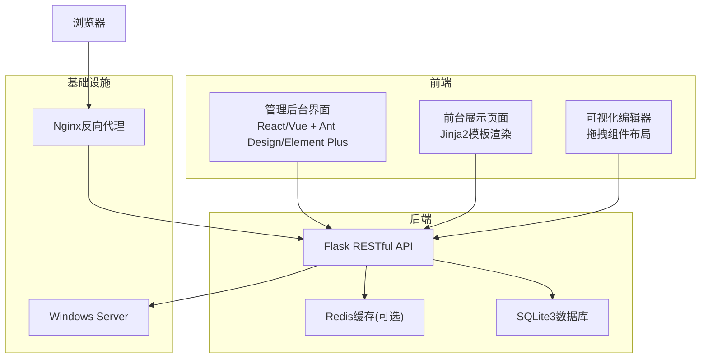
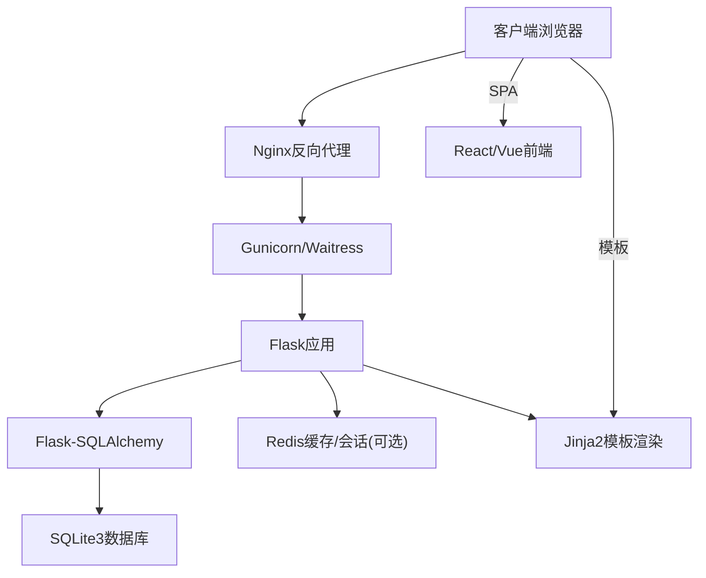
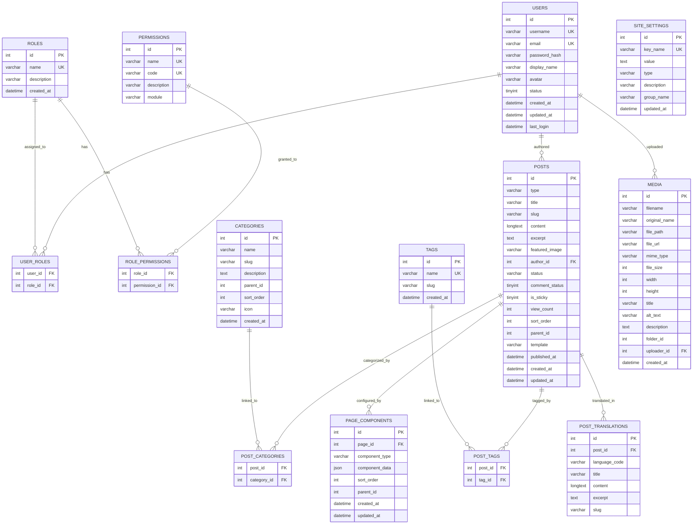
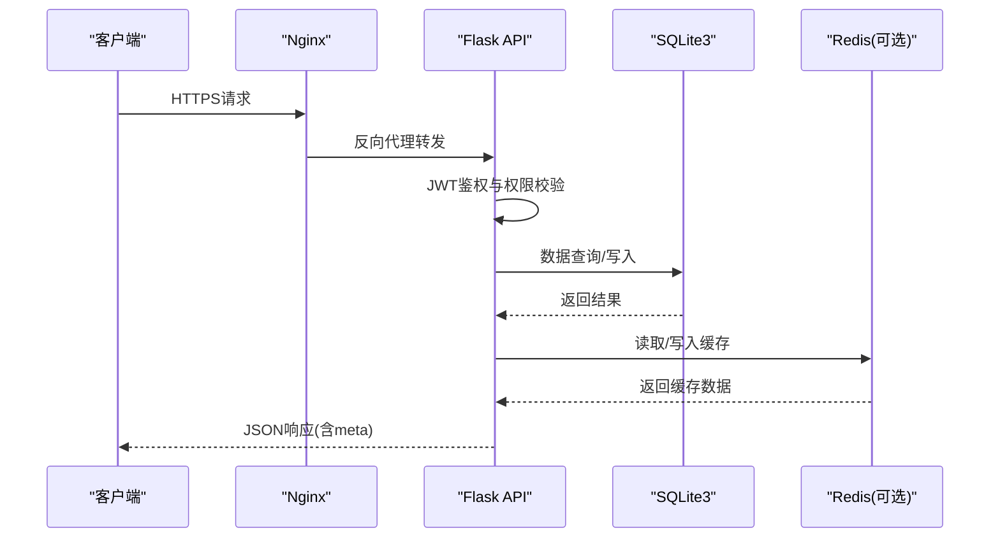
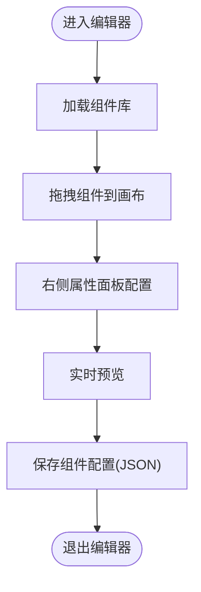
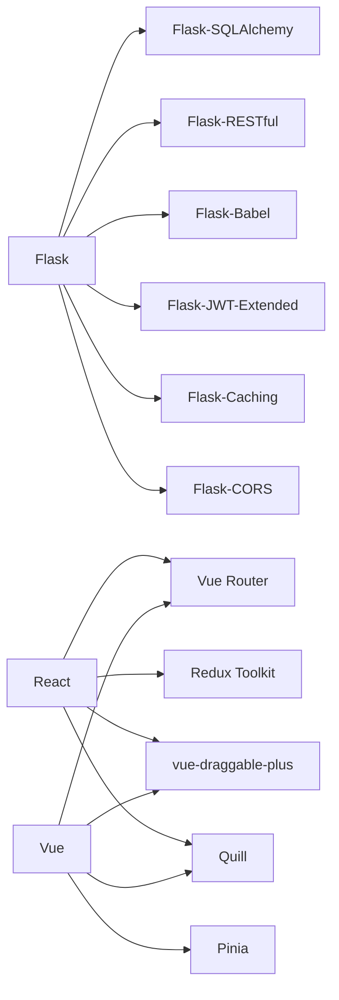

# 设计阶段

<cite>
**本文档引用的文件**
- [企业网站CMS系统开发需求文档.ini](file://企业网站CMS系统开发需求文档.ini)
- [企业网站CMS系统详细需求文档.md](file://企业网站CMS系统详细需求文档.md)
</cite>

## 目录
1. [引言](#引言)
2. [项目结构](#项目结构)
3. [核心组件](#核心组件)
4. [架构总览](#架构总览)
5. [详细组件分析](#详细组件分析)
6. [依赖分析](#依赖分析)
7. [性能考虑](#性能考虑)
8. [故障排除指南](#故障排除指南)
9. [结论](#结论)
10. [附录](#附录)

## 引言
本设计阶段文档面向企业网站CMS系统的架构设计、数据库设计与UI/UX设计工作，旨在：
- 明确系统整体架构模式、组件关系与数据流向
- 完善数据库ER设计、表结构定义、索引策略与数据完整性约束
- 规范UI/UX设计流程，包括原型设计、交互流程与视觉规范
- 确定设计文档交付物与评审验证机制，确保方案可行性与完整性

本设计基于需求文档中的技术栈与功能边界，结合MVP（最小可行产品）开发策略，在8天内完成核心功能的交付。

## 项目结构
项目采用前后端分离架构，后端使用Python Flask + SQLite3，前端提供React/Vue两种技术栈选项，并支持纯HTML模板渲染模式。部署于Windows Server + Nginx环境，采用Gunicorn或Waitress作为WSGI服务器，Redis可选用于缓存与会话。

**图表来源**
- [企业网站CMS系统详细需求文档.md](file://企业网站CMS系统详细需求文档.md#L22-L57)

**章节来源**
- [企业网站CMS系统详细需求文档.md](file://企业网站CMS系统详细需求文档.md#L22-L57)

## 核心组件
- 前端管理后台：提供用户管理、文章管理、媒体库管理、页面管理与系统配置的图形界面。
- 可视化编辑器：支持组件拖拽、实时预览与组件配置，简化非技术用户的页面编辑体验。
- 后端API：提供认证授权、内容管理、媒体管理、系统配置等RESTful接口。
- 数据库：采用SQLite3存储业务数据，支持全文搜索与索引优化；Redis可选用于缓存与会话。
- 部署与运维：Nginx反向代理、HTTPS终止、Gzip压缩、日志与监控。

**章节来源**
- [企业网站CMS系统详细需求文档.md](file://企业网站CMS系统详细需求文档.md#L61-L120)
- [企业网站CMS系统详细需求文档.md](file://企业网站CMS系统详细需求文档.md#L551-L660)

## 架构总览
系统采用“前后端分离 + 混合渲染”的架构模式：
- 前端：React/Vue单页应用或Jinja2模板渲染的混合模式
- 后端：Flask提供RESTful API与模板渲染
- 数据层：SQLite3 + Redis（可选）
- 网络层：Nginx反向代理、HTTPS、Gzip压缩

**图表来源**
- [企业网站CMS系统详细需求文档.md](file://企业网站CMS系统详细需求文档.md#L555-L660)

**章节来源**
- [企业网站CMS系统详细需求文档.md](file://企业网站CMS系统详细需求文档.md#L22-L57)
- [企业网站CMS系统详细需求文档.md](file://企业网站CMS系统详细需求文档.md#L555-L660)

## 详细组件分析

### 数据库设计（ER图与表结构）
数据库采用SQLite3，核心表包括用户与权限、内容管理、媒体库、页面组件配置与站点设置等。为支持全文搜索，采用FTS5虚拟表并配合触发器保持同步。

**图表来源**
- [企业网站CMS系统详细需求文档.md](file://企业网站CMS系统详细需求文档.md#L714-L904)

**章节来源**
- [企业网站CMS系统详细需求文档.md](file://企业网站CMS系统详细需求文档.md#L660-L938)

### API接口设计
API采用RESTful风格，统一返回格式包含code、message、data与meta字段，支持分页与鉴权。核心接口覆盖认证、用户管理、文章管理、页面管理、分类标签、媒体库与系统配置等模块。

**图表来源**
- [企业网站CMS系统详细需求文档.md](file://企业网站CMS系统详细需求文档.md#L940-L1076)

**章节来源**
- [企业网站CMS系统详细需求文档.md](file://企业网站CMS系统详细需求文档.md#L940-L1076)

### 可视化编辑器设计
编辑器支持组件拖拽、实时预览与样式配置，采用React或Vue的拖拽库实现，组件配置以JSON形式存储于page_components表。编辑器提供文本、图片、容器、按钮与表单等核心组件，满足MVP阶段的页面布局需求。

**图表来源**
- [企业网站CMS系统详细需求文档.md](file://企业网站CMS系统详细需求文档.md#L63-L233)

**章节来源**
- [企业网站CMS系统详细需求文档.md](file://企业网站CMS系统详细需求文档.md#L63-L233)

### UI/UX设计流程
- 原型设计：确定页面布局与交互流程，优先保证核心功能的易用性
- 交互设计：明确用户操作路径与反馈机制，确保权限控制与表单验证
- 视觉设计：采用Ant Design或Element Plus的设计规范，统一色彩、字体与间距
- 响应式设计：适配桌面、平板与手机端，遵循移动端优先原则

**章节来源**
- [企业网站CMS系统详细需求文档.md](file://企业网站CMS系统详细需求文档.md#L63-L233)

## 依赖分析
- 后端依赖：Flask生态（SQLAlchemy、RESTful、Babel、JWT等），Pillow用于图片处理，bcrypt用于密码加密
- 前端依赖：React/Vue生态（路由、状态管理、拖拽、富文本），Ant Design/Element Plus组件库
- 基础设施：Nginx、Windows Server、Redis（可选）、SQLite3

**图表来源**
- [企业网站CMS系统详细需求文档.md](file://企业网站CMS系统详细需求文档.md#L555-L660)

**章节来源**
- [企业网站CMS系统详细需求文档.md](file://企业网站CMS系统详细需求文档.md#L555-L660)

## 性能考虑
- 缓存策略：页面缓存、数据缓存与静态资源缓存，Redis可选
- 资源优化：图片懒加载、响应式图片、WebP格式、CSS/JS压缩与关键CSS内联
- 数据库优化：合理索引、避免N+1查询、连接池配置与慢查询日志
- CDN配置：静态资源CDN加速与缓存刷新

**章节来源**
- [企业网站CMS系统详细需求文档.md](file://企业网站CMS系统详细需求文档.md#L512-L548)

## 故障排除指南
- 认证与授权：检查JWT密钥配置、Token过期与刷新机制
- 数据库：确认SQLite3文件权限、索引与FTS5触发器是否正确创建
- 文件上传：验证文件类型白名单、大小限制与存储路径
- 部署：检查Nginx代理配置、SSL证书与日志路径

**章节来源**
- [企业网站CMS系统详细需求文档.md](file://企业网站CMS系统详细需求文档.md#L1078-L1140)
- [企业网站CMS系统详细需求文档.md](file://企业网站CMS系统详细需求文档.md#L1141-L1356)

## 结论
本设计阶段明确了系统架构、数据库设计与UI/UX流程，结合MVP策略在8天内完成核心功能交付。通过前后端分离与混合渲染模式，系统具备良好的可维护性与扩展性；数据库采用SQLite3与Redis组合，满足中小型企业的需求；可视化编辑器简化了页面配置流程，降低了技术门槛。

## 附录

### 设计文档交付物
- 需求规格说明书
- 系统设计文档
- 数据库设计文档
- API接口文档（Swagger）
- 部署运维文档
- 用户操作手册
- 代码注释覆盖率 > 30%

**章节来源**
- [企业网站CMS系统详细需求文档.md](file://企业网站CMS系统详细需求文档.md#L1853-L1862)

### 设计评审与验证
- 技术方案评审：确认技术栈与架构模式的可行性
- 原型验证：可视化编辑器与交互流程的可用性测试
- 性能基准测试：页面加载时间、API响应时间与并发用户支持
- 安全测试：XSS、CSRF、SQL注入与文件上传安全验证
- 兼容性测试：主流浏览器与移动端适配
- 文档完整性检查：交付物清单核对与验收标准对照

**章节来源**
- [企业网站CMS系统详细需求文档.md](file://企业网站CMS系统详细需求文档.md#L1804-L1862)
- [企业网站CMS系统开发需求文档.ini](file://企业网站CMS系统开发需求文档.ini#L181-L187)