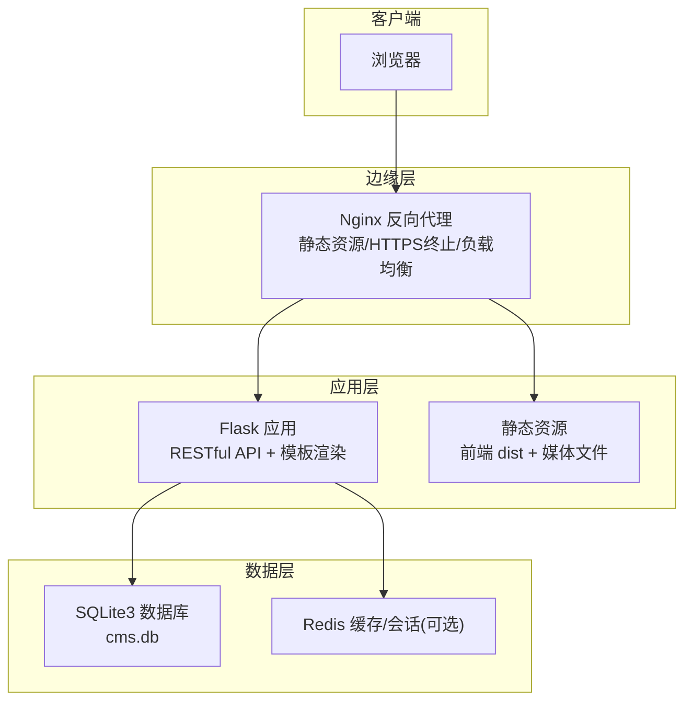
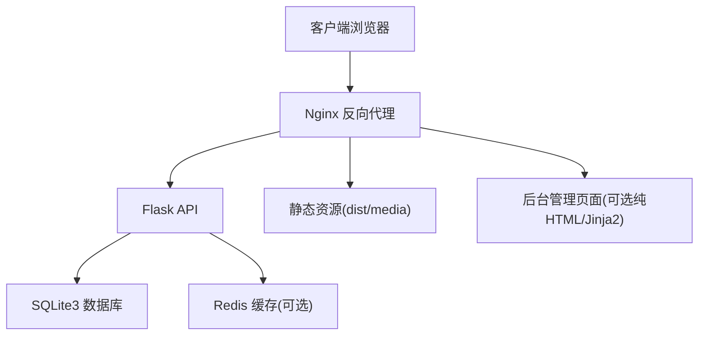
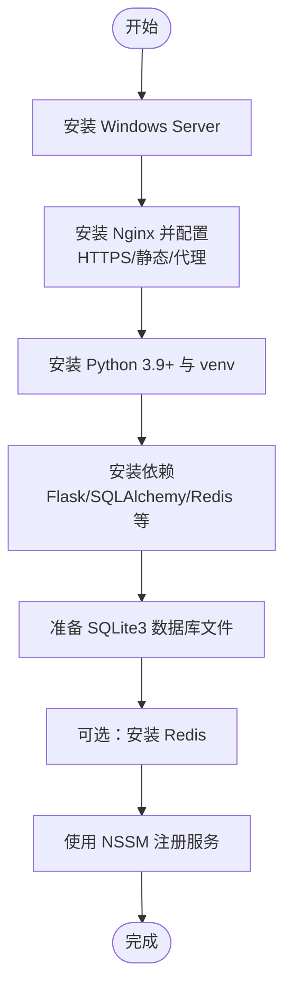
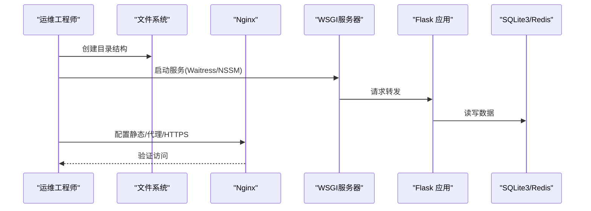
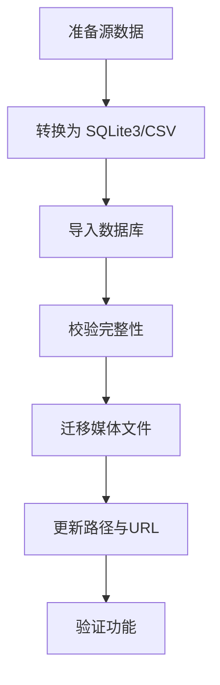
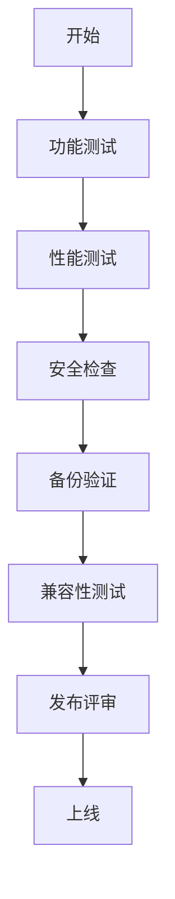
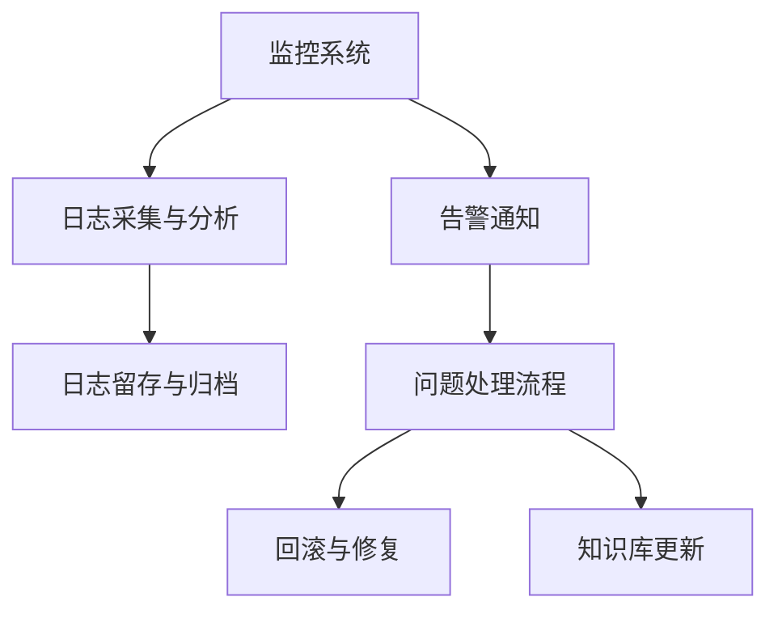
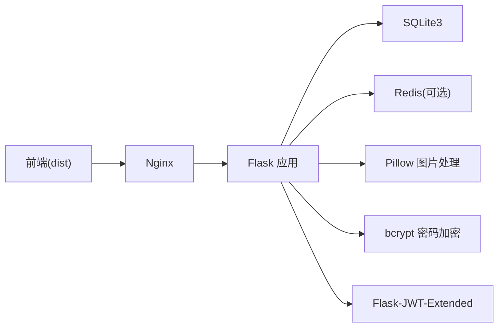

# 部署上线阶段

<cite>
**本文档引用的文件**
- [企业网站CMS系统开发需求文档.ini](file://企业网站CMS系统开发需求文档.ini)
- [企业网站CMS系统详细需求文档.md](file://企业网站CMS系统详细需求文档.md)
- [开发计划表_2月4日-2月12日.md](file://开发计划表_2月4日-2月12日.md)
</cite>

## 目录
1. [引言](#引言)
2. [项目结构](#项目结构)
3. [核心组件](#核心组件)
4. [架构总览](#架构总览)
5. [详细组件分析](#详细组件分析)
6. [依赖关系分析](#依赖关系分析)
7. [性能考量](#性能考量)
8. [故障排查指南](#故障排查指南)
9. [结论](#结论)
10. [附录](#附录)

## 引言
本文件面向部署上线阶段，围绕“从环境准备到系统正式运行”的完整流程，结合仓库中的需求文档与开发计划，系统化梳理部署环境准备、系统部署实施、数据迁移、上线前检查以及上线后的运维保障。文档既关注技术细节，也兼顾非技术读者的理解，提供可视化图示与可执行步骤指引。

## 项目结构
- 后端采用 Python + Flask + SQLite3 + Nginx + Windows Server 的轻量级架构。
- 前端可选 React/Vue 或纯 HTML 模板渲染，统一由 Nginx 提供静态资源与反向代理。
- 部署采用 NSSM 将后端服务注册为 Windows 服务，配合 Waitress/Gunicorn 作为 WSGI 服务器。

**图表来源**
- [企业网站CMS系统详细需求文档.md](file://企业网站CMS系统详细需求文档.md#L22-L57)
- [开发计划表_2月4日-2月12日.md](file://开发计划表_2月4日-2月12日.md#L440-L506)

**章节来源**
- [企业网站CMS系统详细需求文档.md](file://企业网站CMS系统详细需求文档.md#L22-L57)
- [开发计划表_2月4日-2月12日.md](file://开发计划表_2月4日-2月12日.md#L440-L506)

## 核心组件
- Nginx：反向代理、静态资源服务、HTTPS 终止、Gzip 压缩、负载均衡（可选）。
- Flask 应用：RESTful API、模板渲染、业务逻辑、权限控制。
- SQLite3：主数据库文件，零配置、ACID 支持、便于备份与部署。
- Redis：可选，用于缓存与会话（高并发时启用）。
- Windows 服务：使用 NSSM 将后端服务注册为 Windows 服务，开机自启、崩溃重启。
- 前端构建产物：dist 目录，由 Nginx 提供静态资源。

**章节来源**
- [企业网站CMS系统详细需求文档.md](file://企业网站CMS系统详细需求文档.md#L555-L659)
- [开发计划表_2月4日-2月12日.md](file://开发计划表_2月4日-2月12日.md#L440-L506)

## 架构总览
系统采用前后端分离架构，Nginx 作为入口网关，Flask 提供 API 与模板渲染，SQLite3 存储业务数据，Redis 可选缓存。部署在 Windows Server 上，通过 NSSM 注册服务，Waitress/WSGI 服务器承载应用。

**图表来源**
- [企业网站CMS系统详细需求文档.md](file://企业网站CMS系统详细需求文档.md#L22-L57)
- [企业网站CMS系统详细需求文档.md](file://企业网站CMS系统详细需求文档.md#L1143-L1230)

**章节来源**
- [企业网站CMS系统详细需求文档.md](file://企业网站CMS系统详细需求文档.md#L22-L57)
- [企业网站CMS系统详细需求文档.md](file://企业网站CMS系统详细需求文档.md#L1143-L1230)

## 详细组件分析

### 环境准备
- 操作系统：Windows Server 2019/2022。
- Web 服务器：Nginx 1.24+，配置 HTTPS、Gzip、静态资源、反向代理。
- Python 运行环境：Python 3.9+，虚拟环境 venv，pip 安装依赖。
- 进程管理：NSSM 注册 Flask 服务，Waitress/WSGI 服务器。
- 数据库：SQLite3，无需服务端；Redis 可选。
- 监控与日志：logging + RotatingFileHandler，可选 Sentry/Flask-Profiler。

**图表来源**
- [开发计划表_2月4日-2月12日.md](file://开发计划表_2月4日-2月12日.md#L440-L506)
- [企业网站CMS系统详细需求文档.md](file://企业网站CMS系统详细需求文档.md#L629-L659)

**章节来源**
- [开发计划表_2月4日-2月12日.md](file://开发计划表_2月4日-2月12日.md#L440-L506)
- [企业网站CMS系统详细需求文档.md](file://企业网站CMS系统详细需求文档.md#L629-L659)

### 系统部署实施
- 目录结构：D:\cms\data、D:\cms\media、D:\cms\logs。
- 后端部署：
  - 创建虚拟环境并安装依赖。
  - 初始化数据库（迁移/建表）。
  - 启动服务（Waitress/NSSM）。
- 前端部署：
  - 构建前端项目，生成 dist。
  - 配置 Nginx 指向 dist 目录。
- Nginx 配置：
  - 静态资源、API 代理、SPA 路由回退、HTTPS、Gzip、CORS、安全头。

**图表来源**
- [开发计划表_2月4日-2月12日.md](file://开发计划表_2月4日-2月12日.md#L440-L506)
- [企业网站CMS系统详细需求文档.md](file://企业网站CMS系统详细需求文档.md#L1143-L1230)

**章节来源**
- [开发计划表_2月4日-2月12日.md](file://开发计划表_2月4日-2月12日.md#L440-L506)
- [企业网站CMS系统详细需求文档.md](file://企业网站CMS系统详细需求文档.md#L1143-L1230)

### 数据迁移工作
- 历史数据导入：将现有数据库导出为 SQLite3 文件或 CSV，导入到 cms.db。
- 配置数据初始化：通过系统配置接口或数据库脚本初始化网站设置、SEO、邮件等。
- 用户数据迁移：导入用户表与角色权限关联，确保密码哈希一致。
- 媒体文件迁移：将媒体目录结构迁移至 D:\cms\media，并更新数据库中的 file_path/file_url。

**图表来源**
- [开发计划表_2月4日-2月12日.md](file://开发计划表_2月4日-2月12日.md#L459-L463)
- [企业网站CMS系统详细需求文档.md](file://企业网站CMS系统详细需求文档.md#L839-L889)

**章节来源**
- [开发计划表_2月4日-2月12日.md](file://开发计划表_2月4日-2月12日.md#L459-L463)
- [企业网站CMS系统详细需求文档.md](file://企业网站CMS系统详细需求文档.md#L839-L889)

### 上线前检查
- 功能验证：用户登录/权限、文章 CRUD、媒体上传、可视化编辑器、前台展示。
- 性能测试：页面加载时间、API 响应时间、并发用户支持。
- 安全检查：XSS/CSRF/SQL 注入测试、HTTPS 强制跳转、文件上传安全。
- 备份验证：数据库备份文件可用性、恢复演练。
- 兼容性测试：主流浏览器、移动端、分辨率适配。

**图表来源**
- [开发计划表_2月4日-2月12日.md](file://开发计划表_2月4日-2月12日.md#L419-L432)
- [企业网站CMS系统详细需求文档.md](file://企业网站CMS系统详细需求文档.md#L1360-L1441)

**章节来源**
- [开发计划表_2月4日-2月12日.md](file://开发计划表_2月4日-2月12日.md#L419-L432)
- [企业网站CMS系统详细需求文档.md](file://企业网站CMS系统详细需求文档.md#L1360-L1441)

### 上线后的运维工作
- 监控告警：服务状态、性能指标、错误率、磁盘空间、告警通知。
- 日志分析：访问日志、错误日志、审计日志，定期归档与留存。
- 问题处理：快速定位、回滚策略、补丁发布、容量评估。
- 用户支持：常见问题 FAQ、操作手册、培训材料、紧急联系方式。

**图表来源**
- [企业网站CMS系统详细需求文档.md](file://企业网站CMS系统详细需求文档.md#L1417-L1422)

**章节来源**
- [企业网站CMS系统详细需求文档.md](file://企业网站CMS系统详细需求文档.md#L1417-L1422)

## 依赖关系分析
- Flask 依赖：Flask-SQLAlchemy、Flask-Migrate、Flask-Login、Flask-WTF、Flask-CORS、Flask-RESTful、Flask-Caching、Flask-Babel、Flask-JWT-Extended、bcrypt、Pillow、python-dotenv、requests、waitress 等。
- 前端依赖：React/Vue + Vite + UI 组件库 + 拖拽库 + 富文本 + HTTP 客户端。
- 部署依赖：Nginx、NSSM、Windows 服务、可选 Redis。

**图表来源**
- [企业网站CMS系统详细需求文档.md](file://企业网站CMS系统详细需求文档.md#L555-L628)
- [企业网站CMS系统详细需求文档.md](file://企业网站CMS系统详细需求文档.md#L1304-L1322)

**章节来源**
- [企业网站CMS系统详细需求文档.md](file://企业网站CMS系统详细需求文档.md#L555-L628)
- [企业网站CMS系统详细需求文档.md](file://企业网站CMS系统详细需求文档.md#L1304-L1322)

## 性能考量
- 静态资源：Nginx 提供静态文件服务，开启 Gzip 压缩与缓存头。
- 数据库：SQLite3 适合中小规模读多写少场景；必要时启用 WAL 模式与索引优化。
- 缓存：Redis 可选用于页面缓存与会话，减少数据库压力。
- 并发：Waitress 在 Windows 上表现稳定；高并发时考虑负载均衡与 CDN。
- 前端：构建产物最小化与懒加载，减少首屏时间。

**章节来源**
- [企业网站CMS系统详细需求文档.md](file://企业网站CMS系统详细需求文档.md#L512-L548)
- [企业网站CMS系统详细需求文档.md](file://企业网站CMS系统详细需求文档.md#L1362-L1380)

## 故障排查指南
- 服务无法启动：检查 NSSM 配置、端口占用、虚拟环境路径、环境变量。
- Nginx 404/502：确认静态资源路径、API 代理配置、Flask 服务状态。
- 数据库异常：检查 cms.db 文件权限、WAL 模式、磁盘空间。
- 文件上传失败：检查 MIME 类型白名单、文件大小限制、存储路径权限。
- 权限与认证：核对 JWT 密钥、CORS 配置、CSRF Token、会话存储。

**章节来源**
- [开发计划表_2月4日-2月12日.md](file://开发计划表_2月4日-2月12日.md#L490-L499)
- [企业网站CMS系统详细需求文档.md](file://企业网站CMS系统详细需求文档.md#L1128-L1140)

## 结论
本部署上线阶段文档基于仓库中的需求与开发计划，明确了从环境准备到系统正式运行的全流程。通过 Nginx + Flask + SQLite3 + Windows 服务的组合，能够快速、稳定地完成部署；同时提供了数据迁移、上线前检查与运维保障的实践建议，确保系统在生产环境中安全、可靠地运行。

## 附录
- 部署清单：后端代码、前端构建产物、Nginx 配置、Windows 服务配置、数据库文件、环境变量模板、SSL 证书。
- 文档清单：用户操作手册、系统管理员手册、API 文档、部署运维文档、常见问题 FAQ。
- 培训清单：管理员培训记录、编辑人员培训记录、培训视频（可选）。

**章节来源**
- [开发计划表_2月4日-2月12日.md](file://开发计划表_2月4日-2月12日.md#L665-L700)
- [企业网站CMS系统详细需求文档.md](file://企业网站CMS系统详细需求文档.md#L1804-L1862)