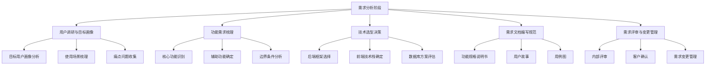
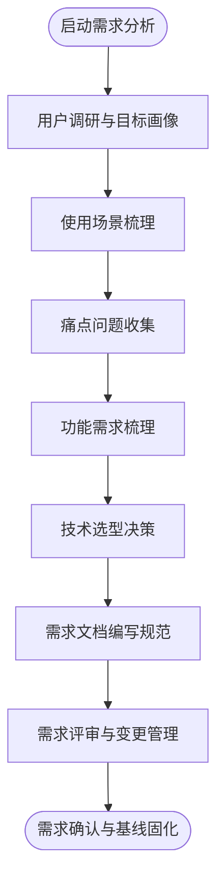

# 需求分析阶段

<cite>
**本文引用的文件**
- [企业网站CMS系统开发需求文档.ini](file://企业网站CMS系统开发需求文档.ini)
- [企业网站CMS系统详细需求文档.md](file://企业网站CMS系统详细需求文档.md)
</cite>

## 目录
1. [引言](#引言)
2. [项目结构](#项目结构)
3. [核心组件](#核心组件)
4. [架构总览](#架构总览)
5. [详细组件分析](#详细组件分析)
6. [依赖分析](#依赖分析)
7. [性能考量](#性能考量)
8. [故障排查指南](#故障排查指南)
9. [结论](#结论)
10. [附录](#附录)

## 引言
本文件面向“需求分析阶段”，系统化梳理从项目启动到需求确认的完整流程，覆盖用户调研方法、功能需求梳理、技术选型决策、需求文档规范以及需求评审流程等关键环节。结合仓库中的两份需求文档，我们将以实际项目为蓝本，给出可操作、可落地的方法论与实践建议，帮助团队高效达成高质量的需求共识。

## 项目结构
本仓库包含两份核心文档：
- 一份为“开发需求文档.ini”，提供高层目标、功能清单、技术建议与项目范围等概要信息；
- 一份为“详细需求文档.md”，涵盖技术架构、功能细节、数据库设计、API规范、部署配置、验收标准、风险管理与成本预算等详尽内容。

这两份文档共同构成需求分析阶段的“事实依据”和“工作基线”。

**章节来源**
- file://企业网站CMS系统开发需求文档.ini#L1-L191
- file://企业网站CMS系统详细需求文档.md#L1-L2026

## 核心组件
- 用户调研与目标画像：明确目标用户群体、典型使用场景与核心痛点，形成可验证的用户画像。
- 功能需求梳理：从“核心功能—辅助功能—边界条件”的维度，建立需求层次与优先级。
- 技术选型：围绕后端框架、前端技术栈、数据库与部署环境，形成可执行的技术方案。
- 需求文档规范：统一文档格式与交付物，确保需求表达清晰、可追溯、可验证。
- 需求评审流程：建立内部评审、客户确认与变更控制的闭环机制，保障质量与一致性。

**章节来源**
- file://企业网站CMS系统开发需求文档.ini#L1-L191
- file://企业网站CMS系统详细需求文档.md#L1-L2026

## 架构总览
需求分析阶段的产出将直接影响后续的设计与开发。下图展示了需求分析阶段的关键活动与其相互关系，强调“以用户为中心”的需求提炼与“以技术为支撑”的方案设计之间的协同。

[本图为概念性流程图，不直接对应具体源文件，故不附“图示来源”]

## 详细组件分析

### 用户调研方法
- 目标用户画像分析
  - 明确不同角色（如超级管理员、管理员、编辑、访客）的职责、能力与期望。
  - 结合项目目标，量化用户画像的典型行为与使用频率，指导功能优先级与交互设计。
- 使用场景梳理
  - 从“日常运营—突发应急—扩展演进”三个维度，梳理典型使用场景，识别关键流程与潜在风险点。
- 痛点问题收集
  - 通过访谈、问卷、竞品分析等方式，收集现有系统或替代方案的不足，形成需求改进清单。

[本节为方法论总结，不直接分析具体源文件，故不附“章节来源”]

### 功能需求梳理
- 核心功能识别
  - 以“高频、关键、可验证”为原则，识别必须实现的功能点；例如用户登录/权限管理、文章管理、媒体库、可视化编辑器、前台展示、基础SEO等。
- 辅助功能确定
  - 在核心功能之外，识别提升易用性与可维护性的功能，如备份恢复、日志审计、多语言（延后）、高级SEO等。
- 边界条件分析
  - 明确输入/输出边界、异常处理边界、并发与容量边界，形成需求约束与验收标准。

**章节来源**
- file://企业网站CMS系统开发需求文档.ini#L14-L120
- file://企业网站CMS系统详细需求文档.md#L61-L549

### 技术选型决策
- 后端框架选择
  - 依据项目规模与运维复杂度，选择轻量级方案（如Python Flask）以降低部署与维护成本。
- 前端技术栈确定
  - 提供React/Vue/纯HTML三种选项，兼顾开发效率与学习成本，便于团队快速上手。
- 数据库方案评估
  - 针对中小场景，推荐SQLite3以简化部署与备份；在高并发或复杂场景下，再评估MySQL等方案。

**章节来源**
- file://企业网站CMS系统开发需求文档.ini#L70-L91
- file://企业网站CMS系统详细需求文档.md#L553-L659

### 需求文档编写规范
- 功能规格说明书
  - 以“模块—子模块—功能点—验收标准”的层级结构，确保需求可分解、可验证。
- 用户故事
  - 采用“角色—目标—价值”的格式，聚焦用户视角与业务价值，便于排定优先级。
- 用例图
  - 描述系统与外部参与者的关系，明确系统边界与关键交互。

**章节来源**
- file://企业网站CMS系统开发需求文档.ini#L134-L152
- file://企业网站CMS系统详细需求文档.md#L1804-L1862

### 需求评审流程
- 内部评审
  - 由技术负责人、产品经理与开发代表参与，对需求完整性、可行性与一致性进行评审。
- 客户确认
  - 以可验证的样例（如原型、接口清单、数据库设计）为基础，获得客户书面确认。
- 需求变更管理
  - 建立变更申请、影响评估、审批与回溯机制，确保变更受控且可追溯。

**章节来源**
- file://企业网站CMS系统详细需求文档.md#L2018-L2023

## 依赖分析
需求分析阶段的产出与后续工作存在强耦合关系：
- 用户调研与场景梳理决定功能清单与优先级；
- 功能需求梳理决定技术方案与资源投入；
- 技术选型影响数据库设计与API规范；
- 需求文档规范决定评审与变更管理的执行方式；
- 需求评审与变更管理决定最终基线的稳定性。

[本图为概念性依赖关系图，不直接对应具体源文件，故不附“图示来源”]

## 性能考量
- 响应时间与并发能力
  - 明确页面加载、API响应、数据库查询等关键指标，作为验收标准的一部分。
- 资源占用与扩展性
  - 在MVP阶段关注资源占用上限，在后续版本逐步引入缓存、CDN与数据库优化策略。

**章节来源**
- file://企业网站CMS系统详细需求文档.md#L1362-L1380

## 故障排查指南
- 需求偏差
  - 通过评审与客户确认，减少需求理解偏差导致的返工。
- 技术不可行
  - 在技术选型阶段充分评估可行性，必要时提供替代方案与权衡建议。
- 变更失控
  - 严格执行变更流程，确保每次变更都有记录与影响评估。

**章节来源**
- file://企业网站CMS系统详细需求文档.md#L1865-L1924

## 结论
需求分析阶段是项目成功的基石。通过系统化的用户调研、严谨的功能梳理、务实的技术选型、规范的文档与评审流程，可以有效降低不确定性、提高交付质量与效率。建议在项目启动前完成本阶段的全部工作，并以可验证的基线作为后续设计与开发的依据。

## 附录
- 风险管理与成本预算
  - 对Windows环境兼容性、拖拽编辑器性能、数据库瓶颈等技术风险提出应对措施；
  - 对服务器、软件许可与第三方服务进行成本估算，为项目预算提供参考。

**章节来源**
- file://企业网站CMS系统详细需求文档.md#L1865-L1958