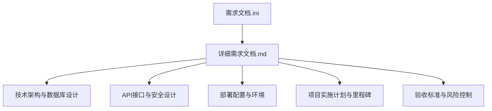
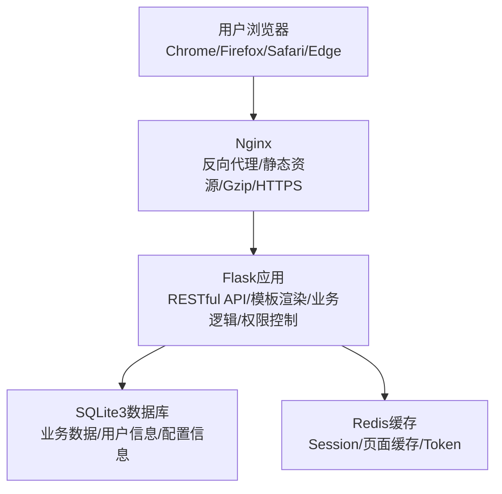
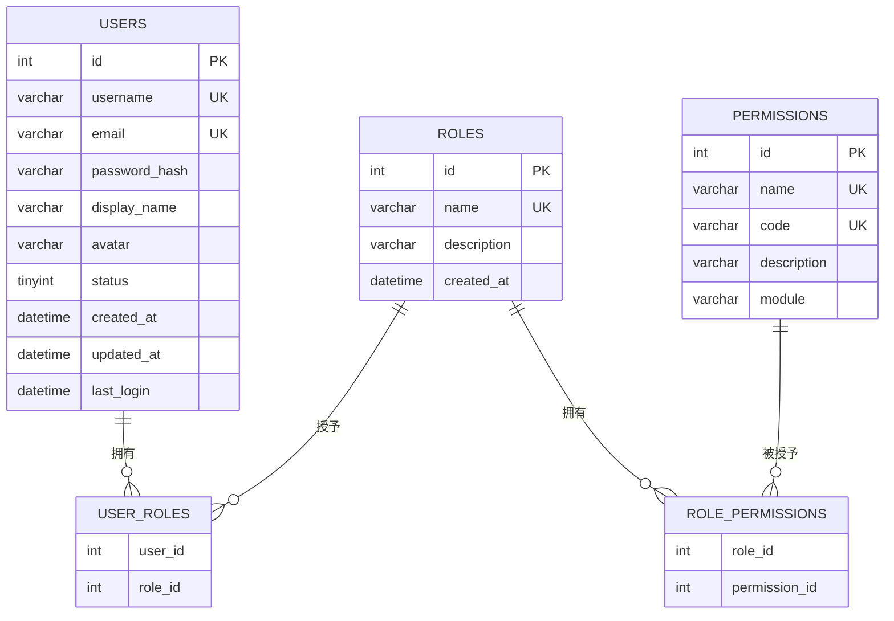
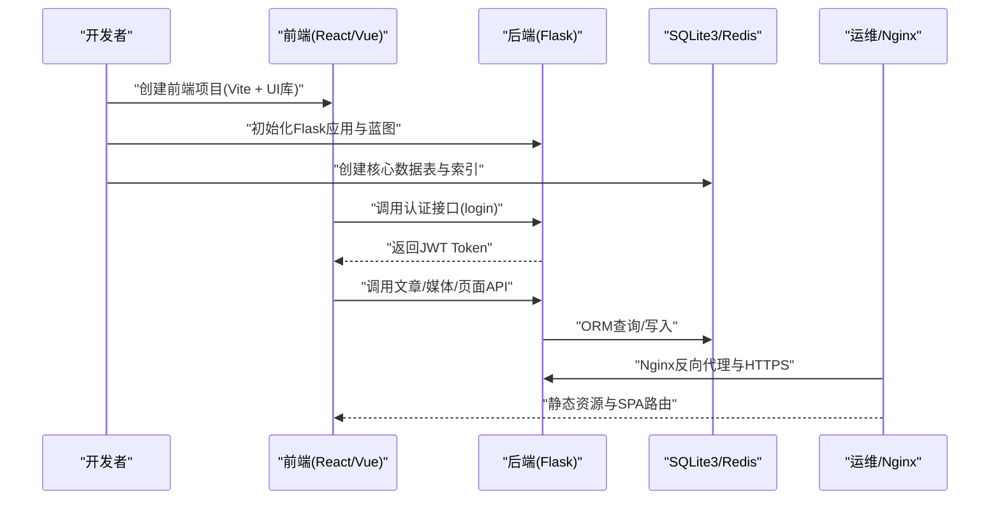
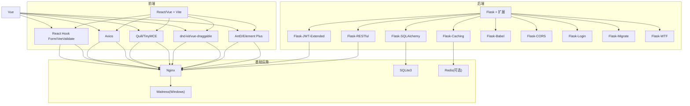

# 项目开发阶段

<cite>
**本文引用的文件**
- [企业网站CMS系统开发需求文档.ini](file://企业网站CMS系统开发需求文档.ini)
- [企业网站CMS系统详细需求文档.md](file://企业网站CMS系统详细需求文档.md)
</cite>

## 目录
1. [引言](#引言)
2. [项目结构](#项目结构)
3. [核心组件](#核心组件)
4. [架构总览](#架构总览)
5. [详细组件分析](#详细组件分析)
6. [依赖分析](#依赖分析)
7. [性能考量](#性能考量)
8. [故障排查指南](#故障排查指南)
9. [结论](#结论)
10. [附录](#附录)

## 引言
本文件面向“企业网站CMS系统”的完整开发流程，覆盖从需求分析到系统上线的全过程。文档依据仓库内的两份需求文档，系统梳理了需求分析、设计、开发实施、测试、部署上线等阶段的工作内容与交付物，并结合技术栈与架构设计，给出可执行的阶段划分、里程碑与质量保障措施，帮助项目团队高效推进并高质量交付。

## 项目结构
- 仓库包含两份核心文档：
  - 《企业网站CMS系统开发需求文档.ini》：概述项目背景、目标、功能需求、技术需求、非功能需求、项目范围、交付物、里程碑与验收标准。
  - 《企业网站CMS系统详细需求文档.md》：详细技术架构、数据库设计、API接口、安全设计、部署配置、项目实施计划、验收标准、风险与成本预算等。

**章节来源**
- file://企业网站CMS系统开发需求文档.ini#L1-L191
- file://企业网站CMS系统详细需求文档.md#L1-L2026

## 核心组件
- 前端可视化编辑模块：拖拽布局、组件库、实时预览、响应式布局。
- 后台管理模块：用户权限管理、内容管理（文章/页面/媒体）、系统配置。
- 核心功能：多语言支持、SEO优化、性能优化。
- 技术栈：Python Flask + Nginx + Windows Server；前端可选React/Vue或纯HTML模板。
- 非功能性需求：性能、安全、可用性、兼容性、可维护性。

**章节来源**
- file://企业网站CMS系统开发需求文档.ini#L14-L120
- file://企业网站CMS系统详细需求文档.md#L22-L57

## 架构总览
系统采用前后端分离架构，Nginx作为反向代理与静态资源服务，Flask应用提供RESTful API与模板渲染，SQLite作为主数据库，Redis可选用于缓存与会话。支持SPA与纯HTML模板两种前端模式。

**图表来源**
- file://企业网站CMS系统详细需求文档.md#L28-L57

**章节来源**
- file://企业网站CMS系统详细需求文档.md#L22-L57

## 详细组件分析

### 需求分析阶段
- 用户调研与需求确认：明确企业官网展示需求、降低技术门槛、提升管理效率的目标。
- 功能梳理：前端可视化编辑（拖拽布局、组件库、实时预览、响应式）、后台管理（用户权限、内容管理、系统配置）、核心功能（多语言、SEO、性能）。
- 技术选型：后端Python Flask + 前端React/Vue或纯HTML模板；部署Windows Server + Nginx；数据库SQLite3 + Redis可选。
- 项目范围与交付物：前后端代码、数据库脚本、部署文档、API文档、用户手册、技术文档、培训材料。
- 里程碑与验收：需求确认、原型设计、功能实现、测试优化、部署上线、用户验收。

**章节来源**
- file://企业网站CMS系统开发需求文档.ini#L1-L191
- file://企业网站CMS系统详细需求文档.md#L1463-L1784

### 设计阶段
- 系统架构设计：前后端分离、混合模式（Jinja2模板渲染与SPA）。
- 数据库设计：用户与权限表、内容管理表、媒体库表、页面组件配置表、站点配置表、多语言翻译表；SQLite3全文搜索使用FTS5虚拟表。
- API接口设计：统一JSON格式、JWT认证、分页与元信息、常见HTTP状态码。
- 安全设计：JWT Token机制、密码加密、SQL注入防护、XSS/CSRF防护、文件上传安全、数据传输安全。
- 部署配置：Nginx配置示例、Flask应用配置、Windows服务注册（NSSM）、环境变量与依赖清单。

**图表来源**
- file://企业网站CMS系统详细需求文档.md#L716-L768

**章节来源**
- file://企业网站CMS系统详细需求文档.md#L660-L938
- file://企业网站CMS系统详细需求文档.md#L940-L1076
- file://企业网站CMS系统详细需求文档.md#L1078-L1140
- file://企业网站CMS系统详细需求文档.md#L1141-L1356

### 开发实施阶段
- 阶段一：架构设计与环境搭建（1天）
  - 任务：技术方案评审、虚拟环境与依赖安装、Flask项目结构、配置文件、数据库初始化、日志与核心数据表设计、测试数据准备。
  - 交付物：可运行Flask应用、SQLite数据库文件、数据模型、基础框架。
- 阶段二：后端核心API开发（3天）
  - 任务：认证系统（JWT、密码加密、权限装饰器）、文章API（CRUD、分页、筛选）、分类API（树形结构）、媒体库API（上传、压缩、信息管理）、页面管理API、网站配置与SEO接口。
  - 交付物：认证系统完成、文章与分类API完成、媒体库功能完成、页面管理API完成、接口测试集合。
- 阶段三：管理后台界面开发（2天）
  - 任务：前端框架（React/Vue + Vite + UI库）、路由与状态管理、登录页面、管理后台布局、文章列表/编辑、媒体库、分类管理、网站配置与SEO设置。
  - 交付物：前端框架搭建完成、登录页面完成、所有管理后台页面完成。
- 阶段四：可视化编辑器与前台展示（1天）
  - 任务：简化版可视化编辑器（拖拽系统、组件面板、属性配置、5个核心组件）、前台页面（首页、列表、详情、导航、SEO）。
  - 交付物：可视化编辑器基础版完成、前台展示页面完成。
- 阶段五：测试、修复与部署（1天）
  - 任务：功能测试（浏览器与移动端）、Bug修复、性能优化、Windows Server配置、Nginx与Flask服务配置、SSL证书、前端构建与部署。
  - 交付物：系统部署成功、测试通过、系统正常运行。
- 阶段六：交付与培训（1天）
  - 任务：功能演示、性能与安全检查、用户验收、管理员与编辑人员培训、文档编写（用户手册、技术文档、运维文档）。
  - 交付物：完整CMS系统、操作手册与技术文档、培训完成、项目正式交付。

**图表来源**
- file://企业网站CMS系统详细需求文档.md#L1503-L1770

**章节来源**
- file://企业网站CMS系统详细需求文档.md#L1503-L1770

### 测试阶段
- 质量保证措施：
  - 单元测试：补充后端API单元测试与数据验证。
  - 集成测试：接口连通性、权限控制、文件上传、缓存与会话。
  - 性能测试：页面加载时间、API响应时间、并发用户支持、数据库查询响应。
  - 安全测试：XSS、CSRF、SQL注入、文件上传安全、HTTPS与密码加密。
  - 兼容性测试：主流浏览器、移动端响应式、分辨率支持。
- 验收标准：MVP必须实现的功能清单、性能与安全验收、兼容性验收、文档验收。

**章节来源**
- file://企业网站CMS系统详细需求文档.md#L1804-L1862

### 部署上线阶段
- 环境配置：Windows Server + Nginx + Flask + SQLite3；可选Redis；使用NSSM将Flask注册为Windows服务。
- 数据迁移：SQLite单文件数据库，部署时复制数据库文件与备份目录；必要时提供备份恢复流程。
- 用户培训：管理员培训（系统登录、用户管理、系统配置、数据备份）、编辑人员培训（文章创建与发布、媒体上传管理、页面编辑器使用、常见问题处理）。
- 文档交付：用户操作手册、技术架构文档、API接口文档、数据库设计文档、部署运维文档。

**章节来源**
- file://企业网站CMS系统详细需求文档.md#L1141-L1356
- file://企业网站CMS系统详细需求文档.md#L1726-L1770

## 依赖分析
- 技术栈依赖：Flask生态（SQLAlchemy、Migrate、Login、WTF、CORS、RESTful、Caching、Babel、JWT-Extended）、前端React/Vue生态（Vite、UI库、状态管理、路由、拖拽、富文本、HTTP客户端、表单校验）、Nginx、SQLite3、Redis（可选）、Waitress（Windows友好WSGI）。
- 外部依赖：Pillow（图片处理）、bcrypt（密码加密）、python-dotenv（环境变量）、requests（HTTP客户端）、celery（异步任务可选）。
- 部署依赖：NSSM（Windows服务管理）、SSL证书、CDN（可选）、云存储SDK（可选）。

**图表来源**
- file://企业网站CMS系统详细需求文档.md#L555-L622
- file://企业网站CMS系统详细需求文档.md#L1304-L1322

**章节来源**
- file://企业网站CMS系统详细需求文档.md#L555-L622
- file://企业网站CMS系统详细需求文档.md#L1304-L1322

## 性能考量
- 页面缓存：Redis全页面缓存、缓存预热、失效策略、登录用户不缓存。
- 数据缓存：查询结果缓存、API响应缓存、缓存Key命名规范。
- 静态资源缓存：浏览器缓存、版本号/哈希更新策略。
- 资源优化：图片懒加载、响应式图片、WebP、CSS/JS压缩合并、关键CSS内联、非关键资源异步加载。
- 数据库优化：索引优化、避免N+1查询、连接池配置、慢查询日志。
- CDN配置：静态资源CDN加速、CDN域名配置、CDN缓存刷新。
- 性能指标：首页加载<2秒、内页加载<3秒、API响应<500ms、数据库查询<100ms、并发用户>1000。

**章节来源**
- file://企业网站CMS系统详细需求文档.md#L512-L548
- file://企业网站CMS系统详细需求文档.md#L1362-L1380

## 故障排查指南
- 常见问题：
  - Windows环境兼容性：使用Waitress替代Gunicorn，提前在Windows环境测试，准备Docker容器化备选。
  - 拖拽编辑器性能：使用虚拟滚动、组件懒加载、限制单页组件数量、性能监控与优化。
  - 数据库性能瓶颈：合理索引、查询优化、Redis缓存、数据库读写分离（如需要）。
  - 需求变更频繁：严格需求评审、变更流程控制、预留缓冲时间。
  - 人员变动：完善代码规范与文档、知识共享与培训、关键角色备份。
  - 数据泄露：安全开发培训、代码安全审计、渗透测试、日志监控。
- 安全加固：XSS/CSRF防护、SQL注入防护、文件上传安全验证、HTTPS强制跳转、密码加密存储。
- 监控与告警：服务状态监控、性能指标监控、错误率监控、磁盘空间监控、告警通知（邮件/短信）。

**章节来源**
- file://企业网站CMS系统详细需求文档.md#L1865-L1923
- file://企业网站CMS系统详细需求文档.md#L1417-L1422

## 结论
本项目以MVP策略在8天内完成核心功能闭环，采用Python Flask + Nginx + Windows Server的轻量级架构，结合SQLite3与Redis可选方案，兼顾易部署与可扩展性。通过清晰的阶段划分、严格的验收标准与风险控制，确保在紧凑时间内高质量交付。后续可根据业务增长逐步演进至MySQL、CDN与更丰富的组件库与多语言能力。

## 附录
- 术语表：CMS、SPA、ORM、JWT、RBAC、CSRF、XSS、SEO、CDN、SSL/TLS。
- 参考资料：Flask、React、Vue、Nginx、MySQL官方文档及相关技术链接。
- 联系方式：技术支持邮箱、紧急联系电话、工作时间。

**章节来源**
- file://企业网站CMS系统详细需求文档.md#L1961-L2026