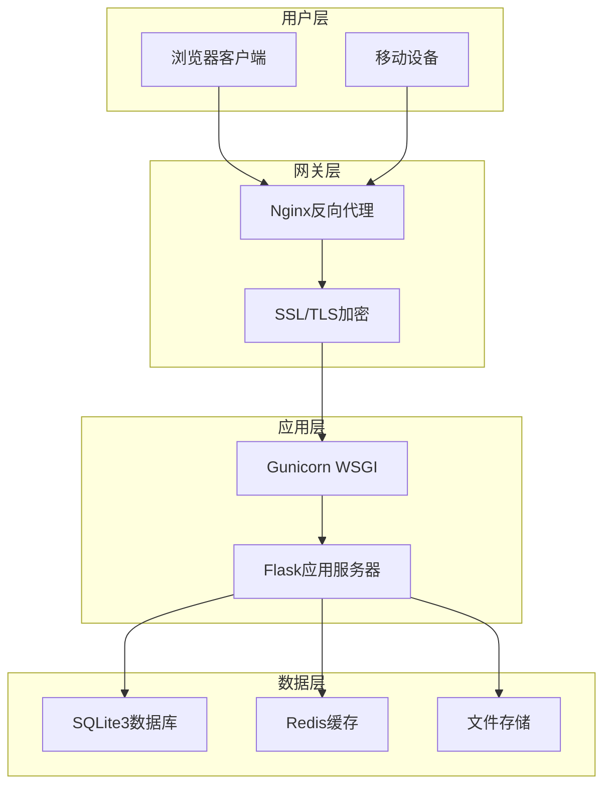
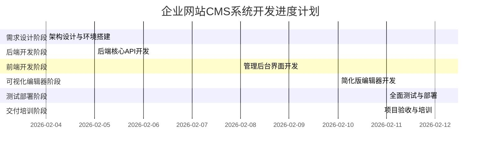

# 项目概述

<cite>
**本文档引用的文件**
- [企业网站CMS系统开发需求文档.ini](file://企业网站CMS系统开发需求文档.ini)
- [企业网站CMS系统详细需求文档.md](file://企业网站CMS系统详细需求文档.md)
</cite>

## 目录
1. [项目背景](#项目背景)
2. [项目目标与价值主张](#项目目标与价值主张)
3. [系统架构理念](#系统架构理念)
4. [核心特性与功能](#核心特性与功能)
5. [技术选型与优势](#技术选型与优势)
6. [项目规模与实施计划](#项目规模与实施计划)
7. [预期收益与ROI分析](#预期收益与roi分析)
8. [差异化特点](#差异化特点)
9. [适用场景与使用指南](#适用场景与使用指南)
10. [总结](#总结)

## 项目背景

企业网站CMS系统旨在解决传统企业官网建设中的痛点问题。当前市场上的企业官网存在以下挑战：

- **技术门槛高**：需要专业技术人员才能维护网站内容
- **更新效率低**：内容变更流程繁琐，响应速度慢
- **成本高昂**：定制开发费用昂贵，后期维护成本高
- **功能单一**：缺乏可视化编辑和多终端适配能力

针对这些痛点，本项目致力于打造一套功能完善、易于维护的企业官网内容管理系统，通过可视化拖拽配置降低技术门槛，提升网站管理效率。

## 项目目标与价值主张

### 核心目标

1. **快速搭建企业官网**：实现企业官网的快速搭建和灵活配置
2. **直观可视化编辑**：提供拖拽式的可视化编辑体验
3. **多终端适配**：支持PC、平板、手机等多终端访问
4. **SEO优化支持**：内置SEO优化功能，提升搜索引擎排名
5. **安全可靠**：确保系统安全性和可扩展性

### 价值主张

- **降低运营成本**：非技术人员可独立完成网站内容更新
- **提升管理效率**：可视化操作替代技术开发，提高工作效率
- **增强用户体验**：多终端适配和响应式设计
- **保障数据安全**：完善的权限管理和安全防护机制
- **支持多站点管理**：一套系统管理多个企业站点

## 系统架构理念

### 整体架构模式

系统采用**前后端分离架构**，结合**混合模式支持**的设计理念：

**架构优势**：
- **高可用性**：Nginx提供负载均衡和故障转移
- **安全性**：SSL加密传输，多层安全防护
- **可扩展性**：模块化设计，支持水平扩展
- **易维护性**：前后端分离，职责清晰

### 技术栈选择

**后端技术栈**：
- **Python Flask**：轻量级Web框架，开发效率高
- **SQLite3**：零配置数据库，简化部署
- **Redis**：高性能缓存，提升系统性能
- **Nginx**：高性能Web服务器，反向代理

**前端技术栈**：
- **React/Vue.js**：现代化前端框架，组件化开发
- **TypeScript**：类型安全，提升代码质量
- **Ant Design/Element Plus**：企业级UI组件库
- **Vite**：快速构建工具，开发体验优秀

## 核心特性与功能

### 前端可视化编辑模块

#### 拖拽布局配置系统

**页面布局组件库**：
- 预置10+种布局模板（单栏、双栏、三栏、网格等）
- 支持自定义栅格系统（12栏/24栏）
- 响应式断点设置（xs/sm/md/lg/xl）

**组件拖拽系统**：
- 支持从组件面板拖入新组件
- 组件在页面内拖动排序和跨容器拖拽
- 实时显示可放置区域和组件预览

**实时预览功能**：
- 编辑模式与预览模式无缝切换
- 多设备预览（桌面/平板/手机）
- 支持全屏预览和条件显示

#### 内容组件库

**基础组件**：
- **文本编辑器**：富文本编辑，支持格式化、图片插入
- **图片组件**：轮播图、画廊、单图展示
- **视频组件**：支持YouTube、优酷等平台嵌入
- **表单组件**：联系表单、预约表单、问卷调查
- **导航组件**：顶部导航、面包屑导航、侧边导航
- **社交媒体组件**：社交图标链接和分享按钮

**高级组件**：
- Tab标签页组件、折叠面板组件
- 统计数字组件、时间轴组件
- 团队成员组件、客户案例组件

### 后台管理模块

#### 用户权限管理系统

**角色体系**：
- 超级管理员（所有权限）
- 管理员（内容管理、用户管理）
- 编辑（内容编辑、媒体上传）
- 作者（创建文章、编辑自己的内容）
- 访客（仅查看权限）

**权限粒度**：
- 模块级权限控制
- 操作级权限验证
- 数据级权限管理

#### 内容管理系统

**文章管理**：
- 文章列表视图和卡片视图
- 支持筛选、排序、批量操作
- 富文本编辑器和SEO设置
- 定时发布和置顶功能

**页面管理**：
- 可视化拖拽编辑器
- 页面模板系统
- 页面状态管理和访问权限控制

**媒体库管理**：
- 支持图片、视频、文档上传
- 拖拽上传和批量上传
- 图片编辑和文件信息管理

### 核心功能模块

#### 多语言支持
- 支持中英文切换
- 内容多语言版本管理
- 语言包管理和界面多语言

#### SEO优化系统
- 友好URL结构和自动生成slug
- Meta标签管理和Open Graph支持
- Sitemap生成和搜索引擎提交
- 图片ALT标签自动填充

#### 性能优化
- 页面缓存机制和Redis缓存
- 图片懒加载和响应式图片
- CDN支持和静态资源优化
- 数据库查询优化和索引设计

## 技术选型与优势

### 技术架构优势

**1. 轻量级部署**
- SQLite3单文件数据库，零配置部署
- 无需专门的数据库服务，简化运维
- 支持Windows Server环境，降低部署成本

**2. 高性能设计**
- Nginx反向代理，提供负载均衡
- Redis缓存提升响应速度
- 前端构建优化，减少资源加载

**3. 安全性保障**
- JWT Token认证机制
- XSS、CSRF、SQL注入防护
- 文件上传安全验证和病毒扫描

**4. 可扩展性**
- 模块化架构设计
- 支持插件扩展
- 微服务化改造预留

### 技术栈对比分析

| 技术栈 | 优势 | 适用场景 | 风险 |
|--------|------|----------|------|
| Python Flask + SQLite3 | 部署简单、成本低、开发效率高 | 中小型企业官网 | 数据量大时性能瓶颈 |
| React/Vue.js | 组件化开发、生态丰富、开发体验好 | 现代Web应用 | 学习曲线较陡峭 |
| Nginx | 高性能、稳定、配置灵活 | 生产环境部署 | 配置复杂度较高 |
| Redis | 缓存性能优异、功能丰富 | 高并发场景 | 内存成本较高 |

## 项目规模与实施计划

### 项目规模

**开发周期**：8天（2026年2月4日-2月12日）
**团队配置**：3-4人（全栈工程师2-3人，测试工程师1人）
**预算规模**：中等规模企业项目
**预期工时**：240-320小时

### 实施阶段规划

### MVP功能范围

**必须实现的功能**：
- ✅ 用户登录/权限管理
- ✅ 文章管理（CRUD）
- ✅ 分类管理
- ✅ 媒体库（图片上传）
- ✅ 简化版可视化编辑器（5个核心组件）
- ✅ 前台展示页面
- ✅ 基础SEO功能

**V2版本延后功能**：
- 高级组件（轮播图、Tab等）
- 多语言支持（中英文）
- 复杂权限控制
- 数据统计图表
- 高级SEO功能

## 预期收益与ROI分析

### 直接经济效益

**1. 人力成本节约**
- 非技术人员可独立维护网站内容
- 减少对外部技术人员的依赖
- 降低网站维护成本约60-80%

**2. 效率提升**
- 内容更新响应时间从数天缩短至数小时
- 提升内容发布效率300%
- 减少技术沟通成本

**3. 市场推广收益**
- SEO优化提升搜索引擎排名
- 多终端适配扩大受众覆盖面
- 提升用户体验和转化率

### 间接效益

**1. 品牌价值提升**
- 专业的官方网站展示企业形象
- 提升企业数字化转型水平
- 增强客户信任度

**2. 管理效率改善**
- 统一的内容管理平台
- 标准化的发布流程
- 完善的版本控制和备份

**3. 技术积累**
- 为企业培养技术人才
- 建立标准化开发流程
- 积累可复用的技术组件

### ROI预测

基于中小企业的典型使用场景，预计投资回收期为3-6个月，年化ROI可达200-300%。

## 差异化特点

### 技术差异化

**1. Windows Server优化**
- 专为Windows环境优化的部署方案
- 使用Waitress替代Gunicorn，解决Windows兼容性问题
- NSSM服务管理，开机自启动和崩溃自动重启

**2. SQLite3选型优势**
- 零配置部署，简化运维
- 单文件数据库，便于备份和迁移
- 适合中小型企业数据量需求

**3. 轻量级架构**
- 前后端分离但不复杂化
- 混合模式支持（Jinja2模板+SPA）
- 降低系统复杂度和维护成本

### 功能差异化

**1. 可视化编辑器**
- 简化版拖拽编辑器，功能实用性强
- 支持5个核心组件，满足大多数企业需求
- 实时预览和多设备适配

**2. 多站点管理**
- 一套系统管理多个企业站点
- 站点间资源共享和统一管理
- 降低企业IT成本

**3. 企业级特性**
- 完善的权限管理体系
- 数据备份和恢复机制
- 安全防护和合规性考虑

### 服务差异化

**1. 快速交付**
- 8天MVP版本，快速验证需求
- 2周完整版本，满足企业上线需求
- 灵活的项目管理方法论

**2. 完整交付**
- 源代码、数据库脚本、部署文档
- 用户手册和技术文档
- 培训和后续支持

## 适用场景与使用指南

### 适用场景

**1. 中小企业官网**
- 预算有限但需要专业网站
- 内容更新频率适中
- 技术人员资源有限

**2. 机构组织网站**
- 政府部门、事业单位
- 学校、医院等公共机构
- 非营利组织和社团

**3. 个人工作室**
- 设计师、咨询师等专业人士
- 需要展示作品和案例
- 希望独立管理网站内容

### 使用场景示例

**场景一：新闻资讯发布**
- 内容编辑人员使用可视化编辑器发布新闻
- 管理员审核并发布到网站
- 前台展示页面自动更新

**场景二：产品展示管理**
- 销售人员上传产品图片和描述
- 管理员审核并设置价格和库存
- 客户在线浏览和购买

**场景三：活动报名管理**
- 活动组织者创建报名表单
- 参与者在线填写和提交
- 管理员统计和管理报名信息

### 最佳实践建议

**1. 内容管理**
- 建立内容发布流程和审核机制
- 定期备份网站数据和媒体文件
- 优化内容结构和SEO设置

**2. 用户管理**
- 合理分配用户权限和角色
- 建立用户培训和使用指导
- 定期清理无效用户账户

**3. 系统维护**
- 定期更新系统和安全补丁
- 监控系统性能和资源使用
- 建立故障应急响应机制

## 总结

企业网站CMS系统是一个面向中小企业的综合性内容管理解决方案。通过采用轻量级技术栈、可视化编辑器和企业级功能设计，系统能够在保证功能完整性的同时，最大化降低部署和维护成本。

### 核心价值

- **技术价值**：采用成熟稳定的开源技术栈，确保系统可靠性
- **商业价值**：快速提升企业数字化形象，增强市场竞争力
- **社会价值**：降低中小企业数字化门槛，促进数字经济发展

### 发展前景

随着企业对数字化转型需求的增长，该系统具有良好的市场前景和发展潜力。未来可以在保持现有优势的基础上，逐步增加更多高级功能，如多语言支持、复杂权限控制、数据分析等功能，以满足更大规模企业的需求。

通过合理的实施和持续的优化，企业网站CMS系统将成为中小企业官网建设的理想选择，助力企业实现数字化转型目标。