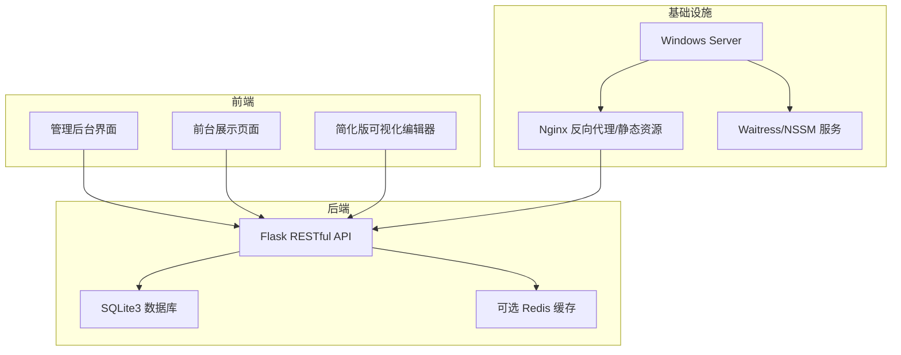
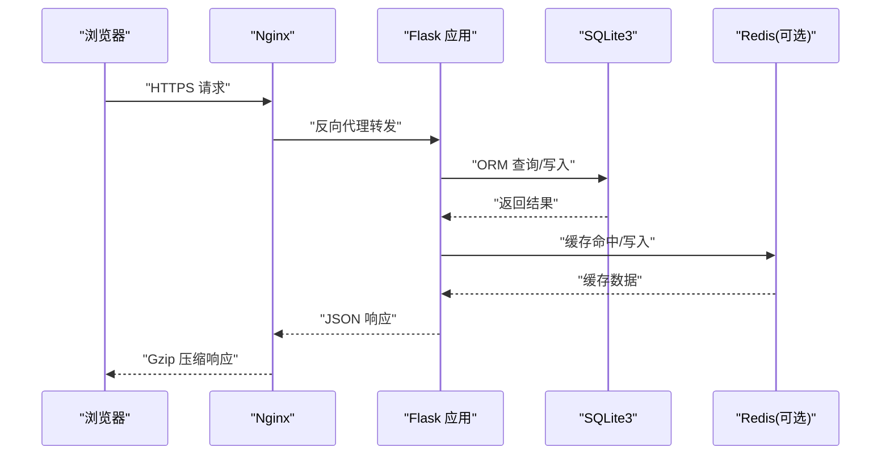
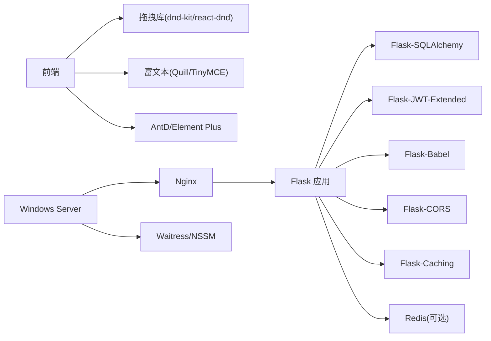

# 风险应对规划

<cite>
**本文引用的文件**
- [企业网站CMS系统开发需求文档.ini](file://企业网站CMS系统开发需求文档.ini)
- [企业网站CMS系统详细需求文档.md](file://企业网站CMS系统详细需求文档.md)
</cite>

## 目录
1. [引言](#引言)
2. [项目结构](#项目结构)
3. [核心组件](#核心组件)
4. [架构总览](#架构总览)
5. [详细组件分析](#详细组件分析)
6. [依赖分析](#依赖分析)
7. [性能考量](#性能考量)
8. [故障排查指南](#故障排查指南)
9. [结论](#结论)
10. [附录](#附录)

## 引言
本文件面向“企业网站CMS系统”的风险应对规划，结合项目需求文档中的技术架构、功能范围、实施计划与风险识别，系统化梳理风险规避、减轻、转移与接受策略，并配套风险应对计划模板、责任分工表、时间表与应急响应流程，帮助项目团队在有限时间内高质量交付MVP版本并建立可持续的风险治理能力。

## 项目结构
本项目采用前后端分离架构，后端基于Python Flask + SQLite3，前端可选React/Vue或纯HTML模板；部署于Windows Server + Nginx + Waitress/Gunicorn，强调“轻量化、易部署、低运维成本”。项目周期短、任务集中，采用MVP策略，优先保障核心功能按时交付。

**图表来源**
- [企业网站CMS系统详细需求文档.md](file://企业网站CMS系统详细需求文档.md#L22-L57)
- [企业网站CMS系统详细需求文档.md](file://企业网站CMS系统详细需求文档.md#L1141-L1230)
- [企业网站CMS系统详细需求文档.md](file://企业网站CMS系统详细需求文档.md#L1324-L1344)

**章节来源**
- [企业网站CMS系统详细需求文档.md](file://企业网站CMS系统详细需求文档.md#L22-L57)
- [企业网站CMS系统详细需求文档.md](file://企业网站CMS系统详细需求文档.md#L1141-L1230)
- [企业网站CMS系统详细需求文档.md](file://企业网站CMS系统详细需求文档.md#L1324-L1344)

## 核心组件
- 后端服务：Flask + RESTful API，提供认证、内容管理、媒体库、系统配置等接口。
- 数据层：SQLite3（默认），支持Redis可选缓存；数据库文件组织清晰，便于备份与恢复。
- 前端：管理后台界面、前台展示页面、简化版可视化编辑器（MVP阶段）。
- 部署：Nginx反向代理、HTTPS终止、Gzip压缩；Windows服务注册（NSSM）+ Waitress。
- 安全：JWT认证、bcrypt密码加密、CORS/CSRF/XSS/SQL注入防护、HTTPS强制跳转、限流与日志审计。

**章节来源**
- [企业网站CMS系统详细需求文档.md](file://企业网站CMS系统详细需求文档.md#L555-L628)
- [企业网站CMS系统详细需求文档.md](file://企业网站CMS系统详细需求文档.md#L660-L713)
- [企业网站CMS系统详细需求文档.md](file://企业网站CMS系统详细需求文档.md#L1078-L1140)
- [企业网站CMS系统详细需求文档.md](file://企业网站CMS系统详细需求文档.md#L1141-L1230)

## 架构总览
系统采用“前端SPA/纯HTML + 后端API + 数据库/缓存 + 反向代理”的分层架构。前端通过Nginx代理访问后端API，后端通过ORM访问SQLite3，必要时使用Redis缓存热点数据。部署在Windows Server上，使用Waitress作为WSGI服务器并通过NSSM注册为Windows服务。

**图表来源**
- [企业网站CMS系统详细需求文档.md](file://企业网站CMS系统详细需求文档.md#L22-L57)
- [企业网站CMS系统详细需求文档.md](file://企业网站CMS系统详细需求文档.md#L1141-L1230)
- [企业网站CMS系统详细需求文档.md](file://企业网站CMS系统详细需求文档.md#L1232-L1302)

## 详细组件分析

### 风险识别与应对策略矩阵
依据项目文档中的风险清单，结合应对策略四象限（规避、减轻、转移、接受），形成策略矩阵与实施要点。

- 风险1：Windows Server环境兼容性问题
  - 风险等级：中
  - 应对策略：减轻（提前Windows环境测试、使用Windows友好的Waitress、准备Docker容器化备选）
  - 资源配置：测试环境、Waitress配置、Docker镜像准备
  - 时间安排：阶段一（2月4日）完成环境验证与备选方案准备

- 风险2：拖拽编辑器性能问题
  - 风险等级：高
  - 应对策略：减轻（虚拟滚动、组件懒加载、限制单页组件数量、性能监控）
  - 资源配置：拖拽库、前端工程化、性能监控工具
  - 时间安排：阶段四（2月10日）完成性能优化与回归测试

- 风险3：数据库性能瓶颈
  - 风险等级：高
  - 应对策略：减轻（合理索引、查询优化、Redis缓存、读写分离）
  - 资源配置：数据库索引设计、缓存策略、监控告警
  - 时间安排：阶段二至阶段三（2月5日-2月9日）持续优化

- 风险4：需求变更频繁
  - 风险等级：高
  - 应对策略：规避（严格需求评审、变更流程控制、预留缓冲时间）
  - 资源配置：变更控制流程、文档版本管理
  - 时间安排：贯穿整个项目周期

- 风险5：人员变动
  - 风险等级：高
  - 应对策略：减轻（完善代码规范与文档、知识共享、关键角色备份）
  - 资源配置：文档、培训材料、交接清单
  - 时间安排：阶段一至阶段二（2月4日-2月7日）

- 风险6：数据泄露
  - 风险等级：高
  - 应对策略：减轻（安全开发培训、代码安全审计、渗透测试、日志监控）
  - 资源配置：安全审计工具、渗透测试、日志与告警
  - 时间安排：阶段五（2月11日）完成安全加固与测试

**章节来源**
- [企业网站CMS系统详细需求文档.md](file://企业网站CMS系统详细需求文档.md#L1867-L1923)

### 风险应对策略详解

#### 风险规避策略（完全消除风险）
- 适用场景：对系统稳定性与合规性要求极高的关键环节
- 实施步骤：
  - 在设计阶段明确技术栈与部署方案，避免在开发中反复切换
  - 对Windows Server环境进行充分验证，确保依赖组件兼容
  - 严格限定MVP范围，避免超出交付窗口的功能进入开发
- 资源配置：测试环境、技术评审会议、变更控制流程

**章节来源**
- [企业网站CMS系统详细需求文档.md](file://企业网站CMS系统详细需求文档.md#L1463-L1531)
- [企业网站CMS系统详细需求文档.md](file://企业网站CMS系统详细需求文档.md#L1897-L1903)

#### 风险减轻策略（降低发生概率或影响）
- 适用场景：常见但可控的技术与项目风险
- 实施步骤：
  - 性能优化：索引设计、查询优化、缓存策略、虚拟滚动
  - 安全加固：JWT、bcrypt、CORS/CSRF/XSS/SQL注入防护、HTTPS、限流
  - 人员与文档：完善代码规范、知识共享、文档与交接清单
- 资源配置：监控工具、安全审计、文档与培训

**章节来源**
- [企业网站CMS系统详细需求文档.md](file://企业网站CMS系统详细需求文档.md#L1877-L1884)
- [企业网站CMS系统详细需求文档.md](file://企业网站CMS系统详细需求文档.md#L1886-L1894)
- [企业网站CMS系统详细需求文档.md](file://企业网站CMS系统详细需求文档.md#L1913-L1923)
- [企业网站CMS系统详细需求文档.md](file://企业网站CMS系统详细需求文档.md#L1078-L1140)

#### 风险转移策略（保险、外包、合同条款）
- 适用场景：超出团队能力范围或外部依赖风险
- 实施步骤：
  - 采用成熟开源技术栈，将技术风险转移给社区与生态
  - 通过云服务（如CDN、对象存储）转移运维与容量压力
  - 通过合同条款明确第三方服务的SLA与责任边界
- 资源配置：云服务订阅、合同与供应商管理

**章节来源**
- [企业网站CMS系统详细需求文档.md](file://企业网站CMS系统详细需求文档.md#L1952-L1956)

#### 风险接受策略（建立应急储备）
- 适用场景：低概率、低影响且难以规避/减轻的风险
- 实施步骤：
  - 建立应急响应预案与快速回滚机制
  - 准备应急资源（备用服务器、回滚脚本、紧急联系人）
  - 对不可抗力风险（如极端流量、政策变化）设定接受阈值
- 资源配置：应急预案、回滚脚本、应急联系人

**章节来源**
- [企业网站CMS系统详细需求文档.md](file://企业网站CMS系统详细需求文档.md#L1412-L1416)

### 风险应对计划模板
- 风险编号：R001-R006
- 风险描述：见“风险识别与应对策略矩阵”
- 风险等级：低/中/高
- 影响程度：低/中/高
- 发生概率：低/中/高
- 应对策略：规避/减轻/转移/接受
- 责任人：后端负责人、前端负责人、安全负责人、测试负责人
- 资源需求：测试环境、监控工具、文档、云服务
- 时间节点：阶段一至阶段六
- 验收标准：测试通过、监控达标、文档齐全

**章节来源**
- [企业网站CMS系统详细需求文档.md](file://企业网站CMS系统详细需求文档.md#L1867-L1923)
- [企业网站CMS系统详细需求文档.md](file://企业网站CMS系统详细需求文档.md#L1774-L1784)

### 责任分工表
- 项目经理：总体协调、里程碑跟踪、变更控制
- 后端负责人：API开发、数据库优化、安全加固
- 前端负责人：管理后台与可视化编辑器开发、性能优化
- 测试/部署工程师：测试执行、部署配置、监控与应急响应
- 安全负责人：安全审计、渗透测试、日志与告警

**章节来源**
- [企业网站CMS系统详细需求文档.md](file://企业网站CMS系统详细需求文档.md#L1786-L1796)

### 时间表安排
- 阶段一：架构设计与环境搭建（2月4日）
- 阶段二：后端核心API开发（2月5日-2月7日）
- 阶段三：管理后台界面开发（2月8日-2月9日）
- 阶段四：可视化编辑器与前台（2月10日）
- 阶段五：测试、修复与部署（2月11日）
- 阶段六：交付与培训（2月12日）

**章节来源**
- [企业网站CMS系统详细需求文档.md](file://企业网站CMS系统详细需求文档.md#L1463-L1531)
- [企业网站CMS系统详细需求文档.md](file://企业网站CMS系统详细需求文档.md#L1532-L1608)
- [企业网站CMS系统详细需求文档.md](file://企业网站CMS系统详细需求文档.md#L1609-L1651)
- [企业网站CMS系统详细需求文档.md](file://企业网站CMS系统详细需求文档.md#L1656-L1694)
- [企业网站CMS系统详细需求文档.md](file://企业网站CMS系统详细需求文档.md#L1695-L1725)
- [企业网站CMS系统详细需求文档.md](file://企业网站CMS系统详细需求文档.md#L1726-L1771)

### 应急响应流程与快速决策机制
- 触发条件：性能异常、安全事件、部署失败、关键功能缺陷
- 快速决策：由项目经理牵头，相关责任人30分钟内给出处置方案
- 应急措施：回滚至上一个稳定版本、启用降级模式（如禁用缓存）、临时扩容（如增加Worker）
- 事后复盘：记录事件、根因分析、改进措施与预防机制

**章节来源**
- [企业网站CMS系统详细需求文档.md](file://企业网站CMS系统详细需求文档.md#L1412-L1416)
- [企业网站CMS系统详细需求文档.md](file://企业网站CMS系统详细需求文档.md#L1867-L1923)

### 风险应对效果评估、经验总结与最佳实践
- 评估维度：功能达成率、性能指标、安全测试通过率、用户验收通过率、文档完整性
- 经验总结：MVP优先、Windows环境验证、缓存与索引先行、安全左移、变更控制
- 最佳实践：持续集成与自动化测试、监控告警与日志审计、定期演练应急响应

**章节来源**
- [企业网站CMS系统详细需求文档.md](file://企业网站CMS系统详细需求文档.md#L1804-L1862)
- [企业网站CMS系统详细需求文档.md](file://企业网站CMS系统详细需求文档.md#L1417-L1423)

## 依赖分析
- 技术栈依赖：Flask生态（SQLAlchemy、JWT、Babel、CORS、Caching等）与前端生态（React/Vue、拖拽库、富文本编辑器）
- 基础设施依赖：Nginx、Windows Server、Waitress/NSSM、可选Redis
- 外部依赖：云存储（OSS/COS/七牛）、CDN、邮件服务

**图表来源**
- [企业网站CMS系统详细需求文档.md](file://企业网站CMS系统详细需求文档.md#L555-L628)
- [企业网站CMS系统详细需求文档.md](file://企业网站CMS系统详细需求文档.md#L1141-L1230)
- [企业网站CMS系统详细需求文档.md](file://企业网站CMS系统详细需求文档.md#L1324-L1344)

**章节来源**
- [企业网站CMS系统详细需求文档.md](file://企业网站CMS系统详细需求文档.md#L555-L628)
- [企业网站CMS系统详细需求文档.md](file://企业网站CMS系统详细需求文档.md#L1141-L1230)
- [企业网站CMS系统详细需求文档.md](file://企业网站CMS系统详细需求文档.md#L1324-L1344)

## 性能考量
- 响应时间：首页<2秒、内页<3秒、API<500ms、数据库查询<100ms
- 并发与资源：支持1000+并发用户、内存<2GB、CPU<70%
- 优化手段：页面缓存、数据缓存、静态资源CDN、图片懒加载、Gzip压缩、虚拟滚动、索引优化

**章节来源**
- [企业网站CMS系统详细需求文档.md](file://企业网站CMS系统详细需求文档.md#L1362-L1380)
- [企业网站CMS系统详细需求文档.md](file://企业网站CMS系统详细需求文档.md#L512-L548)

## 故障排查指南
- 常见问题：Windows服务无法启动、Nginx代理失败、JWT鉴权失败、数据库锁冲突、缓存未生效
- 排查步骤：检查日志（access/error）、确认环境变量、验证数据库文件权限、核对Redis连接、检查CORS与HTTPS配置
- 快速修复：重启服务、回滚最近变更、临时关闭缓存、修正CORS白名单

**章节来源**
- [企业网站CMS系统详细需求文档.md](file://企业网站CMS系统详细需求文档.md#L1141-L1230)
- [企业网站CMS系统详细需求文档.md](file://企业网站CMS系统详细需求文档.md#L1232-L1302)
- [企业网站CMS系统详细需求文档.md](file://企业网站CMS系统详细需求文档.md#L1417-L1423)

## 结论
本风险应对规划以项目需求文档为基础，结合MVP交付节奏，提出针对性的规避、减轻、转移与接受策略，并配套计划模板、责任分工与应急流程。通过严格的变更控制、安全左移与性能优化，可在8天内高质量交付核心功能，同时为后续演进打下坚实基础。

## 附录
- 风险应对计划模板（示例）
  - 风险编号：R001
  - 风险描述：Windows Server环境兼容性问题
  - 风险等级：中
  - 应对策略：减轻
  - 责任人：后端负责人
  - 资源需求：Windows测试环境、Waitress配置、Docker镜像
  - 时间节点：2月4日
  - 验收标准：Windows环境验证通过、Waitress部署成功

- 责任分工表（示例）
  - 项目经理：总体协调、里程碑跟踪
  - 后端负责人：API开发、数据库优化、安全加固
  - 前端负责人：管理后台与可视化编辑器开发
  - 测试/部署工程师：测试执行、部署配置、监控与应急响应
  - 安全负责人：安全审计、渗透测试、日志与告警

- 应急响应流程（示例）
  - 触发条件：性能异常/安全事件/部署失败
  - 快速决策：30分钟内给出处置方案
  - 应急措施：回滚、降级、临时扩容
  - 复盘：事件记录、根因分析、改进措施

**章节来源**
- [企业网站CMS系统详细需求文档.md](file://企业网站CMS系统详细需求文档.md#L1867-L1923)
- [企业网站CMS系统详细需求文档.md](file://企业网站CMS系统详细需求文档.md#L1774-L1784)
- [企业网站CMS系统详细需求文档.md](file://企业网站CMS系统详细需求文档.md#L1412-L1416)