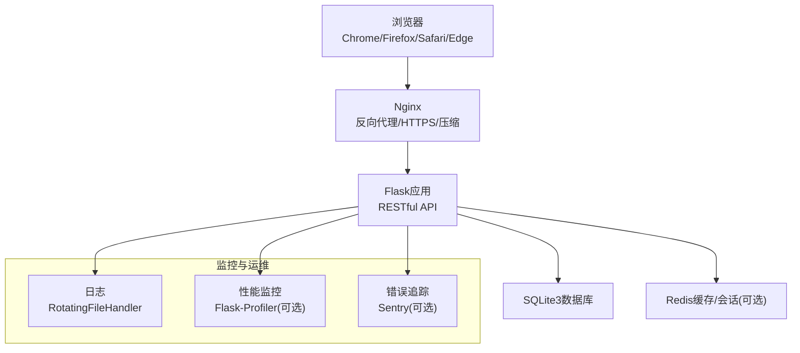
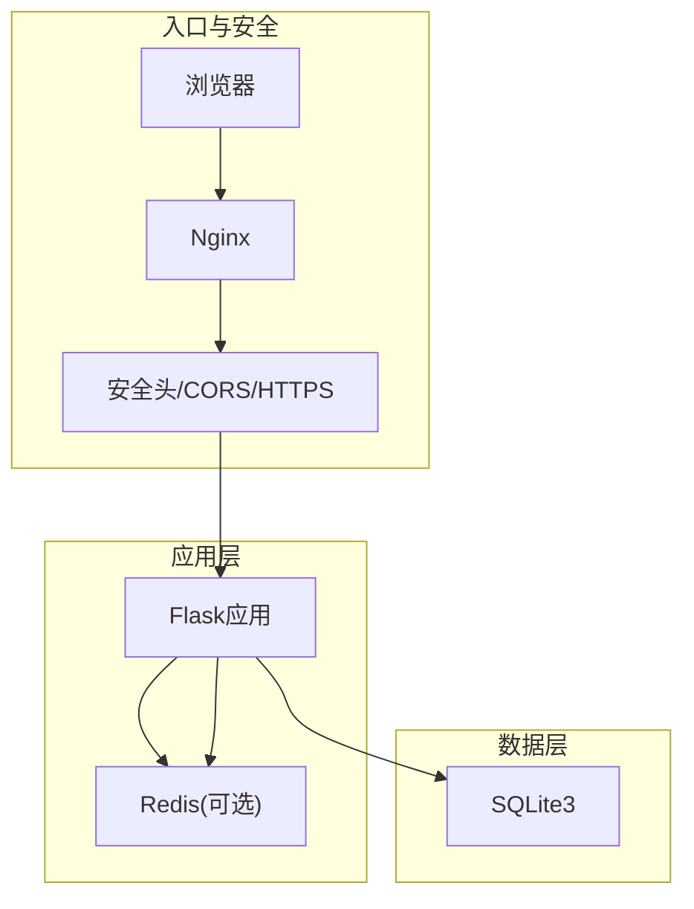
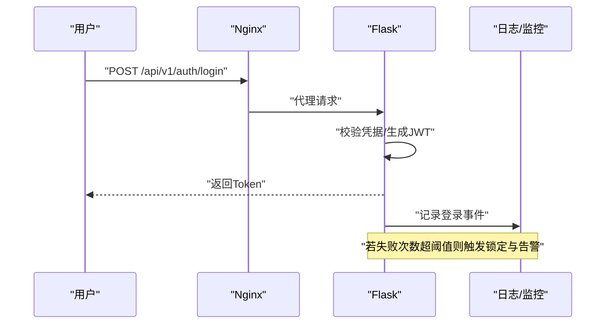
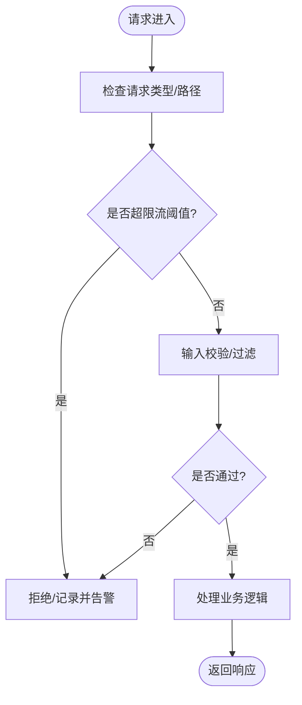
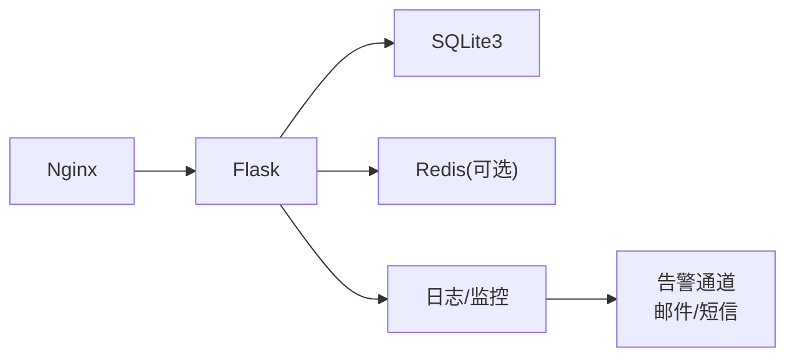
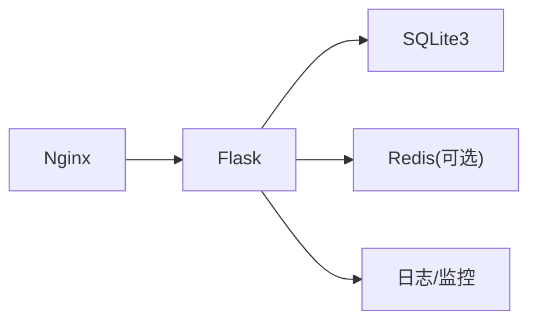

# 风险监控与控制

<cite>
**本文引用的文件**
- [企业网站CMS系统开发需求文档.ini](file://企业网站CMS系统开发需求文档.ini)
- [企业网站CMS系统详细需求文档.md](file://企业网站CMS系统详细需求文档.md)
</cite>

## 目录
1. [引言](#引言)
2. [项目结构](#项目结构)
3. [核心组件](#核心组件)
4. [架构总览](#架构总览)
5. [详细组件分析](#详细组件分析)
6. [依赖分析](#依赖分析)
7. [性能考量](#性能考量)
8. [故障排查指南](#故障排查指南)
9. [结论](#结论)
10. [附录](#附录)

## 引言
本文件面向“企业网站CMS系统”的风险监控与控制体系建设，结合项目文档中的技术架构、安全设计、部署配置与非功能性需求，系统化梳理风险监控指标、预警机制、异常检测、控制措施、审计与合规、沟通与报告等关键要素，并提供可落地的仪表板模板、KPI指标体系与报告格式建议，帮助项目在有限时间内高质量交付并建立可持续的风险治理能力。

## 项目结构
- 项目采用前后端分离架构，后端基于Flask + SQLite3，前端可选React/Vue或纯HTML模板渲染；通过Nginx反向代理提供HTTPS、静态资源服务、Gzip压缩与负载均衡（可选）。
- 部署环境为Windows Server，使用Waitress/Gunicorn + NSSM服务管理，具备日志与可选Redis缓存/会话能力。
- 非功能性需求覆盖性能、安全、可用性、兼容性与可维护性，为风险监控与控制提供基线。

**图表来源**
- [企业网站CMS系统详细需求文档.md](file://企业网站CMS系统详细需求文档.md#L28-L57)
- [企业网站CMS系统详细需求文档.md](file://企业网站CMS系统详细需求文档.md#L630-L659)

**章节来源**
- [企业网站CMS系统详细需求文档.md](file://企业网站CMS系统详细需求文档.md#L22-L57)
- [企业网站CMS系统详细需求文档.md](file://企业网站CMS系统详细需求文档.md#L630-L659)

## 核心组件
- 认证与授权：JWT Token、RBAC权限模型、登录失败锁定、会话管理。
- 数据安全：ORM参数化、输入/输出过滤、CSP、CSRF、文件上传白名单与大小限制。
- API安全：Flask-Limiter限流、SameSite Cookie、双重提交Cookie。
- 性能与可用性：页面缓存、数据缓存、静态资源缓存、CDN、Nginx压缩与HTTPS。
- 监控与告警：服务状态、性能指标、错误率、磁盘空间、邮件/短信通知。

**章节来源**
- [企业网站CMS系统详细需求文档.md](file://企业网站CMS系统详细需求文档.md#L1078-L1140)
- [企业网站CMS系统详细需求文档.md](file://企业网站CMS系统详细需求文档.md#L1360-L1423)

## 架构总览
系统采用“浏览器/Nginx/Flask/数据库/缓存”的分层结构，Nginx承担入口流量治理与安全加固，Flask提供RESTful API与模板渲染，SQLite3承载业务数据，Redis可选用于缓存与会话。监控侧通过日志、性能与错误追踪工具形成闭环。

**图表来源**
- [企业网站CMS系统详细需求文档.md](file://企业网站CMS系统详细需求文档.md#L1143-L1230)
- [企业网站CMS系统详细需求文档.md](file://企业网站CMS系统详细需求文档.md#L1232-L1302)

## 详细组件分析

### 认证与授权风险监控
- 监控指标
  - 登录失败次数（IP/用户维度）
  - Token刷新频率
  - 会话活跃用户数
  - 异常登录（IP/设备变化）告警
- 预警机制
  - 登录失败阈值触发临时锁定
  - 异常登录即时邮件/短信通知
- 控制措施
  - 强制HTTPS与HSTS
  - CSRF Token与SameSite Cookie
  - JWT刷新令牌与短期访问令牌
- 异常检测
  - 基于滑动窗口的失败次数统计
  - 地理位置与设备指纹比对

**图表来源**
- [企业网站CMS系统详细需求文档.md](file://企业网站CMS系统详细需求文档.md#L1080-L1140)
- [企业网站CMS系统详细需求文档.md](file://企业网站CMS系统详细需求文档.md#L1417-L1422)

**章节来源**
- [企业网站CMS系统详细需求文档.md](file://企业网站CMS系统详细需求文档.md#L1080-L1140)
- [企业网站CMS系统详细需求文档.md](file://企业网站CMS系统详细需求文档.md#L1417-L1422)

### 数据安全与API安全监控
- 监控指标
  - SQL注入/跨站脚本/跨站请求伪造检测次数
  - API请求速率（按IP/用户）
  - 文件上传类型与大小违规
  - 敏感数据访问日志
- 预警机制
  - WAF/限流触发告警
  - 异常文件类型/过大文件上传告警
- 控制措施
  - ORM参数化查询
  - 输入过滤与输出转义
  - Flask-WTF CSRF保护
  - Flask-Limiter限流
- 异常检测
  - 基于正则与规则的输入校验
  - 限流阈值触发的异常行为识别

**图表来源**
- [企业网站CMS系统详细需求文档.md](file://企业网站CMS系统详细需求文档.md#L1128-L1140)
- [企业网站CMS系统详细需求文档.md](file://企业网站CMS系统详细需求文档.md#L1130-L1135)

**章节来源**
- [企业网站CMS系统详细需求文档.md](file://企业网站CMS系统详细需求文档.md#L1128-L1140)
- [企业网站CMS系统详细需求文档.md](file://企业网站CMS系统详细需求文档.md#L1130-L1135)

### 性能与可用性监控
- 监控指标
  - 页面加载时间（首页/内页）
  - API响应时间
  - 数据库查询耗时
  - 缓存命中率
  - 磁盘空间与I/O
  - 并发用户数与QPS
- 预警机制
  - 响应时间/错误率阈值告警
  - 磁盘空间低于阈值告警
- 控制措施
  - 页面缓存、数据缓存、静态资源缓存
  - Gzip压缩、CDN加速
  - Nginx限流与健康检查
- 异常检测
  - 基于历史基线的同比/环比异常
  - 缓存失效导致的延迟激增

**图表来源**
- [企业网站CMS系统详细需求文档.md](file://企业网站CMS系统详细需求文档.md#L1362-L1380)
- [企业网站CMS系统详细需求文档.md](file://企业网站CMS系统详细需求文档.md#L1417-L1422)

**章节来源**
- [企业网站CMS系统详细需求文档.md](file://企业网站CMS系统详细需求文档.md#L1362-L1380)
- [企业网站CMS系统详细需求文档.md](file://企业网站CMS系统详细需求文档.md#L1417-L1422)

### 备份与容灾监控
- 监控指标
  - 备份成功率与完整性
  - 备份保留周期与归档
  - 恢复演练成功率
- 预警机制
  - 备份失败/超时告警
  - 恢复演练失败告警
- 控制措施
  - 每日全量备份、增量备份
  - 异地备份至云存储
  - 定期恢复演练
- 异常检测
  - 备份文件体积/时间异常
  - 恢复时间目标（RTO）与恢复点目标（RPO）偏离

**章节来源**
- [企业网站CMS系统详细需求文档.md](file://企业网站CMS系统详细需求文档.md#L1406-L1416)

### 风险监控仪表板模板
- 仪表板分区建议
  - 服务健康区：服务状态、错误率、响应时间
  - 安全事件区：登录失败、异常登录、API限流触发
  - 性能指标区：页面加载、API响应、缓存命中率
  - 资源监控区：磁盘空间、内存/CPU、并发用户
  - 备份与容灾区：备份成功率、恢复演练结果
- KPI指标体系
  - 服务可用性：≥99.9%
  - 页面加载时间：首页<2s，内页<3s
  - API响应时间：<500ms
  - 错误率：日均<0.1%
  - 备份成功率：100%（月度）
  - 恢复时间目标（RTO）：<30分钟
  - 恢复点目标（RPO）：<1小时
- 报告格式
  - 周报/月报模板：指标趋势、异常事件、处置措施、改进建议

（本节为概念性模板，不直接分析具体文件）

### 风险控制措施执行与偏差纠正
- 执行流程
  - 风险识别 → 指标设定 → 监控采集 → 预警触发 → 偏差分析 → 控制措施 → 结果验证 → 持续改进
- 偏差纠正
  - 对于性能异常：启用缓存、优化查询、CDN加速
  - 对于安全事件：封禁IP、重置密钥、加强日志
  - 对于可用性下降：扩容实例、健康检查、回滚
- 持续改进
  - 周/月回顾会议，更新阈值与策略
  - 引入A/B测试验证优化效果

（本节为通用流程说明，不直接分析具体文件）

### 风险审计、合规与第三方评估
- 审计范围
  - 认证与授权日志、敏感操作审计、错误与安全事件日志
- 合规要点
  - HTTPS/TLS、CSP、CSRF防护、文件上传白名单
- 第三方评估
  - 渗透测试、代码安全审计、性能压力测试

**章节来源**
- [企业网站CMS系统详细需求文档.md](file://企业网站CMS系统详细需求文档.md#L1391-L1401)
- [企业网站CMS系统详细需求文档.md](file://企业网站CMS系统详细需求文档.md#L1913-L1923)

### 风险沟通机制与透明度
- 沟通渠道
  - 邮件/短信告警、内部看板、周报/月报
- 利益相关者
  - 管理员、编辑、运维、安全团队、管理层
- 透明度保障
  - 公开阈值与规则、定期发布风险报告、问题追踪与闭环

（本节为通用机制说明，不直接分析具体文件）

## 依赖分析
- 组件耦合
  - Nginx与Flask：反向代理与上游服务解耦
  - Flask与数据库：ORM抽象降低耦合
  - Flask与Redis：可选缓存/会话，便于替换
- 外部依赖
  - Nginx、Python生态、SQLite3、可选Redis
- 循环依赖
  - 无明显循环依赖，采用分层架构

**图表来源**
- [企业网站CMS系统详细需求文档.md](file://企业网站CMS系统详细需求文档.md#L28-L57)
- [企业网站CMS系统详细需求文档.md](file://企业网站CMS系统详细需求文档.md#L1232-L1302)

**章节来源**
- [企业网站CMS系统详细需求文档.md](file://企业网站CMS系统详细需求文档.md#L28-L57)
- [企业网站CMS系统详细需求文档.md](file://企业网站CMS系统详细需求文档.md#L1232-L1302)

## 性能考量
- 基准要求
  - 首页加载<2s，内页<3s，API<500ms，数据库查询<100ms
- 优化手段
  - 页面缓存、数据缓存、静态资源缓存、CDN、Gzip压缩
- 监控重点
  - 响应时间分布、错误率、缓存命中率、磁盘空间

**章节来源**
- [企业网站CMS系统详细需求文档.md](file://企业网站CMS系统详细需求文档.md#L1362-L1380)

## 故障排查指南
- 常见问题
  - 登录失败过多：检查登录锁定策略与日志
  - API限流频繁：调整限流阈值或优化调用频率
  - 页面加载慢：检查缓存配置与CDN
  - 备份失败：检查备份脚本与存储权限
- 工具与日志
  - Flask日志、Nginx访问/错误日志、可选Sentry错误追踪

**章节来源**
- [企业网站CMS系统详细需求文档.md](file://企业网站CMS系统详细需求文档.md#L1417-L1422)
- [企业网站CMS系统详细需求文档.md](file://企业网站CMS系统详细需求文档.md#L655-L659)

## 结论
本项目在有限时间内采用MVP策略，围绕认证授权、数据安全、API安全、性能与可用性、备份容灾等关键领域建立了风险监控与控制的基础框架。通过明确的监控指标、预警机制与控制措施，配合定期审计与沟通机制，可有效保障系统的稳定性、安全性与可维护性，并为后续迭代提供持续改进的抓手。

## 附录
- 风险清单与应对
  - Windows环境兼容性：使用Waitress、提前测试、准备容器化备选
  - 拖拽编辑器性能：虚拟滚动、组件懒加载、限制单页组件数量
  - 数据库性能瓶颈：合理索引、查询优化、Redis缓存
  - 需求变更频繁：严格评审、变更流程、预留缓冲
  - 人员变动：完善文档与知识共享、关键角色备份
  - 数据泄露：安全培训、代码审计、渗透测试、日志监控

**章节来源**
- [企业网站CMS系统详细需求文档.md](file://企业网站CMS系统详细需求文档.md#L1867-L1923)