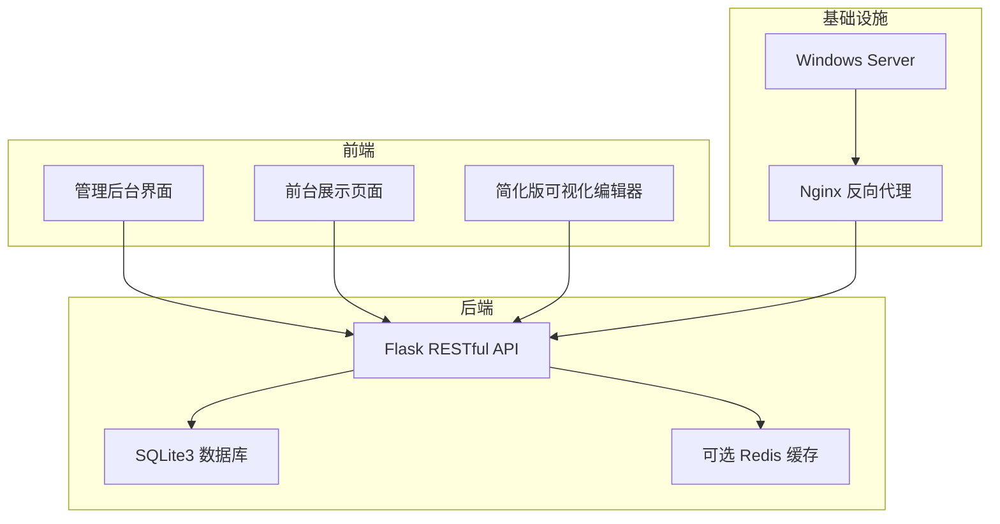
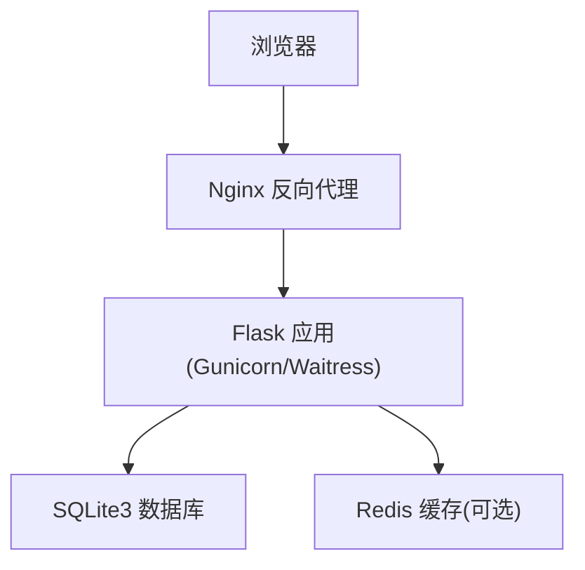
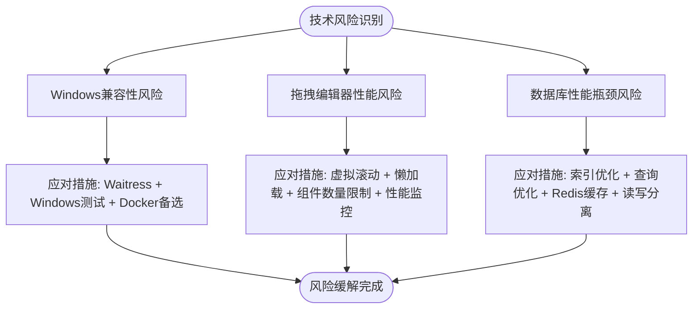
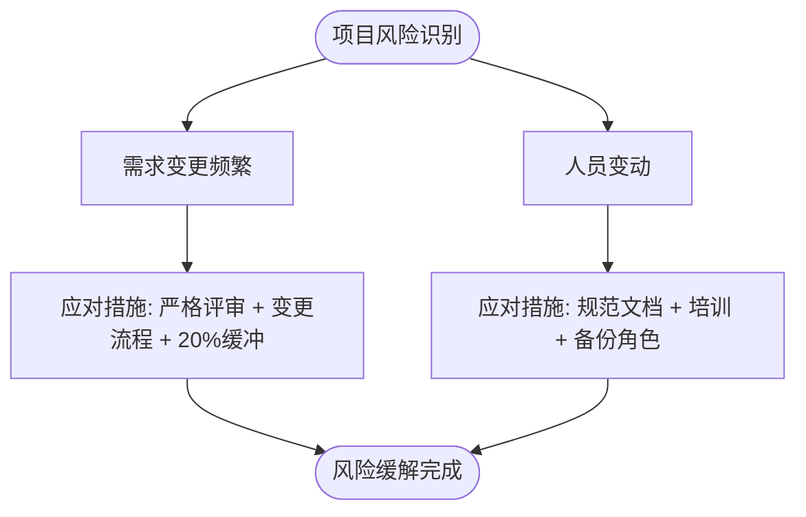
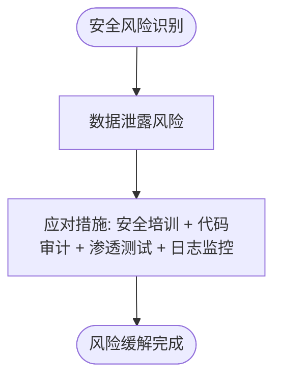
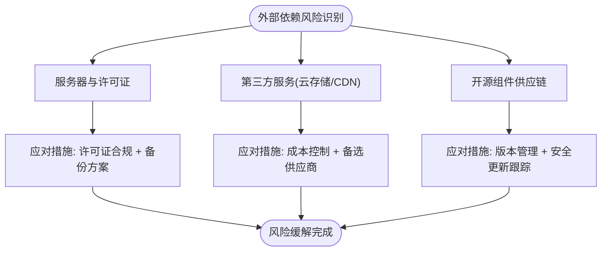
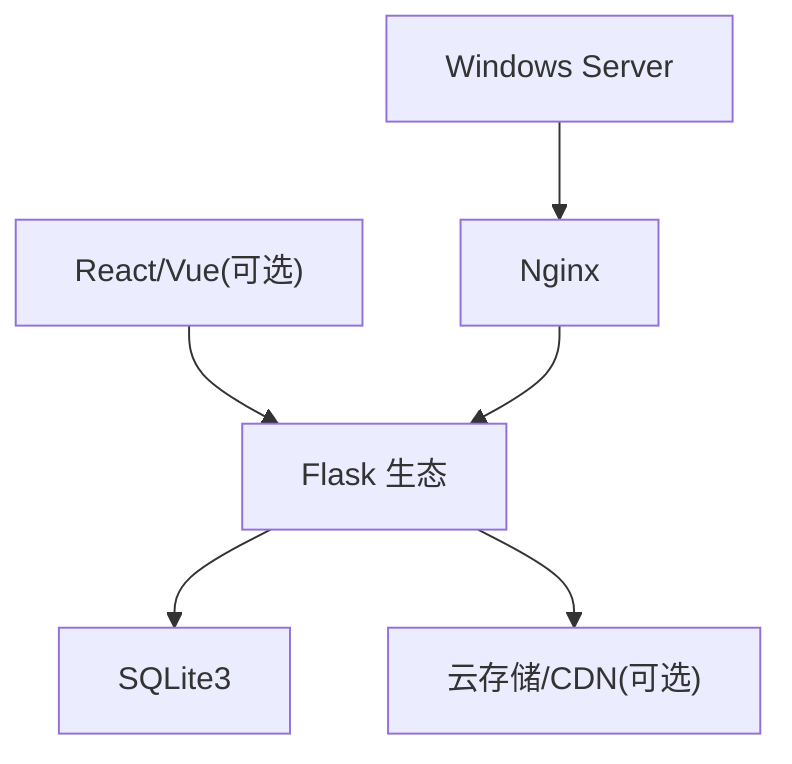

# 风险管理

<cite>
**本文引用的文件**
- [企业网站CMS系统开发需求文档.ini](file://企业网站CMS系统开发需求文档.ini)
- [企业网站CMS系统详细需求文档.md](file://企业网站CMS系统详细需求文档.md)
</cite>

## 目录
1. [引言](#引言)
2. [项目结构](#项目结构)
3. [核心组件](#核心组件)
4. [架构总览](#架构总览)
5. [详细组件分析](#详细组件分析)
6. [依赖分析](#依赖分析)
7. [性能考量](#性能考量)
8. [故障排查指南](#故障排查指南)
9. [结论](#结论)
10. [附录](#附录)

## 引言
本风险管理文档面向企业网站CMS系统开发项目，基于现有需求文档中的技术架构、功能范围与实施计划，系统梳理项目在技术、市场、团队与外部依赖四个维度可能面临的风险，并提出针对性的应对策略、缓解措施、应急预案、监控机制与报告制度。文档旨在帮助项目团队建立统一的风险认知与处置流程，确保在8天MVP交付周期内高质量完成系统交付。

## 项目结构
项目采用“前后端分离 + 轻量化后端”的架构设计，后端基于Python Flask + SQLite3，前端可选React/Vue或纯HTML模板渲染，部署于Windows Server + Nginx环境。项目周期短、目标明确，采用MVP策略聚焦核心功能，为后续版本迭代预留空间。

**图表来源**
- [企业网站CMS系统详细需求文档.md](file://企业网站CMS系统详细需求文档.md#L28-L57)
- [企业网站CMS系统详细需求文档.md](file://企业网站CMS系统详细需求文档.md#L1143-L1230)

**章节来源**
- [企业网站CMS系统详细需求文档.md](file://企业网站CMS系统详细需求文档.md#L22-L57)
- [企业网站CMS系统详细需求文档.md](file://企业网站CMS系统详细需求文档.md#L1143-L1230)

## 核心组件
- 后端服务：Flask + RESTful API，提供认证、内容管理、媒体库、系统配置等接口。
- 数据存储：SQLite3（默认）+ 可选Redis（高并发时使用），数据库文件集中管理，便于备份与恢复。
- 前端组件：管理后台界面、前台展示页面、简化版可视化编辑器（MVP阶段仅实现5个核心组件）。
- 部署与运维：Nginx反向代理、Windows服务（NSSM）、环境变量配置、日志与监控。

**章节来源**
- [企业网站CMS系统详细需求文档.md](file://企业网站CMS系统详细需求文档.md#L555-L659)
- [企业网站CMS系统详细需求文档.md](file://企业网站CMS系统详细需求文档.md#L1232-L1356)

## 架构总览
系统采用“前后端分离 + 混合模式支持”的架构，既可使用SPA，也可使用Jinja2模板渲染的纯HTML后台。Nginx负责静态资源、HTTPS终止与反向代理，Flask应用提供API与模板渲染，SQLite3支撑业务数据，Redis用于缓存与会话（可选）。

**图表来源**
- [企业网站CMS系统详细需求文档.md](file://企业网站CMS系统详细需求文档.md#L28-L57)
- [企业网站CMS系统详细需求文档.md](file://企业网站CMS系统详细需求文档.md#L579-L659)

**章节来源**
- [企业网站CMS系统详细需求文档.md](file://企业网站CMS系统详细需求文档.md#L22-L57)

## 详细组件分析

### 技术风险
- Windows Server环境兼容性：使用Waitress替代Gunicorn，提前在Windows环境测试，准备Docker容器化备选方案。
- 拖拽编辑器性能：采用虚拟滚动、组件懒加载、限制单页组件数量与性能监控。
- 数据库性能瓶颈：合理索引、查询优化、Redis缓存、必要时读写分离。

**图表来源**
- [企业网站CMS系统详细需求文档.md](file://企业网站CMS系统详细需求文档.md#L1867-L1894)

**章节来源**
- [企业网站CMS系统详细需求文档.md](file://企业网站CMS系统详细需求文档.md#L1867-L1894)

### 项目风险
- 需求变更频繁：严格需求评审、变更流程控制、预留20%缓冲时间。
- 人员变动：完善代码规范与文档、知识共享与培训、关键角色备份。

**图表来源**
- [企业网站CMS系统详细需求文档.md](file://企业网站CMS系统详细需求文档.md#L1895-L1912)

**章节来源**
- [企业网站CMS系统详细需求文档.md](file://企业网站CMS系统详细需求文档.md#L1895-L1912)

### 安全风险
- 数据泄露：开展安全开发培训、代码安全审计、渗透测试、日志监控。

**图表来源**
- [企业网站CMS系统详细需求文档.md](file://企业网站CMS系统详细需求文档.md#L1913-L1923)

**章节来源**
- [企业网站CMS系统详细需求文档.md](file://企业网站CMS系统详细需求文档.md#L1913-L1923)

### 外部依赖风险
- 服务器与许可证：Windows Server许可、SSL证书、域名、云存储与CDN等第三方服务。
- 供应链风险：依赖开源组件（Flask、Nginx、SQLite3、React/Vue等）的版本与安全更新。

**图表来源**
- [企业网站CMS系统详细需求文档.md](file://企业网站CMS系统详细需求文档.md#L1937-L1957)

**章节来源**
- [企业网站CMS系统详细需求文档.md](file://企业网站CMS系统详细需求文档.md#L1937-L1957)

### 市场风险
- 竞争对手快速跟进：通过快速交付MVP抢占市场先机，后续版本持续迭代增强差异化能力。
- 客户期望与验收标准：在MVP阶段明确验收标准，减少后期返工。

**章节来源**
- [企业网站CMS系统详细需求文档.md](file://企业网站CMS系统详细需求文档.md#L1804-L1862)

## 依赖分析
项目依赖关系主要体现在技术栈、部署环境与第三方服务三个方面。后端依赖Flask生态与SQLite3，前端可选React/Vue或纯HTML模板；部署依赖Nginx与Windows Server；第三方服务包括云存储、CDN与邮件服务等。

**图表来源**
- [企业网站CMS系统详细需求文档.md](file://企业网站CMS系统详细需求文档.md#L555-L659)
- [企业网站CMS系统详细需求文档.md](file://企业网站CMS系统详细需求文档.md#L1143-L1230)

**章节来源**
- [企业网站CMS系统详细需求文档.md](file://企业网站CMS系统详细需求文档.md#L555-L659)
- [企业网站CMS系统详细需求文档.md](file://企业网站CMS系统详细需求文档.md#L1143-L1230)

## 性能考量
- 响应时间：首页加载<2秒，内页<3秒，API<500ms，数据库查询<100ms。
- 并发性能：支持1000+并发用户，QPS≥500，数据库连接池50。
- 资源占用：内存<2GB，CPU<70%，磁盘IO<80%。
- 优化手段：页面缓存、数据缓存、静态资源缓存、图片懒加载、CDN加速、索引优化、查询优化。

**章节来源**
- [企业网站CMS系统详细需求文档.md](file://企业网站CMS系统详细需求文档.md#L1362-L1380)

## 故障排查指南
- 日志与监控：使用logging模块与RotatingFileHandler，可选Flask-Profiler与Sentry。
- 错误处理：完善的API错误处理与状态码返回，结合前端错误提示优化用户体验。
- 备份与恢复：每日数据库备份，支持手动与自动备份，异步任务可选Celery。

**章节来源**
- [企业网站CMS系统详细需求文档.md](file://企业网站CMS系统详细需求文档.md#L555-L659)
- [企业网站CMS系统详细需求文档.md](file://企业网站CMS系统详细需求文档.md#L1360-L1460)

## 结论
本项目在8天MVP周期内，通过明确的技术选型、严格的验收标准与完善的风险应对策略，能够在保证交付质量的同时有效控制技术、项目、安全与外部依赖风险。建议在项目执行过程中持续进行风险监控与回顾，确保后续版本迭代顺利推进。

## 附录

### 风险登记册管理
- 风险识别：定期进行风险识别与评估，形成风险登记册。
- 风险分级：依据影响程度与发生概率进行分级管理。
- 责任分工：明确每项风险的责任人与处置时限。
- 更新机制：随项目进展定期更新风险登记册。

### 风险评估矩阵
- 横轴：概率（低/中/高）
- 纵轴：影响（低/中/高）
- 等级划分：高风险优先处置，中低风险纳入日常监控。

### 风险概率与影响分析
- Windows兼容性：概率低，影响中，应对措施明确。
- 拖拽编辑器性能：概率中，影响高，需重点优化。
- 数据库性能：概率中，影响高，需索引与缓存配合。
- 需求变更：概率中，影响高，需流程控制与缓冲。
- 人员变动：概率低，影响高，需文档与备份。
- 数据泄露：概率低，影响高，需安全审计与监控。

### 风险控制工具
- 风险监控：日志与监控系统、性能指标仪表盘。
- 风险预警：阈值报警、异常检测、告警通知。
- 风险报告：定期风险报告、变更影响评估、经验教训总结。

### 风险转移策略
- 保险：针对关键第三方服务购买相应保障。
- 合同：与供应商明确SLA与责任边界。
- 备选方案：Docker容器化、云存储多供应商、CDN备选。

### 风险接受标准
- 可接受风险：低概率且低影响，持续观察。
- 需要控制风险：中高概率或中高影响，制定缓解措施。
- 需要规避风险：极高影响或极高概率，重新评估方案。

### 项目变更管理
- 变更申请：填写变更申请表，说明变更内容与影响。
- 评审流程：技术负责人与项目经理评审，决定是否批准。
- 实施与验证：变更实施后进行回归测试与验收。
- 记录归档：变更记录归档，形成经验库。

### 风险沟通与利益相关者管理
- 沟通机制：定期风险会议、风险报告、紧急事件沟通。
- 利益相关者：管理层、开发团队、测试团队、运维团队、客户代表。
- 透明度：风险信息及时共享，确保各方知情。

### 风险文化建设与培训
- 风险意识：通过培训提升全员风险意识。
- 持续改进：定期回顾风险管理效果，优化流程与工具。