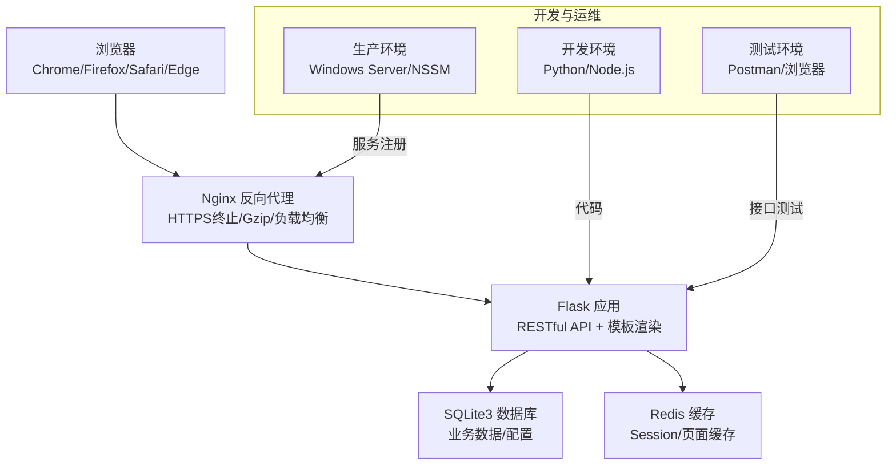
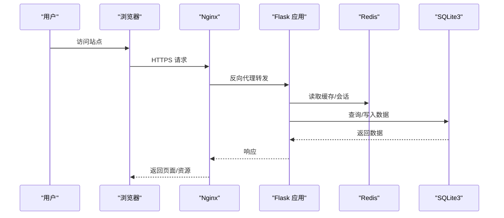
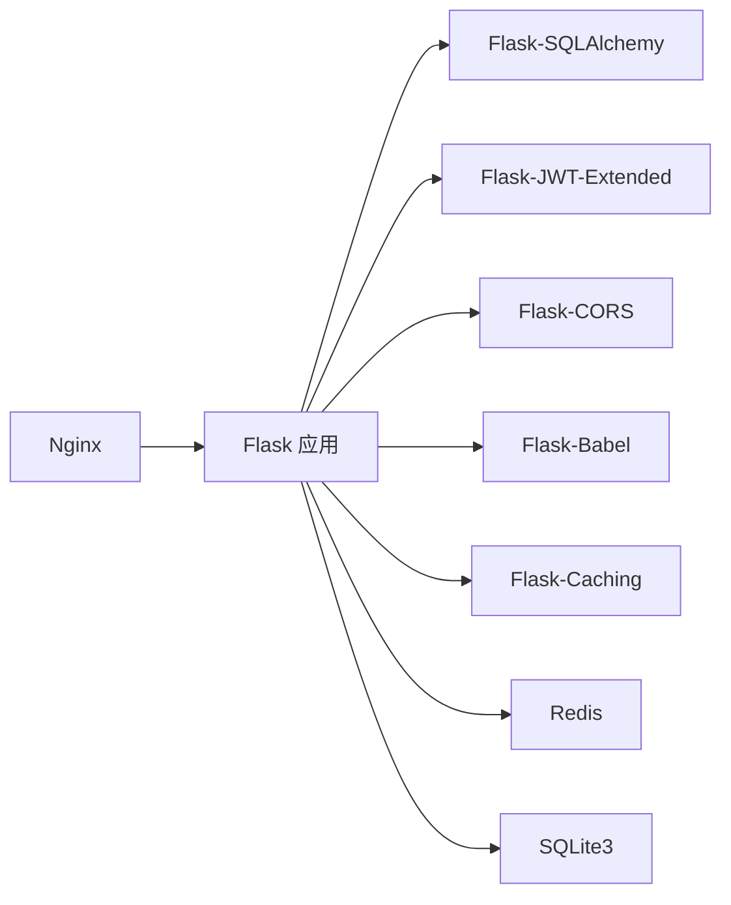

# 风险评估

<cite>
**本文引用的文件**
- [企业网站CMS系统开发需求文档.ini](file://企业网站CMS系统开发需求文档.ini)
- [企业网站CMS系统详细需求文档.md](file://企业网站CMS系统详细需求文档.md)
</cite>

## 目录
1. [引言](#引言)
2. [项目结构](#项目结构)
3. [核心组件](#核心组件)
4. [架构总览](#架构总览)
5. [详细组件分析](#详细组件分析)
6. [依赖分析](#依赖分析)
7. [性能考量](#性能考量)
8. [故障排查指南](#故障排查指南)
9. [结论](#结论)
10. [附录](#附录)

## 引言
本风险评估文档围绕企业网站CMS系统开发需求文档中的技术栈、功能边界、部署环境与非功能性需求，系统化梳理项目在技术、项目与安全层面可能遇到的风险，并给出量化评估方法、风险矩阵应用、定性与定量评估手段、风险阈值与预警指标、以及复核与动态调整策略。文档旨在帮助项目团队在有限时间内高质量交付MVP版本的同时，建立可持续的风险治理机制。

## 项目结构
- 项目采用前后端分离架构，后端基于Python Flask，前端可选React/Vue或纯HTML模板渲染；部署于Windows Server + Nginx + Gunicorn/Waitress。
- 核心模块包括：认证与权限、内容管理（文章/页面）、媒体库、系统配置、SEO优化、性能与缓存、安全防护、部署与监控。
- 非功能性需求覆盖性能、安全、可用性、兼容性与可维护性，为风险识别与评估提供基线。

**图表来源**
- [企业网站CMS系统详细需求文档.md](file://企业网站CMS系统详细需求文档.md#L22-L57)
- [企业网站CMS系统详细需求文档.md](file://企业网站CMS系统详细需求文档.md#L1143-L1230)
- [企业网站CMS系统详细需求文档.md](file://企业网站CMS系统详细需求文档.md#L1232-L1302)

**章节来源**
- [企业网站CMS系统详细需求文档.md](file://企业网站CMS系统详细需求文档.md#L22-L57)
- [企业网站CMS系统详细需求文档.md](file://企业网站CMS系统详细需求文档.md#L1143-L1230)
- [企业网站CMS系统详细需求文档.md](file://企业网站CMS系统详细需求文档.md#L1232-L1302)

## 核心组件
- 认证与权限：基于JWT的认证流程、RBAC权限模型、用户角色与权限分配。
- 内容管理：文章与页面的CRUD、分类/标签、SEO配置、页面组件配置（JSON存储）。
- 媒体库：文件上传、类型校验、缩略图生成、信息编辑、云存储支持。
- 系统配置：网站设置、URL规则、邮件配置、安全设置、备份管理。
- 性能与缓存：页面缓存、数据缓存、静态资源缓存、CDN、数据库优化。
- 安全防护：XSS/CSRF/SQL注入防护、文件上传安全、HTTPS/HSTS、API限流。
- 部署与监控：Nginx配置、Windows服务注册、日志与错误追踪、监控告警。

**章节来源**
- [企业网站CMS系统详细需求文档.md](file://企业网站CMS系统详细需求文档.md#L235-L446)
- [企业网站CMS系统详细需求文档.md](file://企业网站CMS系统详细需求文档.md#L448-L549)
- [企业网站CMS系统详细需求文档.md](file://企业网站CMS系统详细需求文档.md#L551-L659)
- [企业网站CMS系统详细需求文档.md](file://企业网站CMS系统详细需求文档.md#L1078-L1141)
- [企业网站CMS系统详细需求文档.md](file://企业网站CMS系统详细需求文档.md#L1360-L1461)

## 架构总览
系统采用“浏览器—Nginx—Flask—SQLite/Redis”的分层架构。Nginx负责静态资源、HTTPS终止、Gzip压缩与反向代理；Flask提供RESTful API与模板渲染；SQLite承担业务数据存储，Redis用于缓存与会话；Windows Server + NSSM实现服务化部署。

**图表来源**
- [企业网站CMS系统详细需求文档.md](file://企业网站CMS系统详细需求文档.md#L22-L57)
- [企业网站CMS系统详细需求文档.md](file://企业网站CMS系统详细需求文档.md#L1143-L1230)
- [企业网站CMS系统详细需求文档.md](file://企业网站CMS系统详细需求文档.md#L1232-L1302)

## 详细组件分析

### 认证与权限模块风险
- 风险类别：安全风险、技术风险
- 风险点：
  - JWT过期与刷新机制异常导致用户频繁掉线
  - RBAC权限粒度过粗或装饰器未正确拦截
  - 密码加密强度不足或历史密码校验缺失
- 评估方法：
  - 定性：专家评审（安全基线检查）
  - 定量：接口压测（并发登录/刷新）、日志审计（失败次数/异常IP）
- 风险矩阵与阈值：
  - 影响：高（用户无法登录/越权）
  - 概率：中（配置疏漏/依赖库版本问题）
  - 阈值：登录失败率>5%/小时、异常IP>3个/小时
- 应对措施：
  - 严格配置JWT过期与刷新策略
  - 完善权限装饰器与单元测试
  - 强密码策略与登录失败锁定

**章节来源**
- [企业网站CMS系统详细需求文档.md](file://企业网站CMS系统详细需求文档.md#L235-L293)
- [企业网站CMS系统详细需求文档.md](file://企业网站CMS系统详细需求文档.md#L1080-L1141)

### 内容管理模块风险
- 风险类别：功能风险、技术风险
- 风险点：
  - 文章/页面编辑器在复杂组件下性能下降
  - SEO配置未生效或冲突
  - 页面组件配置JSON结构不一致导致渲染异常
- 评估方法：
  - 定性：用户故事评审、可用性测试
  - 定量：编辑器渲染时间、SEO检查工具评分、页面渲染错误率
- 风险矩阵与阈值：
  - 影响：中（编辑体验差/SEO效果不佳）
  - 概率：中
  - 阈值：编辑器渲染>3秒、SEO评分<80分、渲染错误>1%
- 应对措施：
  - 组件懒加载与虚拟滚动
  - SEO配置校验与冲突提示
  - 组件Schema校验与默认值

**章节来源**
- [企业网站CMS系统详细需求文档.md](file://企业网站CMS系统详细需求文档.md#L294-L387)
- [企业网站CMS系统详细需求文档.md](file://企业网站CMS系统详细需求文档.md#L448-L549)

### 媒体库模块风险
- 风险类别：安全风险、性能风险
- 风险点：
  - 文件上传类型绕过或病毒文件入库
  - 大文件上传阻塞或超时
  - 缩略图生成失败导致页面异常
- 评估方法：
  - 定性：渗透测试、上传白名单评审
  - 定量：上传成功率、平均上传耗时、缩略图生成失败率
- 风险矩阵与阈值：
  - 影响：中（功能不可用/安全漏洞）
  - 概率：中
  - 阈值：上传失败>2%、平均耗时>5秒、缩略图失败>1%
- 应对措施：
  - 严格白名单与MIME检测
  - 限流与分块上传
  - 异常回滚与重试

**章节来源**
- [企业网站CMS系统详细需求文档.md](file://企业网站CMS系统详细需求文档.md#L355-L387)
- [企业网站CMS系统详细需求文档.md](file://企业网站CMS系统详细需求文档.md#L1116-L1122)

### 系统配置模块风险
- 风险类别：运维风险、安全风险
- 风险点：
  - 配置项冲突（如URL规则与SEO）
  - 备份策略不当导致恢复困难
  - 邮件配置错误影响通知
- 评估方法：
  - 定性：配置清单评审、回归测试
  - 定量：配置变更失败率、备份恢复时间
- 风险矩阵与阈值：
  - 影响：中（业务中断/用户体验下降）
  - 概率：中
  - 阈值：配置失败>1%、恢复时间>30分钟
- 应对措施：
  - 配置冲突检测与提示
  - 自动化备份与定期演练
  - 邮件连通性测试

**章节来源**
- [企业网站CMS系统详细需求文档.md](file://企业网站CMS系统详细需求文档.md#L388-L446)
- [企业网站CMS系统详细需求文档.md](file://企业网站CMS系统详细需求文档.md#L1406-L1422)

### 性能与缓存模块风险
- 风险类别：性能风险、技术风险
- 风险点：
  - 缓存命中率低导致响应变慢
  - 数据库查询未优化引发慢查询
  - CDN配置不当导致资源加载失败
- 评估方法：
  - 定性：性能基线评审
  - 定量：缓存命中率、慢查询数、页面首屏时间
- 风险矩阵与阈值：
  - 影响：中（用户体验下降）
  - 概率：中
  - 阈值：缓存命中率<60%、慢查询>5/分钟、首屏>3秒
- 应对措施：
  - 合理索引与查询优化
  - 缓存预热与失效策略
  - CDN健康检查与回源策略

**章节来源**
- [企业网站CMS系统详细需求文档.md](file://企业网站CMS系统详细需求文档.md#L512-L549)
- [企业网站CMS系统详细需求文档.md](file://企业网站CMS系统详细需求文档.md#L1362-L1380)

### 安全防护模块风险
- 风险类别：安全风险
- 风险点：
  - XSS/CSRF/SQL注入未完全防护
  - 文件上传安全未达标
  - API未限流导致被滥用
- 评估方法：
  - 定性：安全基线检查、代码审计
  - 定量：渗透测试通过率、异常请求占比
- 风险矩阵与阈值：
  - 影响：高（数据泄露/服务不可用）
  - 概率：中
  - 阈值：渗透测试失败>10%、异常请求>100/分钟
- 应对措施：
  - 输入过滤与输出转义
  - CSRF Token与SameSite Cookie
  - ORM参数化与Flask-Limiter

**章节来源**
- [企业网站CMS系统详细需求文档.md](file://企业网站CMS系统详细需求文档.md#L1078-L1141)
- [企业网站CMS系统详细需求文档.md](file://企业网站CMS系统详细需求文档.md#L1381-L1401)

## 依赖分析
- 外部依赖：Nginx、Flask生态（SQLAlchemy、RESTful、CORS、JWT、Babel、Caching）、Redis（可选）、SQLite3。
- 内部耦合：认证模块与权限模块强耦合；内容管理与媒体库存在文件依赖；缓存与数据库存在一致性问题。
- 循环依赖：文档未见循环导入；但需关注缓存失效与数据库更新的时序。

**图表来源**
- [企业网站CMS系统详细需求文档.md](file://企业网站CMS系统详细需求文档.md#L555-L594)
- [企业网站CMS系统详细需求文档.md](file://企业网站CMS系统详细需求文档.md#L1232-L1302)

**章节来源**
- [企业网站CMS系统详细需求文档.md](file://企业网站CMS系统详细需求文档.md#L555-L594)
- [企业网站CMS系统详细需求文档.md](file://企业网站CMS系统详细需求文档.md#L1232-L1302)

## 性能考量
- 响应时间基线：首页<2秒、内页<3秒、API<500ms、数据库查询<100ms。
- 并发与资源：并发用户>1000、QPS>500、内存<2GB、CPU<70%、磁盘IO<80%。
- 优化手段：页面缓存、数据缓存、静态资源缓存、CDN、图片懒加载、索引优化、连接池配置。

**章节来源**
- [企业网站CMS系统详细需求文档.md](file://企业网站CMS系统详细需求文档.md#L1362-L1380)
- [企业网站CMS系统详细需求文档.md](file://企业网站CMS系统详细需求文档.md#L512-L549)

## 故障排查指南
- 日志与监控：使用logging模块与RotatingFileHandler记录访问与错误日志；可选Flask-Profiler与Sentry。
- 常见问题：
  - 404/500错误：检查Nginx代理与Flask路由
  - 登录失败：检查JWT配置与Redis会话
  - 上传失败：检查ALLOWED_EXTENSIONS与MAX_CONTENT_LENGTH
  - 缓存异常：检查Redis连接与缓存Key命名
- 告警机制：服务状态、性能指标、错误率、磁盘空间监控，邮件/短信通知。

**章节来源**
- [企业网站CMS系统详细需求文档.md](file://企业网站CMS系统详细需求文档.md#L655-L659)
- [企业网站CMS系统详细需求文档.md](file://企业网站CMS系统详细需求文档.md#L1417-L1422)

## 结论
本项目在Windows Server环境下采用轻量级技术栈，结合MVP策略，能够在8天内交付核心能力。通过将风险量化评估与风险矩阵相结合，配合定性与定量评估手段，可有效识别与控制认证、内容管理、媒体库、配置、性能与安全等关键风险。建议在交付后持续监控与复核，动态调整阈值与应对策略，保障系统稳定运行与持续演进。

## 附录

### 风险评估矩阵模板与评分标准
- 风险等级划分（示例）
  - 低：影响低且发生概率低
  - 中：影响中等或发生概率中等
  - 高：影响高或发生概率高
- 评分维度（示例）
  - 影响程度：1-5分（极小-极高）
  - 发生概率：1-5分（极低-极高）
  - 风险等级 = 影响 × 概率（归一化至1-5）
- 风险阈值（示例）
  - 高风险：等级≥4
  - 中风险：等级2-3
  - 低风险：等级≤1

### 风险阈值与预警指标（示例）
- 认证：登录失败率>5%/小时、异常IP>3个/小时
- 内容管理：编辑器渲染>3秒、SEO评分<80分、渲染错误>1%
- 媒体库：上传失败>2%、平均耗时>5秒、缩略图失败>1%
- 性能：缓存命中率<60%、慢查询>5/分钟、首屏>3秒
- 安全：渗透测试失败>10%、异常请求>100/分钟

### 风险复核与动态调整策略
- 复核周期：迭代结束与里程碑节点进行风险复核
- 动态调整：根据监控指标与实际发生情况调整阈值与应对措施
- 文档化：每次调整形成记录，纳入知识库