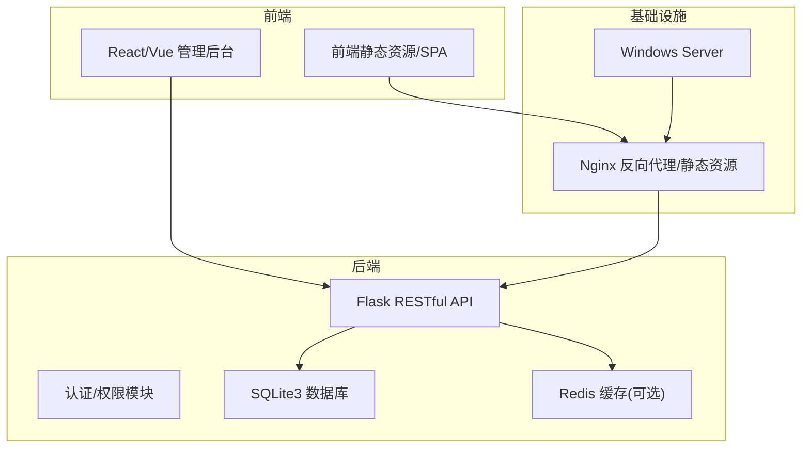
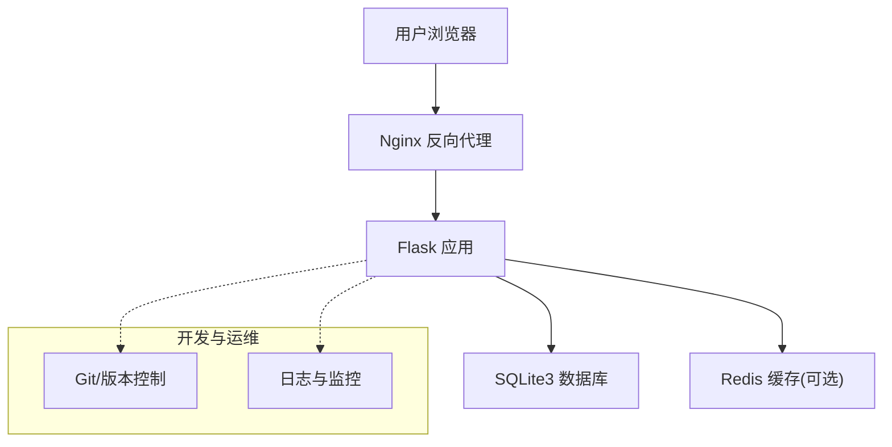

# 风险识别

<cite>
**本文引用的文件**
- [企业网站CMS系统开发需求文档.ini](file://企业网站CMS系统开发需求文档.ini)
- [企业网站CMS系统详细需求文档.md](file://企业网站CMS系统详细需求文档.md)
</cite>

## 目录
1. [引言](#引言)
2. [项目结构](#项目结构)
3. [核心组件](#核心组件)
4. [架构总览](#架构总览)
5. [详细组件分析](#详细组件分析)
6. [依赖分析](#依赖分析)
7. [性能考量](#性能考量)
8. [故障排查指南](#故障排查指南)
9. [结论](#结论)
10. [附录](#附录)

## 引言
本文件面向企业网站CMS系统开发过程，系统化梳理并识别技术风险、项目管理风险、业务风险与外部环境风险，结合项目当前需求文档与技术方案，给出触发条件、影响范围、发生概率、应对策略与持续性管理机制。文档同时提供风险清单模板、风险分类体系、登记册格式与识别方法论，帮助项目团队建立可执行、可追踪、可演进的风险管理体系。

## 项目结构
- 项目采用前后端分离架构，后端基于Python Flask + SQLite3，前端可选React/Vue或纯HTML模板渲染；部署于Windows Server + Nginx。
- 项目周期短、目标明确，采用MVP策略，聚焦核心功能快速交付，后续版本迭代扩展能力。
- 需求文档明确了功能边界、技术栈、性能与安全要求、里程碑与验收标准，为风险识别与控制提供依据。



**图表来源**
- [企业网站CMS系统详细需求文档.md](file://企业网站CMS系统详细需求文档.md#L22-L57)
- [企业网站CMS系统详细需求文档.md](file://企业网站CMS系统详细需求文档.md#L629-L659)

**章节来源**
- [企业网站CMS系统详细需求文档.md](file://企业网站CMS系统详细需求文档.md#L1-L120)

## 核心组件
- 认证与权限：基于JWT与RBAC，覆盖登录、角色、权限、会话与安全策略。
- 内容管理：文章、页面、分类、标签、媒体库、页面组件配置。
- 可视化编辑器：简化版拖拽编辑器，核心组件有限，便于MVP交付。
- 前台展示：基于模板与JSON组件配置渲染，SEO与响应式支持。
- 部署与运维：Nginx反向代理、Windows服务注册、日志与备份策略。

**章节来源**
- [企业网站CMS系统详细需求文档.md](file://企业网站CMS系统详细需求文档.md#L235-L446)
- [企业网站CMS系统详细需求文档.md](file://企业网站CMS系统详细需求文档.md#L1656-L1694)

## 架构总览
- 技术栈与部署：后端Flask + SQLite3，前端React/Vue或纯HTML，Nginx反向代理，Windows Server。
- 性能与安全：明确响应时间、并发、缓存与安全防护要求；数据库选型与缓存策略清晰。
- 风险识别：文档中已列出若干技术、项目与安全风险及应对措施，为本文件提供基础。



**图表来源**
- [企业网站CMS系统详细需求文档.md](file://企业网站CMS系统详细需求文档.md#L553-L659)

**章节来源**
- [企业网站CMS系统详细需求文档.md](file://企业网站CMS系统详细需求文档.md#L551-L659)

## 详细组件分析

### 技术风险
- 风险1：Windows Server环境兼容性问题
  - 触发条件：Windows环境下的WSGI/进程管理差异、服务注册与自动重启。
  - 影响范围：部署失败、服务不可用、上线延期。
  - 发生概率：低。
  - 应对策略：使用Windows友好的WSGI服务器与服务管理工具，提前在Windows环境验证，准备容器化备选方案。
  - 持续性：持续验证Windows部署流程，纳入CI/CD与运维手册。

- 风险2：拖拽编辑器性能问题
  - 触发条件：组件数量增长、复杂嵌套、频繁重排。
  - 影响范围：编辑器卡顿、用户体验差、编辑效率下降。
  - 发生概率：中。
  - 应对策略：虚拟滚动、组件懒加载、限制单页组件数量、性能监控与优化。
  - 持续性：建立性能基线与回归测试，定期评估编辑器性能。

- 风险3：数据库性能瓶颈
  - 触发条件：数据量增长、查询复杂度上升、并发写入增加。
  - 影响范围：响应延迟、查询超时、系统不稳定。
  - 发生概率：中。
  - 应对策略：合理索引、查询优化、Redis缓存、必要时考虑读写分离。
  - 持续性：监控慢查询、定期分析与优化。

**章节来源**
- [企业网站CMS系统详细需求文档.md](file://企业网站CMS系统详细需求文档.md#L1867-L1894)

### 项目管理风险
- 风险4：需求变更频繁
  - 触发条件：业务方对功能理解不清、验收标准模糊。
  - 影响范围：返工、进度延迟、成本超支。
  - 发生概率：中。
  - 应对策略：严格需求评审、变更流程控制、预留缓冲时间、明确验收标准。
  - 持续性：建立变更控制委员会与需求基线管理。

- 风险5：人员变动
  - 触发条件：核心成员离职、临时缺岗。
  - 影响范围：知识断层、进度停滞、质量波动。
  - 发生概率：低。
  - 应对策略：完善文档与代码规范、知识共享、关键角色备份。
  - 持续性：定期知识盘点与交叉培训。

**章节来源**
- [企业网站CMS系统详细需求文档.md](file://企业网站CMS系统详细需求文档.md#L1895-L1912)

### 安全风险
- 风险6：数据泄露
  - 触发条件：弱口令、未加密传输、权限越界、日志缺失。
  - 影响范围：敏感信息外泄、合规风险、声誉损失。
  - 发生概率：低。
  - 应对策略：安全开发培训、代码审计、渗透测试、日志与监控。
  - 持续性：安全基线与定期渗透测试。

**章节来源**
- [企业网站CMS系统详细需求文档.md](file://企业网站CMS系统详细需求文档.md#L1913-L1923)

### 业务风险
- 需求变更与验收偏差：MVP版本功能受限，若业务方期望与实际交付不符，可能导致验收不通过或二次返工。
- 用户接受度：编辑器复杂度与学习曲线可能影响内容编辑效率。
- 市场竞争：同类系统成熟度与价格策略可能影响客户决策。

**章节来源**
- [企业网站CMS系统详细需求文档.md](file://企业网站CMS系统详细需求文档.md#L1804-L1862)

### 外部环境风险
- 政策与合规：数据保护法规、网络安全等级保护要求。
- 供应商风险：第三方组件版本安全公告、许可证合规。
- 自然灾害：服务器中断、备份恢复、异地容灾。

**章节来源**
- [企业网站CMS系统详细需求文档.md](file://企业网站CMS系统详细需求文档.md#L1360-L1461)

## 依赖分析
- 技术依赖：Flask生态、SQLite3、Redis、Nginx、Windows服务管理工具。
- 第三方组件：拖拽库、富文本编辑器、UI组件库、CDN/云存储等。
- 人员与流程：开发、测试、运维、安全审计、变更控制。

```mermaid
graph LR
A["Flask"] --> B["Flask-SQLAlchemy"]
A --> C["Flask-RESTful"]
A --> D["Flask-JWT-Extended"]
A --> E["Flask-Babel"]
A --> F["Flask-CORS"]
A --> G["Flask-Caching"]
A --> H["Flask-Login"]
A --> I["Flask-WTF"]
A --> J["Flask-Migrate"]
K["SQLite3"] <- --> A
L["Redis"] -.-> A
M["Nginx"] --> A
N["Windows 服务管理"] --> A
```

**图表来源**
- [企业网站CMS系统详细需求文档.md](file://企业网站CMS系统详细需求文档.md#L555-L622)
- [企业网站CMS系统详细需求文档.md](file://企业网站CMS系统详细需求文档.md#L629-L659)

**章节来源**
- [企业网站CMS系统详细需求文档.md](file://企业网站CMS系统详细需求文档.md#L555-L659)

## 性能考量
- 响应时间与并发：明确页面与API响应阈值，数据库查询响应上限。
- 缓存策略：页面缓存、数据缓存、静态资源缓存与版本化。
- 资源优化：图片懒加载、响应式图片、压缩与CDN。
- 监控与告警：日志、性能指标、错误率与磁盘空间监控。

**章节来源**
- [企业网站CMS系统详细需求文档.md](file://企业网站CMS系统详细需求文档.md#L1360-L1461)

## 故障排查指南
- 部署问题：检查Nginx配置、Windows服务状态、SSL证书、日志文件。
- 数据库问题：确认SQLite文件权限、连接字符串、备份与恢复流程。
- 性能问题：启用慢查询日志、分析缓存命中率、监控CPU/内存/磁盘IO。
- 安全问题：核对HTTPS、CSP、CSRF、XSS防护配置，检查日志与告警。

**章节来源**
- [企业网站CMS系统详细需求文档.md](file://企业网站CMS系统详细需求文档.md#L1141-L1357)

## 结论
本项目在短周期内采用MVP策略，技术栈与部署方案相对简单，但需关注Windows环境兼容性、拖拽编辑器性能与数据库扩展性等风险。建议建立风险登记册与持续跟踪机制，结合需求变更控制、安全审计与性能监控，确保项目按期高质量交付并在后续版本中逐步完善。

## 附录

### 风险识别方法论
- 头脑风暴与专家访谈：邀请开发、测试、运维与业务代表参与，形成风险清单初稿。
- 历史数据分析：参考类似项目经验教训，识别共性风险。
- SWOT分析：结合项目优势、劣势、机会与威胁，补充风险维度。
- 假设与制约因素分析：梳理项目假设与约束，识别潜在偏差风险。

### 风险清单模板
- 风险编号、风险类别、风险描述、触发条件、影响范围、发生概率、应对策略、责任人、状态、更新时间。

### 风险分类体系
- 技术风险：框架兼容性、数据库性能、第三方依赖、部署与运维。
- 项目管理风险：进度延误、预算超支、人员变动、需求变更。
- 业务风险：需求变更、市场竞争、用户接受度。
- 外部环境风险：政策变化、供应商风险、自然灾害。

### 风险登记册格式
- 项目名称、识别日期、识别人、类别、描述、触发条件、影响、概率、应对策略、责任人、状态、缓解措施、监控指标、更新记录。

### 专家访谈技巧
- 明确访谈目标与议题，准备引导性问题，鼓励开放讨论，记录关键观点与分歧，形成共识与行动项。

### 持续性与动态调整机制
- 定期评审：里程碑节点进行风险回顾与更新。
- 变更驱动：需求变更、技术选型调整、外部环境变化触发再评估。
- 监控与预警：建立KPI与告警机制，及时发现风险征兆。
- 文档化与知识沉淀：将风险识别、应对与经验固化为流程与文档。